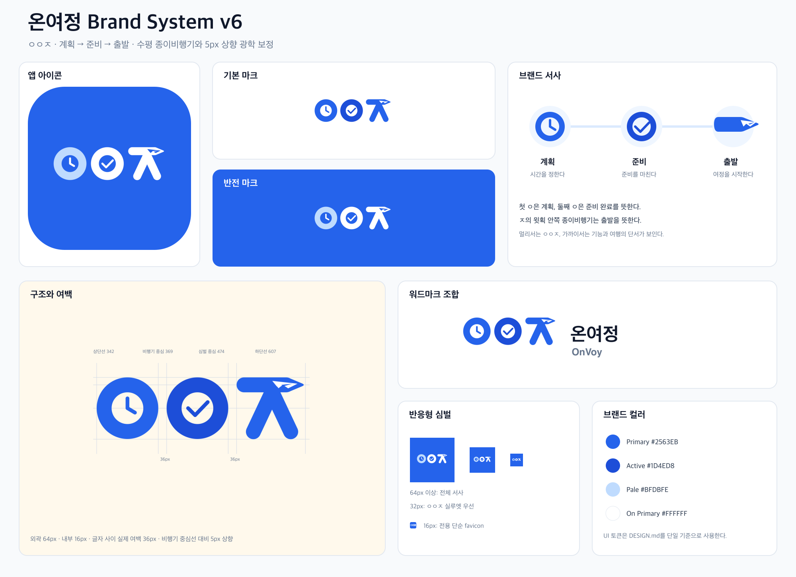

# 온여정 브랜드 문서

`docs/brand`는 온여정의 승인된 브랜드 정책과 원본 자산을 보관하는 Git 추적 영역이다. `_workspace`는 검토 중인 시안에만 사용한다.



## 문서와 자산

| 경로 | 역할 |
| --- | --- |
| `BRAND.md` | 브랜드명, 심벌 의미, 색상, 사용·금지 규칙 |
| `APP-BRAND-ASSET-GUIDE.md` | 모바일 플랫폼별 적용 및 검증 절차 |
| `v6/` | 승인된 SVG 원본, PNG 배포본, 재생성 스크립트 |
| `v6/brand-system.svg` | 전체 브랜드 시스템 보드 |

전체 규칙은 [브랜드 가이드](BRAND.md)에서 확인한다. 모바일 적용 시 [앱 브랜드 자산 적용 가이드](APP-BRAND-ASSET-GUIDE.md)를 함께 따른다.

현재 공식 버전은 **v6**다. 디자인 변경은 `_workspace`에서 검토한 뒤 승인된 결과만 새 버전 디렉터리로 추가한다. 기존 승인 버전은 덮어쓰지 않는다.

## 빠른 확인

```bash
pnpm brand:apply
```

명령은 브랜드 시스템과 앱·웹 배포 자산을 함께 재생성한다. 이후 SVG 파싱, PNG 크기, 64px·32px·16px 축소 품질과 플랫폼 마스크를 확인한다.
