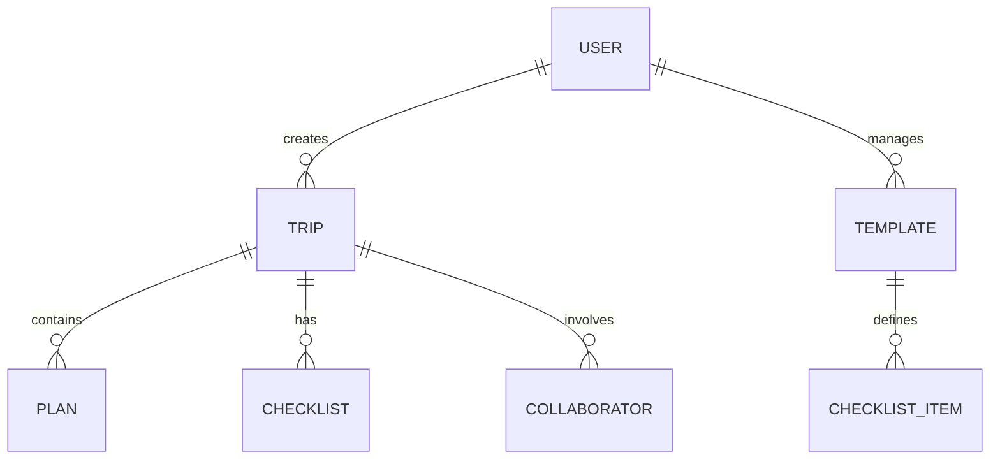

# Domain Models & Logic

OnVoy 프로젝트를 구성하는 핵심 도메인과 비즈니스 로직의 관계입니다. AI는 새로운 기능 구현 시 도메인 간의 계층 구조와 정체성을 유지해야 합니다.

---

## 1. 🧳 Trip (여행)
가장 상위의 도메인으로, 모든 활동의 부모 역할을 수행합니다.

- **Entity**: 여행 제목, 국가, 도시, 시작일, 종료일, 커버 이미지.
- **Collaborators**: 한 여행에는 여러 명의 사용자가 초대될 수 있습니다.
- **Logistics (Storage)**: 
  - 여행과 관련된 모든 사진 및 자산은 `trips` 버킷 내에 저장됩니다.
  - **경로 규칙**: `[user_id]/[trip_id]/[filename]` 형식을 반드시 준수하여 데이터 격리를 보장합니다.
- **Local-first Target**:
  - 전환 후 Trip은 root document boundary가 된다.
  - 초기 모델은 Trip 하나를 하나의 `TripDocumentV1`/Yjs document로 저장한다.
  - 기존 `trips.id`는 document id로 유지한다.
  - Plan, Checklist, Member, Asset은 Trip document 내부 entity로 materialize된다.
  - 향후 document 크기나 compaction 비용이 커질 경우 `plans`, `checklist`, `members`, `assets` subdocument 분리를 후속 ADR로 검토한다.

## 2. 📅 Plan (일정)
여행 기간 내의 세부 활동을 타임라인 형식으로 관리합니다.

- **Entity**: 활동명, 시간, 장소 정보(Location), 예산, 메모.
- **Logic**: 
  - 특정 날짜(`date`)와 시간(`time`)을 기준으로 정렬되어 표시됩니다.
- **Local-first Target**:
  - 기존 `plans.id`는 document 내부 `plans[id]` entity id로 유지한다.
  - 정렬은 동시 편집에 안전하도록 명시적 order 또는 sort key를 사용한다.
  - 장소 사진과 첨부 asset은 Yjs document에 binary로 넣지 않고 Storage reference로 유지한다.

## 3. ✅ Checklist (준비물)
여행을 준비하기 위해 챙겨야 할 아이템들의 목록입니다.

- **Entity**: 아이템 이름, 카테고리, 완료 여부(is_completed), 담당자 정보.
- **Rules**: 
  - **스와이프 인터랙션**: 모바일 UX 최적화를 위해 리스트 아이템을 왼쪽으로 스와이프할 때만 수정/삭제 액션이 노출됩니다.
- **Local-first Target**:
  - 체크리스트는 첫 local-first spike 도메인이다.
  - 기존 `checklist_items.id`는 document 내부 entity id로 유지한다.
  - 개인별 체크 상태는 user check map에서 계산하며, legacy `is_checked`는 호환 필드로만 취급한다.
  - 삭제는 즉시 hard delete가 아니라 tombstone으로 전파한 뒤 compaction 단계에서 정리한다.

## 4. 📋 Template (템플릿)
재사용 가능한 체크리스트 세트입니다.

- **Entity**: 템플릿명, 아이템 리스트, 공개 여부(is_public).

## 5. 👤 User & Auth (사용자)
인증 및 프로필, 프리미엄 권한을 관리합니다.

- **Entity**: 닉네임, 프로필 이미지, 이메일, 가입일.
- **Logistics (Storage)**: 
  - 프로필 이미지는 `profiles` 버킷 내에 저장됩니다.
  - **경로 규칙**: `[user_id]/avatar_[timestamp].jpg` 형식을 사용합니다.
- **Features**: 
  - **Premium**: 인원 초과 협업 등 고급 기능을 위한 구독 상태를 관리합니다.
- **Local-first Target**:
  - Supabase Auth는 유지한다.
  - 로그인 전 guest local document 작성을 허용하되, 공유/백업/웹-모바일 동기화/초대 수락 시 로그인으로 승격한다.
  - 로그인 후 guest document의 `ownerId`를 Supabase `auth.user.id`로 승격하고 최초 encrypted backup snapshot을 업로드한다.
  - 로그아웃, 계정 전환, 회원 탈퇴 시 local store namespace, backup row, push token 정리 정책을 함께 적용한다.

---

## 6. 🔐 Document Permission & Sharing

Local-first 전환 후에도 권한의 최종 authority는 Supabase registry다.

- `document_members`: owner/editor/viewer role과 accepted/revoked 상태를 관리한다.
- `document_invitation_links`: 딥 링크 초대와 초대 코드 fallback을 관리한다.
- `document_share_tokens`: 기존 공유 token 호환성을 유지한다.
- 클라이언트 document 내부 `members` snapshot은 UI guard용이며 보안 경계가 아니다.
- backup upload, invitation accept, role 변경, hard delete는 서버 검증을 거친다.

## 7. 🔔 Notifications

알림은 local-first 구조에서 두 종류로 분리한다.

- 시간 기반 로컬 알림: 일정 리마인더와 준비물 리마인더는 기기 로컬 알림으로 예약한다.
- 협업 변경 push: Yjs blob을 서버가 해석하지 않도록 별도 `notification_events` metadata를 사용한다.
- push payload에는 document content 전체를 넣지 않는다.

---

## 🔗 Domain Relationships (요약)

