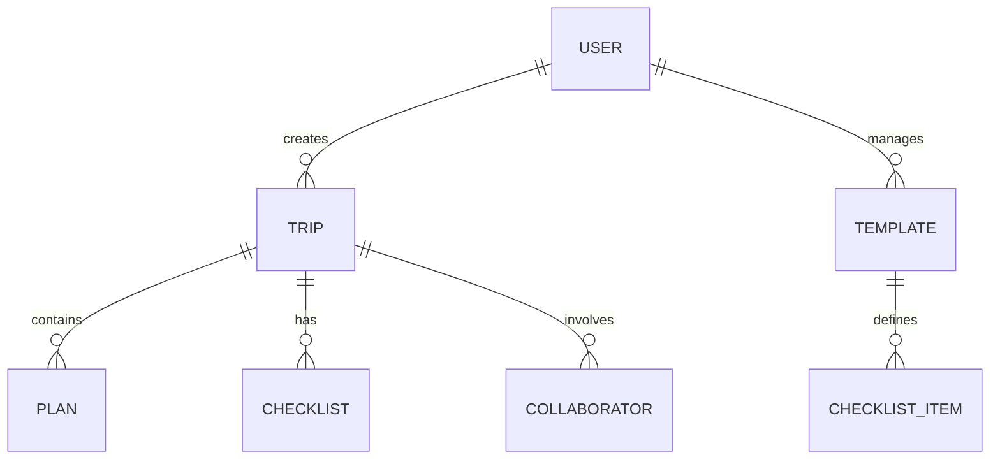

# Domain Models & Logic

OnVoy 프로젝트를 구성하는 핵심 도메인과 비즈니스 로직의 관계입니다. AI는 새로운 기능 구현 시 도메인 간의 계층 구조와 정체성을 유지해야 합니다.

---

## 1. 🧳 Trip (여행)
가장 상위의 도메인으로, 모든 활동의 부모 역할을 수행합니다.

- **Entity**: 여행 제목, 국가, 도시, 시작일, 종료일, 커버 이미지.
- **Collaborators**: 한 여행에는 여러 명의 사용자가 초대될 수 있습니다.
- **Logistics (Storage)**: 
  - 여행과 관련된 모든 사진 및 자산은 `trips` 버킷 내에 저장됩니다.
  - **경로 규칙**: `[user_id]/[trip_id]/[filename]` 형식을 반드시 준수하여 데이터 격리를 보장합니다.

## 2. 📅 Plan (일정)
여행 기간 내의 세부 활동을 타임라인 형식으로 관리합니다.

- **Entity**: 활동명, 시간, 장소 정보(Location), 예산, 메모.
- **Logic**: 
  - 특정 날짜(`date`)와 시간(`time`)을 기준으로 정렬되어 표시됩니다.

## 3. ✅ Checklist (준비물)
여행을 준비하기 위해 챙겨야 할 아이템들의 목록입니다.

- **Entity**: 아이템 이름, 카테고리, 완료 여부(is_completed), 담당자 정보.
- **Rules**: 
  - **스와이프 인터랙션**: 모바일 UX 최적화를 위해 리스트 아이템을 왼쪽으로 스와이프할 때만 수정/삭제 액션이 노출됩니다.

## 4. 📋 Template (템플릿)
재사용 가능한 체크리스트 세트입니다.

- **Entity**: 템플릿명, 아이템 리스트, 공개 여부(is_public).

## 5. 👤 User & Auth (사용자)
인증 및 프로필, 프리미엄 권한을 관리합니다.

- **Entity**: 닉네임, 프로필 이미지, 이메일, 가입일.
- **Logistics (Storage)**: 
  - 프로필 이미지는 `profiles` 버킷 내에 저장됩니다.
  - **경로 규칙**: `[user_id]/avatar_[timestamp].jpg` 형식을 사용합니다.
- **Features**: 
  - **Premium**: 인원 초과 협업 등 고급 기능을 위한 구독 상태를 관리합니다.

---

## 🔗 Domain Relationships (요약)

