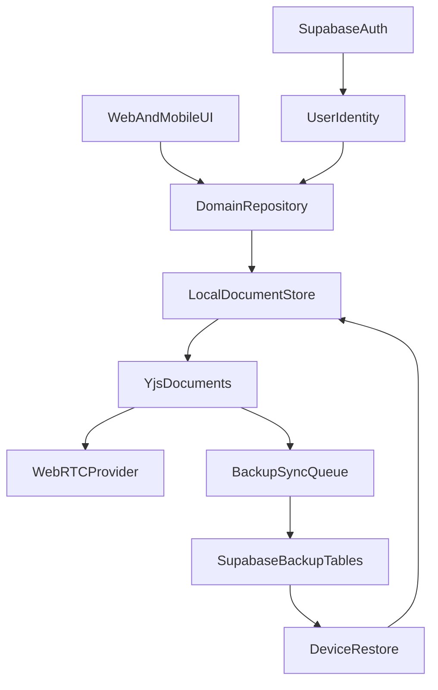
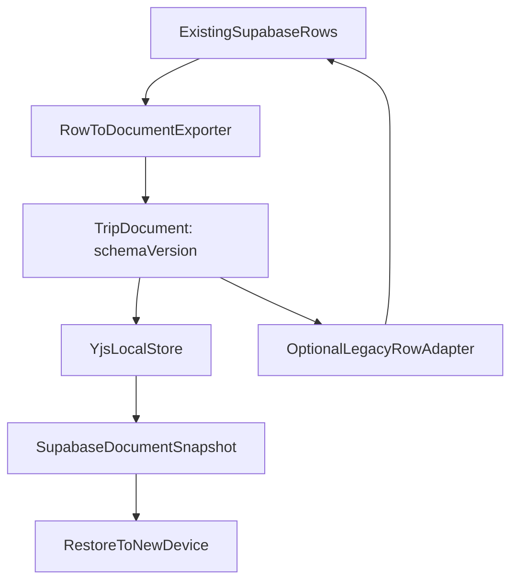

# PLAN-008: Local-First Architecture Review

## 결론

현재 상태에서 전환은 가능합니다. 다만 단순한 API 교체가 아니라 데이터 계층과 협업 모델의 대규모 재설계입니다. UI 전체를 버리는 완전 재구축은 피할 수 있지만, `@nexvoy/core`의 Supabase query helper, Supabase RLS 기반 권한 모델, 체크리스트/일정 mutation 흐름은 사실상 새 아키텍처로 다시 짜야 합니다.

권장 판단은 “전체 재구축”이 아니라 “신규 local-first data engine을 병행 구축한 뒤 도메인별 이관”입니다. 가장 먼저 Trip 단위 문서 모델과 동기화 계약을 설계하고, 체크리스트처럼 충돌 병합 가치가 큰 영역부터 실험하는 것이 안전합니다.

## 현재 구조에서 강하게 묶인 지점

- `packages/core/src/supabase/queries.ts`: Trip, Plan, Checklist, Template, 멤버/초대/공유 링크의 주요 조회와 mutation이 Supabase table API와 RPC에 직접 연결되어 있습니다.
- `supabase/migrations/20260309000001_initial_schema.sql`: 현재 데이터 모델은 정규화된 PostgreSQL 테이블과 RLS가 원본 상태입니다.
- `supabase/migrations/20260320000001_collaboration_and_sharing.sql`: 협업 권한은 `trip_members`, `trip_shares`, RLS helper 함수에 의존합니다.
- `apps/web/app/trips/checklist/ChecklistClient.tsx`: 체크리스트는 일부 `@nexvoy/core`를 거치지 않고 화면에서 직접 Supabase read/write를 수행합니다.
- `apps/web/services/DownloadService.ts`: 현재 오프라인은 local-first 원본이 아니라 Supabase 데이터를 localStorage에 read-only 번들로 복사하는 방식입니다.
- `apps/mobile/lib/supabase.ts`: 모바일 인증 세션은 Supabase Auth와 SecureStore에 맞춰져 있습니다. 이 부분은 유지 가능합니다.

## 목표 아키텍처 초안

## 핵심 설계 결정

- 저장 단위는 PostgreSQL row가 아니라 “Trip 문서” 단위가 유력합니다. `Trip` 안에 `plans`, `checklist`, `members`, metadata를 CRDT subdocument 또는 map/array로 묶어야 합니다.
- Supabase는 source of truth가 아니라 auth, device bootstrap, encrypted backup, 초대/권한 registry 역할로 축소해야 합니다.
- P2P는 실시간 동기화 채널일 뿐 신뢰 가능한 영구 저장소가 아닙니다. 모든 기기가 꺼져 있거나 NAT/방화벽 문제가 있으면 Supabase 백업/relay/restore 경로가 필요합니다.
- 현재 RLS가 보장하던 권한은 local-first에서는 클라이언트 검증만으로 부족합니다. 백업 업로드, 초대 수락, 멤버 권한 변경은 서버에서 검증되어야 합니다.

## 기존 데이터 호환성

기존 데이터는 버리지 않고 이관 가능합니다. 다만 현재 Supabase row 모델과 local-first CRDT 문서 모델은 저장 단위가 다르므로, “기존 테이블을 그대로 CRDT화”하기보다는 변환 계층이 필요합니다.

현재 보존해야 할 주요 데이터는 다음과 같습니다.

- 사용자/인증: `auth.users`, `profiles`
- 여행: `trips`
- 일정: `plans`, `plan_urls`, 장소/사진 관련 컬럼(`location_lat`, `location_lng`, `google_place_id`, `photo_reference`, `image_url`)
- 준비물: `checklists`, `checklist_categories`, `checklist_items`, `checklist_item_assignees`, `checklist_item_user_checks`
- 협업/공유: `trip_members`, `trip_shares`, `trip_invitation_links`
- 부가 기능: `user_devices`, 알림 관련 `plans.alarm_sent_at`, Supabase Storage의 `place-photos`, `trips`, `profiles` 버킷

호환성 관점에서 가장 중요한 결정은 기존 row id를 CRDT 문서 내부 id로 유지하는 것입니다. `trips.id`, `plans.id`, `checklist_items.id`를 새 로컬 id로 바꾸면 기존 공유 링크, 초대, 사진 경로, 알림, E2E seed, 사용자의 북마크/URL이 깨질 수 있습니다.

권장 문서 모델은 Trip 단위입니다.

### 호환 가능한 영역

- 기존 사용자 계정은 Supabase Auth를 유지하므로 대부분 그대로 호환됩니다.
- `profiles`는 계정 메타데이터로 유지할 수 있습니다.
- 기존 여행/일정/준비물 데이터는 Trip document로 변환 가능합니다.
- 기존 공개 공유 링크와 초대 토큰은 Supabase registry로 남기면 호환 가능합니다.
- 기존 사진/첨부 파일은 Storage object path를 document 안에 reference로 보관하면 호환 가능합니다.

### 호환이 어려운 영역

- RLS 기반 권한 검증은 CRDT 문서 내부 변경에는 직접 적용되지 않습니다. 백업 업로드/복구/초대 수락/멤버 변경을 별도 서버 검증 경로로 분리해야 합니다.
- PostgreSQL 정규화 join 기반 통계와 필터링은 CRDT 문서 저장 후 그대로 쓰기 어렵습니다. 검색/통계용 materialized index를 별도로 만들어야 합니다.
- `updated_at` 기반 최신성 판단은 CRDT에서는 충분하지 않습니다. Yjs update clock, document version, device vector, tombstone을 함께 써야 합니다.
- 삭제 데이터는 기존 DB에서는 cascade delete로 사라지지만 CRDT에서는 tombstone이 필요합니다. 즉시 hard delete로 변환하면 다른 기기의 오래된 update가 데이터를 되살릴 수 있습니다.
- 템플릿 공유와 여행 협업은 권한 스냅샷과 서버 registry가 모두 필요합니다. 단순 P2P만으로는 안전하지 않습니다.

### 마이그레이션 모드

1. Read-through 호환: 기존 Supabase row를 읽어 Trip document로 변환하되, write는 기존 Supabase에 유지합니다. 이 단계는 스파이크와 검증용입니다.
2. Dual-write 호환: UI write를 repository로 모으고, Supabase row와 CRDT document에 동시에 반영합니다. 충돌과 누락 감지가 핵심입니다.
3. Document-primary 호환: 로컬 CRDT가 원본이 되고 Supabase에는 snapshot/update log를 백업합니다. 기존 row 테이블은 읽기 전용 legacy view 또는 migration fallback으로 남깁니다.
4. Legacy 종료: 충분한 검증 후 신규 기능은 document store만 사용합니다. 단, Auth, profile, invitation registry, storage metadata는 Supabase에 유지합니다.

### 백업 테이블 제안

기존 정규화 테이블을 즉시 제거하지 않고, 아래와 같은 새 백업 계층을 추가하는 방식이 안전합니다.

- `documents`: `id`, `owner_id`, `type`, `schema_version`, `snapshot`, `snapshot_hash`, `encrypted`, `created_at`, `updated_at`
- `document_updates`: `document_id`, `client_id`, `seq`, `update_blob`, `hash`, `created_at`
- `document_members`: `document_id`, `user_id`, `role`, `status`, `invited_email`
- `document_devices`: `document_id`, `user_id`, `device_id`, `last_synced_seq`, `last_seen_at`
- `legacy_row_map`: `document_id`, `table_name`, `row_id`, `path_in_document`

이 구조를 두면 기존 row id와 새 document path를 연결할 수 있어, 데이터 복구와 부분 롤백이 쉬워집니다.

### 롤백 전략

초기 단계에서는 반드시 Supabase row를 authoritative fallback으로 유지해야 합니다. CRDT 변환 실패나 모바일 WebRTC 문제 발생 시 기존 화면을 Supabase repository 구현체로 되돌릴 수 있어야 합니다. 따라서 첫 구현 목표는 “Supabase 제거”가 아니라 “Supabase repository와 Local-first repository를 교체 가능한 구조로 만드는 것”입니다.

## 단계적 전환 전략

1. ADR 작성: “Supabase as Backup/Auth, Local-first as Primary Store”를 새 ADR로 제안합니다. 기존 ADR-010의 Supabase query helper 전략을 대체하거나 하위 호환 기간을 명시합니다.
2. 저장소 인터페이스 도입: `TripRepository`, `ChecklistRepository`, `TemplateRepository` 같은 인터페이스를 `packages/core`에 만들고 Supabase 구현체를 기존 쿼리 위에 감쌉니다. UI는 repository 인터페이스만 보게 만듭니다.
3. Local document schema 설계: Trip 문서의 CRDT 구조, stable id, 삭제 tombstone, attachment reference, 멤버 권한 snapshot, schema version을 정의합니다.
4. 데이터 호환성 설계: 기존 Supabase row id 유지, Trip document path, `legacy_row_map`, schema version, tombstone 정책을 정의합니다.
5. 파일럿 영역 선정: 체크리스트를 첫 대상으로 권장합니다. 항목 추가/수정/체크는 CRDT 이점이 크고, 일정/초대/사진보다 외부 의존이 적습니다.
6. 로컬 저장소 구현: 웹은 IndexedDB/OPFS 계열, 모바일은 SQLite/MMKV/Expo SQLite 계열을 검토합니다. Yjs update log와 materialized view를 함께 둡니다.
7. 동기화 구현: Yjs provider를 플랫폼별로 분리합니다. 웹은 WebRTC가 상대적으로 쉽지만, Expo RN은 `react-native-webrtc` 등 native module 제약이 있어 Expo Go만으로는 어렵습니다.
8. Supabase 백업 설계: 기존 정규화 테이블을 즉시 버리기보다 `documents`, `document_updates`, `document_snapshots`, `device_sync_state` 같은 백업 테이블을 추가합니다.
9. 마이그레이션 브리지: 기존 Supabase row 데이터를 Trip document로 변환하고, 일정 기간 dual-write 또는 read-through sync를 운용합니다.
10. 도메인별 이관: Checklist → Plans → Templates → Collaboration/Invites 순서가 안전합니다. 초대/권한은 마지막에 옮겨야 합니다.
11. 기존 Supabase write 제거: 안정화 후 화면 직접 Supabase mutation과 `@nexvoy/core/supabase/queries` 의존을 줄이고 백업/인증/복구 경로만 남깁니다.

## 위험도 평가

- 높음: 멀티 사용자 권한, 초대, 데이터 삭제/탈퇴, 충돌 해결 UX, 모바일 WebRTC 지원, 백업 암호화, 데이터 복구.
- 중간: UI 이식, 도메인 타입 재사용, 단일 사용자 오프라인 편집.
- 낮음: Supabase Auth 유지, 프로필/계정 관리 유지, 읽기 전용 백업 조회.

## 재구축 여부

완전 재구축은 권장하지 않습니다. 현재 웹/앱 UI, 도메인 타입, 인증 흐름, 일부 서비스는 재사용 가치가 큽니다. 하지만 데이터 계층은 새로 만드는 수준입니다. 체감 난이도는 “앱 재구축의 50~70%” 정도로 보는 것이 현실적입니다.

## 추천 다음 액션

- 1주 스파이크로 체크리스트 1개 여행에 대해 local Yjs document, IndexedDB 저장, 단일 탭/다중 탭 동기화, Supabase snapshot backup을 검증합니다.
- 이 스파이크에는 기존 Supabase row를 Trip document로 변환하고 다시 legacy row 형태로 복원하는 round-trip 검증을 포함합니다.
- 동시에 Expo RN에서 WebRTC/Yjs provider가 실제 빌드 가능한지 확인합니다. 이 결과가 전체 전환 가능성을 좌우합니다.
- 스파이크 성공 후에만 본격 ADR과 마이그레이션 로드맵을 확정합니다.

## 검토 TODO

- [ ] Local-first 전환 ADR 초안 작성 및 기존 ADR-010과의 관계 정의
- [ ] 현재 Supabase query helper 앞에 도메인 Repository 인터페이스 설계
- [ ] 체크리스트 도메인으로 Yjs local document + local persistence 스파이크 수행
- [ ] Expo RN 환경에서 WebRTC/Yjs provider 빌드 가능성 검증
- [ ] Supabase 백업용 document/update/snapshot 테이블 설계
- [ ] 기존 Supabase row 데이터를 Trip document로 변환하는 마이그레이션 브리지 설계
- [ ] 기존 Supabase 데이터와 Local-first 문서 모델 간 호환성/복구 전략 정의
