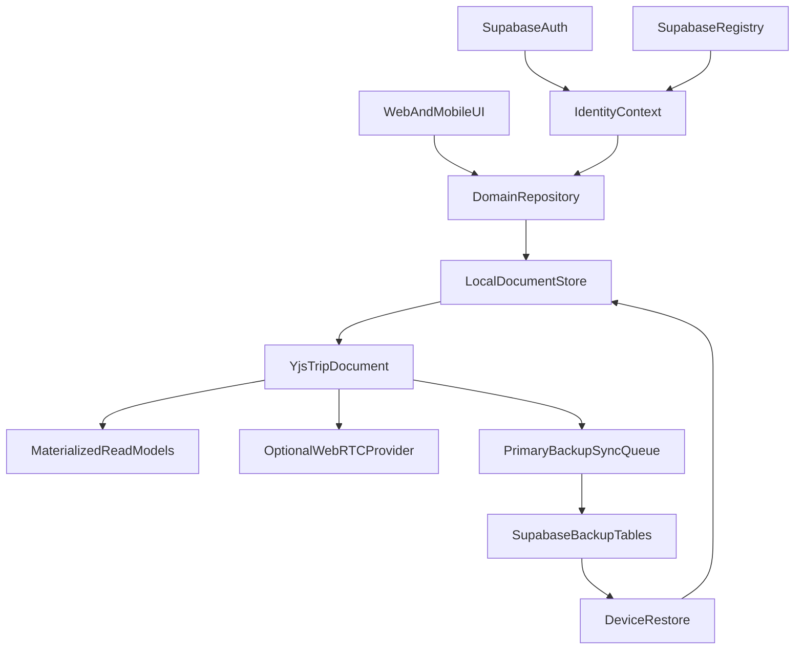
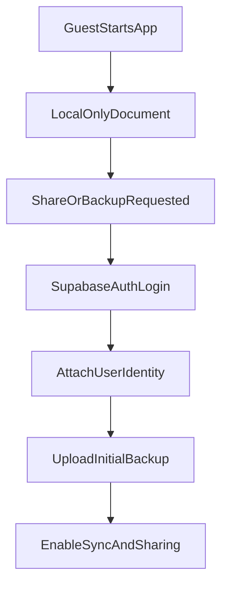

# Local-First Data Engine Technical Spec

## 1. 목적

OnVoy의 데이터 통신 구조를 Supabase 원본 DB 중심에서 Local-first 원본 저장소 중심으로 전환한다. 클라이언트는 로컬 저장소와 CRDT(Yjs)를 우선 사용하고, P2P(WebRTC)로 실시간 협업을 수행한다. Supabase는 사용자 인증, 권한 registry, 백업, 복구, 초대/공유 bootstrap, 첨부 파일 저장을 담당한다.

본 문서는 실제 구현을 위한 기술 명세다. 최종 아키텍처 결정은 `docs/refactor/adrs/ADR-001-local-first-data-engine.md`를 따른다.

## 2. 범위

### 포함

- Trip 단위 Local-first document model
- Yjs 기반 CRDT document/update 저장 전략
- Web/RN 로컬 영속화 계층
- WebRTC P2P 동기화 계층
- Supabase backup/auth/registry 계층
- 지연 인증, 소셜 로그인, guest data 승격 전략
- 초대, 공유, 권한 registry 전략
- 푸시/로컬 알림 전략
- 기존 Supabase row 데이터 호환성 및 마이그레이션 전략
- Repository 추상화
- 단계별 이관 전략
- 스파이크 및 검증 기준

### 제외

- 즉시 전체 도메인 전환
- Supabase Auth 제거
- Supabase Storage 제거
- 기존 row 테이블 즉시 삭제
- 모든 통계/검색 기능의 최종 구현
- 암호화 세부 구현 및 cryptographic primitive 최종 확정

## 3. 현재 상태 요약

현재 OnVoy는 Supabase가 다음 역할을 모두 담당한다.

- 인증: Supabase Auth, OAuth, 세션 저장
- 원본 DB: `trips`, `plans`, `checklists`, `checklist_items`, `templates`
- 권한: RLS, `trip_members`, helper RPC
- 협업: 초대, 공유 링크, 멤버 권한
- 알림: `user_devices`, push Edge Function, 일정 알림 RPC/trigger
- 백엔드 로직: RPC, Edge Function, trigger
- Storage: place photos, trip/profile assets
- 일부 실시간: Supabase Realtime hook

주요 결합 파일:

- `packages/core/src/supabase/queries.ts`
- `apps/web/app/trips/detail/TripClient.tsx`
- `apps/web/app/trips/checklist/ChecklistClient.tsx`
- `apps/mobile/app/trip/[id].tsx`
- `apps/web/services/DownloadService.ts`
- `apps/mobile/lib/supabase.ts`
- `supabase/migrations/*.sql`

## 4. 목표 아키텍처



핵심 원칙:

- UI는 Supabase client나 Yjs를 직접 호출하지 않는다.
- UI는 `Repository` 인터페이스만 사용한다.
- Local-first repository가 원본이다.
- Supabase repository는 전환 기간의 fallback 및 legacy adapter다.
- Supabase backup은 암호화된 CRDT snapshot/update를 저장하며 기본 sync/restore 경로다.
- WebRTC P2P는 동시 접속 중인 peer 간 빠른 전파를 위한 optional fast path다.
- Supabase RLS는 document registry와 backup row 접근에만 적용한다.

## 5. 패키지 구조

제안 구조:

```text
packages/core/src/
  repositories/
    tripRepository.ts
    checklistRepository.ts
    templateRepository.ts
    types.ts
  local-first/
    documentModel.ts
    tripDocument.ts
    migrations.ts
    materialize.ts
    tombstone.ts
    permissions.ts
  sync/
    backupTypes.ts
    syncState.ts
    conflictPolicy.ts
  supabase/
    queries.ts
    legacyRepository.ts
    backupRepository.ts

apps/web/lib/local-first/
  indexedDbStore.ts
  webRtcProvider.ts
  repositoryFactory.ts

apps/mobile/lib/local-first/
  sqliteStore.ts
  webRtcProvider.native.ts
  repositoryFactory.ts
```

`packages/core`에는 플랫폼 API를 넣지 않는다. IndexedDB, SQLite, WebRTC provider 생성은 앱 레이어에서 담당한다.

## 6. Repository 인터페이스

첫 단계에서는 기존 `@nexvoy/core/supabase/queries`를 즉시 제거하지 않고 repository로 감싼다.

예시:

```ts
export interface TripRepository {
  listTrips(userId: string): Promise<TripSummary[]>
  getTripDocument(tripId: string): Promise<TripDocument | null>
  createTrip(input: CreateTripInput): Promise<TripDocument>
  updateTrip(tripId: string, patch: TripPatch): Promise<void>
  deleteTrip(tripId: string): Promise<void>
}

export interface ChecklistRepository {
  getChecklist(tripId: string): Promise<ChecklistReadModel>
  createItem(tripId: string, input: ChecklistItemInput): Promise<string>
  updateItem(tripId: string, itemId: string, patch: ChecklistItemPatch): Promise<void>
  deleteItem(tripId: string, itemId: string): Promise<void>
  toggleItemForUser(tripId: string, itemId: string, userId: string): Promise<void>
}
```

구현체:

- `SupabaseTripRepository`: 현재 Supabase queries 사용
- `LocalFirstTripRepository`: Yjs document 사용
- `DualWriteTripRepository`: migration 기간에 Supabase와 Local-first에 동시 반영

## 7. Trip Document Model

저장 단위는 Trip 단위 단일 Yjs 문서다. `ADR-005` 결정에 따라 초기 구현은 Trip 하나를 하나의 CRDT document로 저장한다. 기존 row id를 내부 id로 유지한다.

```ts
export interface TripDocumentV1 {
  schemaVersion: 1
  trip: {
    id: string
    ownerId: string
    destination: string
    startDate: string
    endDate: string
    adultsCount: number
    childrenCount: number
    coverImageRef: string | null
    bgColor: string | null
    createdAt: string
    updatedAt: string
  }
  plans: Record<string, PlanNode>
  planOrder: string[]
  planUrls: Record<string, PlanUrlNode>
  checklists: Record<string, ChecklistNode>
  checklistItems: Record<string, ChecklistItemNode>
  checklistCategories: Record<string, ChecklistCategoryNode>
  checklistItemAssignees: Record<string, ChecklistItemAssigneeNode>
  checklistItemUserChecks: Record<string, ChecklistItemUserCheckNode>
  members: Record<string, TripMemberNode>
  shares: Record<string, TripShareNode>
  assets: Record<string, AssetRefNode>
  tombstones: Record<string, TombstoneNode>
  meta: {
    createdFromLegacyAt?: string
    lastLegacyExportAt?: string
    lastBackupAt?: string
  }
}
```

Yjs 내부 표현:

- `trip`: `Y.Map`
- `plans`: `Y.Map<Y.Map>`
- `planOrder`: `Y.Array<string>`
- `checklistItems`: `Y.Map<Y.Map>`
- user checks: `Y.Map<Y.Map>` 또는 item별 `Y.Map`
- tombstones: `Y.Map`

정렬이 필요한 컬렉션은 `Y.Array` 또는 명시적 `sort_order`를 사용한다. `created_at`에 의존한 정렬은 동시 작성 시 불안정하다.

## 8. 기존 데이터 매핑

### Trip

| Supabase | Document |
| --- | --- |
| `trips.id` | `trip.id` 및 document id |
| `trips.user_id` | `trip.ownerId` |
| `destination` | `trip.destination` |
| `start_date` | `trip.startDate` |
| `end_date` | `trip.endDate` |
| `adults_count` | `trip.adultsCount` |
| `children_count` | `trip.childrenCount` |
| `cover_image_ref` | `trip.coverImageRef` |
| `bg_color` | `trip.bgColor` |

### Plan

| Supabase | Document |
| --- | --- |
| `plans.id` | `plans[id].id` |
| `trip_id` | document id로 암묵 참조 |
| `title` | `plans[id].title` |
| `location`, `address` | `plans[id].location`, `plans[id].address` |
| `location_lat`, `location_lng` | `plans[id].coordinates` |
| `google_place_id` | `plans[id].googlePlaceId` |
| `image_url` | `plans[id].imageUrl` |
| `photo_reference` | `plans[id].photoReference` |
| `start_datetime_local` | `plans[id].startDateTimeLocal` |
| `end_datetime_local` | `plans[id].endDateTimeLocal` |
| `timezone_string` | `plans[id].timezone` |
| `alarm_minutes_before` | `plans[id].alarmMinutesBefore` |
| `alarm_sent_at` | `plans[id].alarmSentAt` |
| `is_visited` | `plans[id].isVisited` |

`plan_urls`는 `plans[id].urls`로 embed하거나 `planUrls` map으로 유지한다. 기존 row id 호환성을 우선하면 `planUrls` map 유지가 안전하다.

### Checklist

| Supabase | Document |
| --- | --- |
| `checklists.id` | `checklists[id].id` |
| `checklist_items.id` | `checklistItems[id].id` |
| `item_name` | `checklistItems[id].name` |
| `category` | `checklistItems[id].categoryName` |
| `is_private` | `checklistItems[id].isPrivate` |
| `assignment_type` | `checklistItems[id].assignmentType` |
| `assigned_user_id` | `checklistItems[id].assignedUserId` |
| `source_template_name` | `checklistItems[id].sourceTemplateName` |
| `checklist_item_assignees` | `checklistItemAssignees` |
| `checklist_item_user_checks` | `checklistItemUserChecks` |

`is_checked`는 legacy 호환 필드로만 취급한다. CRDT에서는 `assignmentType`에 따라 user check map에서 상태를 계산한다.

### Collaboration

`trip_members`, `trip_shares`, `trip_invitation_links`는 document 내부에도 snapshot을 보관하지만, 최종 권한 검증과 초대 수락은 Supabase registry를 source of authority로 둔다.

## 9. Supabase 백업 스키마

기존 row 테이블은 즉시 제거하지 않는다. 새 backup/registry 테이블을 추가한다.

```sql
create table public.documents (
  id uuid primary key,
  owner_id uuid references public.profiles(id) not null,
  type text not null check (type in ('trip', 'template')),
  schema_version integer not null,
  snapshot bytea,
  snapshot_hash text,
  encrypted boolean default false not null,
  created_at timestamptz default now() not null,
  updated_at timestamptz default now() not null
);

create table public.document_updates (
  id uuid default gen_random_uuid() primary key,
  document_id uuid references public.documents(id) on delete cascade not null,
  client_id text not null,
  seq bigint not null,
  update_blob bytea not null,
  update_hash text not null,
  created_at timestamptz default now() not null,
  unique(document_id, client_id, seq)
);

create table public.document_members (
  id uuid default gen_random_uuid() primary key,
  document_id uuid references public.documents(id) on delete cascade not null,
  user_id uuid references public.profiles(id),
  invited_email text,
  role text not null check (role in ('owner', 'editor', 'viewer')),
  status text not null check (status in ('pending', 'accepted', 'revoked')),
  created_at timestamptz default now() not null,
  updated_at timestamptz default now() not null
);

create table public.document_devices (
  id uuid default gen_random_uuid() primary key,
  document_id uuid references public.documents(id) on delete cascade not null,
  user_id uuid references public.profiles(id) not null,
  device_id text not null,
  last_synced_seq bigint,
  last_seen_at timestamptz,
  unique(document_id, user_id, device_id)
);

create table public.legacy_row_map (
  id uuid default gen_random_uuid() primary key,
  document_id uuid references public.documents(id) on delete cascade not null,
  table_name text not null,
  row_id uuid not null,
  path_in_document text not null,
  unique(table_name, row_id)
);

create table public.document_keys (
  id uuid default gen_random_uuid() primary key,
  document_id uuid references public.documents(id) on delete cascade not null,
  user_id uuid references public.profiles(id) not null,
  key_version integer not null,
  wrapped_dek bytea not null,
  wrapping_alg text not null,
  created_at timestamptz default now() not null,
  revoked_at timestamptz,
  unique(document_id, user_id, key_version)
);
```

RLS 원칙:

- owner/editor만 `document_updates` insert 가능
- viewer는 snapshot/update read만 가능
- `document_members` 변경은 owner만 가능
- 초대 수락은 서버 RPC로만 수행
- 삭제는 tombstone 생성 후 일정 기간 뒤 hard delete
- `documents.snapshot`과 `document_updates.update_blob`은 기본적으로 암호문이다.
- accepted member만 자신의 `document_keys.wrapped_dek`를 읽을 수 있다.

## 10. 인증 및 Identity

Supabase Auth는 유지한다. Local-first 전환 후에도 인증은 다음 기능의 기준이다.

- 클라우드 백업/복구
- 웹/모바일 간 데이터 복구
- 친구 초대/수락
- document 권한 registry
- push token/device 등록
- 회원 탈퇴 및 데이터 삭제

### 지원 로그인

- Email/password
- Kakao OAuth
- Google OAuth
- Apple OAuth

### 지연 인증

`ADR-007` 결정에 따라 guest local mode를 허용한다.

흐름:

1. 앱 최초 실행 시 로그인 없이 로컬 여행/준비물 작성 가능
2. 공유, 백업, 웹/모바일 동기화, 초대 수락 시점에 로그인 유도
3. 로그인 성공 시 guest document를 authenticated document로 승격
4. Supabase backup snapshot 최초 업로드
5. 이후 backup/P2P/sync 활성화



정책:

- guest data는 앱 삭제 시 유실될 수 있음을 UX에서 안내한다.
- guest document는 `localOwnerId`를 사용한다.
- 로그인 후 `ownerId`를 Supabase `auth.user.id`로 승격한다.
- 로그아웃/계정 전환 시 local store는 user namespace로 격리한다.
- 회원 탈퇴 시 local documents, backup rows, push tokens를 모두 정리한다.

자세한 결정은 `docs/refactor/adrs/ADR-007-auth-identity-and-delayed-auth.md`를 따른다.

## 11. Local Persistence

### Web

후보:

- IndexedDB + `y-indexeddb`
- OPFS 기반 binary blob store
- Dexie wrapper

초기 권장:

- Yjs update log: IndexedDB
- materialized read model: IndexedDB object store
- 큰 binary asset: Supabase Storage reference 유지

### Mobile

후보:

- Expo SQLite
- react-native-quick-sqlite
- MMKV

초기 권장:

- Expo managed workflow를 유지해야 한다면 Expo SQLite 우선 검토
- `ADR-002` 결정에 따라 WebRTC native module 검증을 위해 dev client/EAS Build 전환을 허용
- Yjs update blob은 SQLite BLOB 또는 base64 TEXT로 저장

## 12. P2P 동기화

`ADR-004` 결정에 따라 P2P는 optional fast path다. 기본 sync와 복구는 Supabase backup pull/push가 담당한다.

Web:

- `y-webrtc`는 optional Web PoC에서 검토
- signaling server는 P2P 활성화 phase에서만 검토
- BroadcastChannel로 동일 브라우저 탭 동기화

Mobile:

- `ADR-002` 결정에 따라 `react-native-webrtc` 또는 동등한 native provider를 검증한다.
- Expo Go가 아니라 dev client/EAS Build 기반 검증을 허용한다.
- 백그라운드 동기화는 P2P보다 Supabase backup queue를 우선한다.

기본 sync 및 P2P 실패 시 fallback:

1. Local write
2. Backup queue에 pending update 추가
3. 온라인 시 Supabase update upload
4. 상대 기기는 Supabase에서 restore/pull
5. P2P 연결 가능 시 peer 간 update를 빠르게 전파

## 13. 초대, 공유, 권한 모델

Local-first에서 권한은 두 층으로 나눈다.

### Client permission snapshot

문서 내부에 `members` snapshot을 둔다. UI 권한 표시와 optimistic guard에 사용한다.

### Server authority

Supabase `document_members`가 최종 권한 registry다. 다음 작업은 서버 검증을 반드시 거친다.

- document backup upload
- member role 변경
- invitation 생성
- invitation 수락
- share link 생성/폐기
- document hard delete

클라이언트 snapshot과 Supabase registry가 충돌하면 Supabase registry를 우선한다.

### 초대 방식

`ADR-008` 결정에 따라 초대 방식은 복수 채널을 지원하되, 초기 구현은 딥 링크 + 초대 코드 fallback을 우선한다.

- 딥 링크: 카카오톡/문자/공유 시트에 적합
- 초대 코드: 딥 링크 실패 또는 PC/모바일 교차 사용 fallback
- QR 코드: 오프라인 대면 상황에 적합하나 후순위
- 이메일/계정 검색: 보안이 좋고 권한 지정이 명확하나 가입 UX가 필요

초대 링크/코드는 Supabase registry에서 생성/검증한다. 링크 자체에 document content를 포함하지 않는다.

### Signaling 권한 검증

P2P room join 시 다음을 확인한다.

1. Supabase JWT 유효성
2. `document_members.status = accepted`
3. role 기반 접근 권한
4. room secret 유효성

viewer는 로컬에서 임의 변경을 만들 수 있더라도 backup upload와 peer write propagation에서 차단되어야 한다. UI에서도 편집 버튼을 비활성화한다.

자세한 결정은 `docs/refactor/adrs/ADR-008-invitation-and-permission-registry.md`를 따른다.

## 14. 삭제와 Tombstone

CRDT에서는 삭제를 즉시 hard delete로 처리하지 않는다.

```ts
interface TombstoneNode {
  entityType: 'plan' | 'checklistItem' | 'checklist' | 'member' | 'asset'
  entityId: string
  deletedBy: string
  deletedAt: string
  reason?: string
}
```

정책:

- UI에서는 tombstone entity를 숨긴다.
- sync에서는 tombstone을 전파한다.
- 일정 보존 기간 이후 compaction을 수행한다.
- compaction 전에는 legacy restore가 가능해야 한다.

## 15. Push and Local Notifications

`ADR-009` 결정에 따라 Local-first 구조에서는 알림을 두 종류로 나눈다.

### 시간 기반 로컬 알림

여행 일정 리마인더, 출발 전 준비물 리마인더는 기기 로컬 알림으로 처리한다.

- plan 생성/수정 시 로컬 알림 예약
- plan 삭제/시간 변경 시 기존 알림 취소 후 재등록
- 네트워크 없이도 알림 동작
- 로그아웃, document 접근 해제, 회원 탈퇴 시 관련 로컬 알림 제거

### 협업 변경 푸시

협업 변경 알림은 Yjs blob을 서버가 해석하지 않도록 notification metadata를 별도로 생성한다.

흐름:

1. local document 변경
2. Yjs update 생성
3. 사람이 읽을 수 있는 notification summary 생성
4. Supabase `notification_events` insert
5. Edge Function 또는 webhook이 Expo Push 발송

정책:

- document content 전체를 push payload에 넣지 않는다.
- 오프라인 중 발생한 여러 변경은 batching/dedupe한다.
- 같은 document를 보고 있는 사용자에게는 push 대신 in-app toast를 우선한다.
- push token은 user/device lifecycle에 맞춰 등록/삭제한다.

자세한 결정은 `docs/refactor/adrs/ADR-009-notification-strategy.md`를 따른다.

## 16. Migration Strategy

### Phase 0: Architecture Spike

목표:

- 체크리스트 1개 trip을 Trip document로 변환
- Yjs local persistence 검증
- Web 다중 탭 동기화 검증
- Supabase snapshot backup 검증
- row → document → row round-trip 검증

성공 기준:

- 기존 checklist item id 유지
- 체크/해제 동시 편집 병합
- 브라우저 새로고침 후 복원
- Supabase snapshot에서 신규 기기 복원
- legacy Supabase row와 의미상 동일한 결과 복원

### Phase 1: Repository Abstraction

목표:

- 화면이 Supabase 직접 호출 대신 repository 사용
- 기존 Supabase 구현으로 동작 동일성 유지

대상:

- `packages/core/src/supabase/queries.ts`
- `apps/web/app/trips/checklist/ChecklistClient.tsx`
- `apps/mobile/app/trip/[id].tsx`

### Phase 2: Read-through Document

목표:

- Supabase row를 읽어 document 생성
- write는 기존 Supabase 유지
- document materialized read model 검증

### Phase 3: Dual-write

목표:

- repository mutation이 Supabase row와 Yjs document에 동시 반영
- mismatch detector 구현
- 운영 데이터 손실 없이 검증

### Phase 4: Document-primary

목표:

- Local-first repository를 기본값으로 전환
- Supabase row는 fallback/read-only
- backup/update log를 안정화

### Phase 5: Legacy Reduction

목표:

- 신규 기능은 document model만 사용
- legacy row sync 제거 후보 식별
- 통계/search index 별도 구축

## 17. Data Compatibility Requirements

필수:

- 기존 Supabase Auth 계정 유지
- 기존 `trips.id` 기반 URL 유지
- 기존 share token과 invitation token 유효성 유지
- 기존 plan photo storage reference 유지
- 기존 checklist assignment/check state 의미 보존
- 기존 owner/editor/viewer 역할 보존
- 기존 탈퇴/삭제 플로우에서 로컬 데이터와 백업 데이터 모두 정리

비필수:

- 기존 `updated_at` 값과 CRDT clock의 1:1 대응
- 기존 RLS 정책명을 그대로 유지
- 기존 row table을 영구적으로 primary로 유지

## 18. Backup and Restore

Backup queue:

- local update 발생 시 update blob 저장
- 네트워크 가능 시 Supabase `document_updates` 업로드
- 일정 update 수 또는 크기마다 snapshot 생성
- snapshot hash로 corruption 감지

Restore:

1. Supabase Auth 로그인
2. 접근 가능한 `documents` 조회
3. 최신 snapshot 다운로드
4. snapshot 이후 updates 적용
5. materialized read model 재생성
6. P2P provider 연결

## 19. Operating Cost and Infrastructure

Local-first 구조는 중앙 서버 비용을 줄이지만, 완전 무인프라 구조는 아니다. `ADR-010`은 ADR-001~ADR-009 결정사항을 기준으로 후속 비용 검토를 수행한다.

필요 인프라:

- Supabase Auth
- Supabase document backup/update storage
- Supabase Edge Functions 또는 Realtime
- signaling server (P2P optional phase에서 검토)
- STUN/TURN
- web hosting
- Expo Push Service
- 앱스토어 계정 및 도메인

비용 제어 원칙:

- Yjs update는 debounce/batch 후 업로드한다.
- 일정 크기 이상 update log는 snapshot compaction한다.
- image/binary data는 Yjs document에 넣지 않고 Storage reference만 저장한다.
- TURN relay는 P2P optional phase에서만 사용한다.
- notification event는 dedupe/batching한다.

초기에는 managed/free tier를 우선 사용하되, quota 70% 도달 시 업그레이드를 검토한다. 단, 암호화 backup, hybrid index, notification metadata, guest promotion 정책이 반영된 write volume을 재산정해야 한다.

자세한 비용 산정은 `docs/refactor/adrs/ADR-010-operating-cost-and-infrastructure.md`에서 후속 검토한다.

## 20. Observability

필요 이벤트:

- `local_first_document_created`
- `local_first_guest_document_promoted`
- `local_first_restore_started`
- `local_first_restore_completed`
- `local_first_backup_failed`
- `local_first_conflict_detected`
- `local_first_dual_write_mismatch`
- `p2p_connected`
- `p2p_unavailable`
- `local_notification_scheduled`
- `collaboration_push_enqueued`
- `document_permission_denied`

로그에는 문서 id와 에러 코드만 남기고 문서 내용은 남기지 않는다.

## 21. Security and Privacy Considerations

- Supabase backup row는 RLS로 보호한다.
- `ADR-003` 결정에 따라 snapshot/update blob은 암호화한다.
- Key model은 Server-wrapped key를 사용한다.
- 초대받은 사용자의 decrypt 권한 부여 방식을 별도 ADR로 분리할 수 있다.
- P2P 연결은 signaling metadata 노출 범위를 점검한다.
- 로그인 provider별 수집 항목을 개인정보 처리방침에 명시한다.
- WebRTC 연결과 signaling 과정에서 IP 주소/네트워크 정보가 처리될 수 있음을 고지한다.
- 협업 초대 시 참여자 간 프로필 정보와 여행 데이터가 공유됨을 고지한다.
- Supabase 및 하위 인프라에 대한 개인정보 처리 위탁을 고지한다.
- push token, device id, sync state 수집 목적과 보유 기간을 명시한다.

## 22. Test Strategy

Unit:

- row → document 변환
- document → read model materialization
- tombstone merge
- checklist toggle merge
- schema migration

Integration:

- Supabase legacy read-through
- document backup upload/download
- restore from snapshot/update
- dual-write mismatch detection
- guest document promotion
- notification event batching
- permission registry validation

E2E:

- 기존 Supabase 여행 데이터가 새 클라이언트에서 보이는지
- 오프라인에서 체크리스트 편집 후 온라인 복구
- 두 기기 동시 체크리스트 수정 병합
- 초대받은 사용자의 복구 가능 여부
- viewer 권한 사용자의 write upload 차단
- 딥 링크 초대 수락 후 document restore
- guest 작성 데이터 로그인 후 backup 승격
- 일정 로컬 알림 예약/취소
- 회원 탈퇴 후 local/backup 데이터 정리

## 23. Decision ADRs

아래 항목은 구현 중 즉석에서 결정하지 않는다. 각 ADR을 검토하고 승인한 뒤 Technical Spec을 확정한다.

| 결정 항목 | ADR | 현재 상태 |
| --- | --- | --- |
| Local-first + Supabase backup/auth 방향을 채택할 것인가? | `docs/refactor/adrs/ADR-001-local-first-data-engine.md` | 채택됨: Option C |
| 모바일 WebRTC를 위해 Expo dev client/EAS Build 전환을 허용할 것인가? | `docs/refactor/adrs/ADR-002-mobile-webrtc-runtime.md` | 채택됨: Option B, native build 추가 검증 필요 |
| Yjs update blob을 Supabase에 평문 저장할 것인가, 암호화할 것인가? | `docs/refactor/adrs/ADR-003-backup-encryption-key-management.md` | 채택됨: Option B + Server-wrapped key |
| P2P signaling server를 직접 운영할 것인가, 외부 provider를 사용할 것인가? | `docs/refactor/adrs/ADR-004-p2p-signaling-strategy.md` | 채택됨: Option D |
| Trip document가 너무 커질 경우 subdocument를 어떤 기준으로 분리할 것인가? | `docs/refactor/adrs/ADR-005-document-granularity.md` | 채택됨: Option A |
| 검색/통계를 document backup에서 재생성할 것인가, 별도 index table로 유지할 것인가? | `docs/refactor/adrs/ADR-006-search-analytics-indexing.md` | 채택됨: Option C |
| guest 사용과 지연 인증을 허용할 것인가? | `docs/refactor/adrs/ADR-007-auth-identity-and-delayed-auth.md` | 채택됨: Option B |
| 초대 방식과 권한 authority를 어떻게 둘 것인가? | `docs/refactor/adrs/ADR-008-invitation-and-permission-registry.md` | 채택됨: 권장안 |
| 푸시 알림과 로컬 알림을 어떻게 분리할 것인가? | `docs/refactor/adrs/ADR-009-notification-strategy.md` | 채택됨: Option B |
| 초기 운영 인프라와 비용 제어 기준은 무엇인가? | `docs/refactor/adrs/ADR-010-operating-cost-and-infrastructure.md` | 후속 검토 |

## 24. Immediate Next Tasks

1. `ADR-010` 비용/인프라 후속 검토
2. 체크리스트 스파이크 범위 확정
3. repository interface 초안 작성
4. row/document 변환기 초안 작성
5. encrypted backup schema 및 `document_keys` migration 초안 작성
6. Web IndexedDB persistence PoC
7. Mobile WebRTC/Yjs native build feasibility PoC
8. guest document promotion PoC
9. invitation/permission registry PoC
10. notification metadata + local notification PoC
