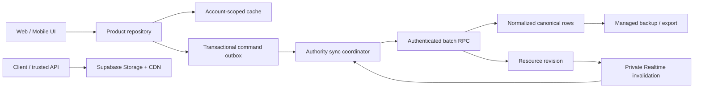

# OnVoy Data Architecture Technical Spec

## 1. Authority Model

OnVoy uses **offline-capable server authority**. Supabase normalized rows are the final
authority for committed trips, plans, checklists, templates, membership, and invitations.
Web IndexedDB and Mobile SQLite provide account-scoped cache, optimistic projection, and a
durable command outbox. They are not an independent source of truth.

Yjs, WebRTC/P2P, signaling, app-layer document encryption, document update backup, and device
key provisioning are retired. Supabase managed backup/export is the remote recovery layer.

```mermaid
flowchart LR
    UI["Web / Mobile UI"] --> Repo["Product repository"]
    Repo --> Cache["Account-scoped cache"]
    Repo --> Outbox["Transactional command outbox"]
    Outbox --> Sync["Authority sync coordinator"]
    Sync --> RPC["Authenticated batch RPC"]
    RPC --> Rows["Normalized canonical rows"]
    RPC --> Revision["Resource revision"]
    Revision --> RT["Private Realtime invalidation"]
    RT --> Sync
    Asset["Client / trusted API"] --> Storage["Supabase Storage + CDN"]
    Rows --> Backup["Managed backup / export"]
```

## 2. Product Boundaries

- Shared product contracts live in `packages/core/src/product`.
- Authority synchronization lives in `packages/core/src/authority`.
- Supabase transport lives in `packages/core/src/supabase/serverAuthorityRepository.ts`.
- Web persistence lives in `apps/web/lib/server-authority`; Mobile persistence lives in
  `apps/mobile/lib/server-authority`.
- Web/Mobile UI calls the product repository factory. It must not directly mutate normalized
  product rows, IndexedDB, SQLite, or legacy document tables.

The authority resource boundary is a trip or template. A trip bundle contains its trip row,
plans, checklist rows, accepted members, and the caller's role. A template bundle contains the
template and its items/shares. Private checklist items are filtered server-side.

## 3. Read and Write Protocol

Reads return the account-local optimistic projection immediately when available. Detail entry,
foreground, reconnect, or a Realtime invalidation compares revisions and fetches canonical data
when needed.

A mutation follows this sequence:

1. Validate the domain input and actor role.
2. In one local transaction, update the optimistic projection and append a command.
3. Batch up to 32 commands through `apply_trip_commands` or `apply_template_commands`.
4. The server validates membership, role, base revision, entity version, and `operation_id`.
5. Apply canonical rows and revision atomically; return acknowledgement or conflict.
6. Rebase pending commands on the acknowledgement. Retry transient errors with backoff.

`operation_id` provides idempotency. Revision and entity version, not `updated_at`, determine
conflicts. A permission revocation is terminal: purge that resource and its pending outbox.

## 4. Realtime and Offline Behavior

Realtime carries only resource type/id, revision, and changed entity identifiers. It never
carries full product content. Missed or truncated invalidations are recovered through revision
comparison and canonical bundle refresh.

Offline edits remain in the durable outbox and are flushed on reconnect/foreground. Cache and
outbox keys always include `account_id`; signing out detaches the account without exposing one
account's data to another. The former separately downloaded trip bundle is not used.

## 5. Membership, Invitations, and Assets

`documents` and `document_members` remain the permission registry. Canonical invitation RPCs
create and accept targeted links/codes without document keys. Owner/editor/viewer enforcement is
server-side; client role checks are UX only.

Asset bytes do not enter command or Realtime payloads. Clients or trusted API routes upload
immutable variants to Supabase Storage, register metadata, and retain references in canonical
rows. Orphan cleanup is a service-role maintenance operation.

## 6. Security and Operations

- Supabase Auth, RLS/RPC authorization, TLS, and provider-managed at-rest encryption are the
  security boundary.
- Never log content, invitation tokens, credentials, command payload bodies, or private rows.
- Legacy sync objects remain retained but revoked during the rollback window.
- DEV V1 reset is explicit and project-ID guarded. Production physical deletion requires export,
  minimum supported client enforcement, observation, approval, and TASK-056.
- Rollout and rollback order is defined in
  `docs/refactor/runbooks/TASK-055-legacy-runtime-retirement.md`.

## 7. Verification Contract

Every data-path change must cover focused Core/platform tests, SQL RLS/RPC tests, typecheck, Web
build, Mobile export, and relevant E2E. Production readiness additionally requires cross-device,
cross-account, offline/reconnect, revoke, conflict, asset, restore, and cost gates in TASK-056.
