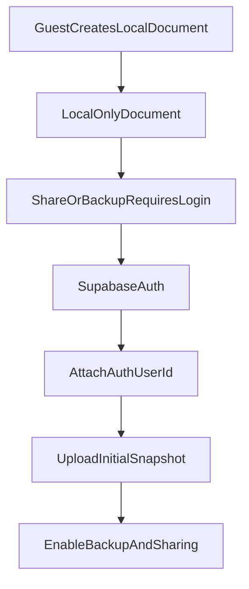

# ADR-007: 인증, 계정 연결, 지연 인증 전략

- 상태: 채택됨
- 결정일: 2026-06-29
- 결정자: ysjee141
- 관련 문서:
  - `docs/refactor/TECHNICAL-SPEC.md`
  - `docs/refactor/adrs/ADR-001-local-first-data-engine.md`

---

## 문제 정의

Local-first 아키텍처에서는 로컬 저장소가 먼저 동작하므로 로그인 없이도 여행 일정과 준비물 데이터를 만들 수 있다. 그러나 클라우드 백업, 웹/모바일 간 복구, 친구 초대, 권한 관리, 푸시 알림을 제공하려면 사용자 식별자가 반드시 필요하다.

따라서 다음을 결정해야 한다.

- 앱 최초 사용 시 로그인을 강제할 것인가?
- guest local data를 로그인 계정으로 어떻게 귀속할 것인가?
- Kakao, Apple, Google, Email 로그인에서 어떤 개인정보 수집을 전제로 할 것인가?
- 계정 탈퇴/로그아웃 시 local-first 데이터와 백업 데이터를 어떻게 처리할 것인가?

---

## 결정해야 할 질문

Local-first UX를 위해 “선 사용, 후 로그인”을 허용할 것인가?

---

## 선택지

### Option A: 기존처럼 로그인 후 사용

장점:

- Supabase Auth/RLS 경계가 단순하다.
- 모든 데이터가 처음부터 `user_id`에 귀속된다.
- 백업과 복구 UX가 단순하다.

단점:

- 초기 진입 장벽이 높다.
- local-first의 장점인 즉시 사용 경험을 살리기 어렵다.
- 여행 계획을 가볍게 시작하는 사용자에게 부담이 된다.

### Option B: Guest local-first 사용 후 네트워크 기능에서 로그인 유도

장점:

- 앱 설치 직후 바로 여행/준비물 작성 가능하다.
- 공유, 백업, 기기 변경 복구가 필요한 시점에 로그인 필요성을 자연스럽게 설명할 수 있다.
- 초기 이탈을 줄일 수 있다.

단점:

- guest document를 계정 document로 귀속하는 migration이 필요하다.
- 동일 기기에 여러 계정이 로그인할 때 데이터 격리가 중요하다.
- guest 상태에서 앱 삭제 시 데이터가 사라진다는 안내가 필요하다.

### Option C: Supabase anonymous auth 사용 후 계정 업그레이드

장점:

- guest도 서버 관점의 user id를 가질 수 있다.
- 나중에 social/email 계정으로 link하는 흐름을 만들 수 있다.
- backup opt-in을 조금 더 일찍 제공할 수 있다.

단점:

- anonymous user lifecycle 관리가 필요하다.
- Supabase Auth 정책과 provider link 제약을 검토해야 한다.
- 사용자에게 “익명 계정” 개념이 혼란스러울 수 있다.

---

## 결정

Option B를 채택한다. Local-first UX를 위해 guest local-first 사용을 허용하고, 공유/백업/동기화/초대 수락 시점에 로그인을 유도한다.

Option C(Supabase anonymous auth)는 당장 채택하지 않고, Supabase 지원 범위와 계정 연결 UX를 별도 검증한다.

정책:

- 로컬 여행/준비물 작성은 guest로 허용한다.
- 공유, 클라우드 백업, 웹/모바일 동기화, 초대 수락 시 로그인 필요.
- 로그인 완료 시 guest local document를 계정 소유 document로 승격한다.
- guest document에는 `localOwnerId`를 두고, 계정 연결 시 `ownerId = auth.user.id`로 migration한다.

---

## 지원 로그인 방식

- Email/password
- Kakao OAuth
- Google OAuth
- Apple OAuth

수집 가정:

- Email: 이메일 주소, Supabase Auth password hash
- Kakao: 이메일, 닉네임/프로필 정보, Kakao provider id
- Google: 이메일, 이름/닉네임, 프로필 이미지, Google provider id
- Apple: 이메일 또는 private relay email, 이름, Apple provider id

최소 수집 원칙:

- 협업자 식별에 필요한 이메일/닉네임 중심으로 수집한다.
- 프로필 이미지는 선택 정보로 취급하는 방향을 우선 검토한다.
- provider id는 계정 연결과 중복 가입 방지 목적으로만 사용한다.

---

## Guest 데이터 승격 흐름

승격 조건:

- 로그인 성공
- document owner가 local guest owner인 상태
- 기존 계정에 같은 document id가 없는 상태
- backup upload 성공 또는 retry queue 등록 성공

---

## 개인정보 처리방침 반영 항목

필수 고지:

- 로그인 provider별 수집 항목
- 사용자가 입력한 여행/일정/준비물 데이터의 로컬 저장 및 클라우드 백업
- 협업 초대 시 참여자 간 프로필 정보와 작성 데이터 공유
- WebRTC 연결 및 signaling 과정에서 IP 주소/네트워크 정보 처리 가능성
- 기기 동기화를 위한 device id, push token, sync state 수집
- Supabase 및 하위 인프라에 대한 개인정보 처리 위탁

---

## 승인 기준

- guest document와 authenticated document 간 migration 테스트가 가능하다.
- 앱 삭제 시 guest 데이터 유실 가능성을 UX에서 안내한다.
- 로그인 후 기존 guest data가 중복 생성되지 않는다.
- 로그아웃/계정 전환 시 local document 격리가 보장된다.
- 개인정보 처리방침에 수집/공유/위탁 항목이 반영된다.

---

## 후속 작업

- guest local owner id 설계
- account attach migration PoC
- provider별 개인정보 수집 항목 확정
- 회원 탈퇴 시 local/backup 삭제 정책 정리
- 약관/개인정보 처리방침 개정안 작성
