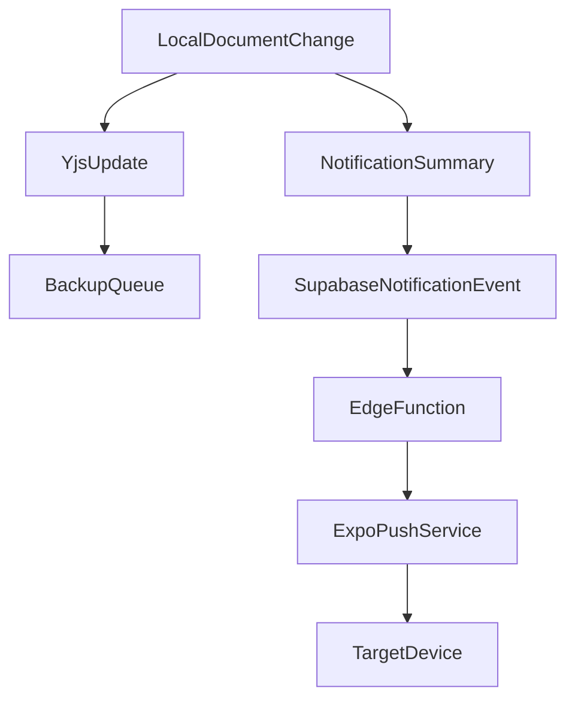

# ADR-009: Local-First 환경의 푸시 및 로컬 알림 전략

- 상태: 채택됨
- 결정일: 2026-06-29
- 결정자: ysjee141
- 관련 문서:
  - `docs/refactor/TECHNICAL-SPEC.md`
  - `docs/refactor/adrs/ADR-001-local-first-data-engine.md`
  - `docs/refactor/adrs/ADR-006-search-analytics-indexing.md`

---

## 문제 정의

전통적인 서버 중심 구조에서는 서버가 row 변경 내용을 해석해 푸시 알림을 발송한다. Local-first 전환 후 Supabase에는 Yjs update blob 또는 snapshot이 저장되며, 서버는 변경 내용의 의미를 직접 알기 어렵다.

하지만 여행 서비스에는 두 종류의 알림이 필요하다.

1. 일정 시간 기반 리마인더
2. 협업 변경 알림

두 알림은 성격이 다르므로 같은 방식으로 처리하면 안 된다.

---

## 결정해야 할 질문

Local-first 구조에서 푸시 알림과 로컬 알림을 어떤 책임 분리로 처리할 것인가?

---

## 선택지

### Option A: 모든 알림을 서버 푸시로 처리

장점:

- 알림 발송 경로가 일관적이다.
- 기기가 꺼져 있어도 서버가 알림을 보낼 수 있다.

단점:

- 서버가 CRDT update 의미를 해석해야 한다.
- 오프라인/로컬 수정과 맞지 않는다.
- E2EE 도입 시 변경 내용을 알 수 없다.

### Option B: 시간 기반 알림은 로컬, 협업 변경은 서버 metadata push

장점:

- 여행 일정 리마인더는 네트워크 없이도 동작한다.
- 협업 알림은 사람이 읽을 수 있는 metadata만 서버에 전달하면 된다.
- Yjs blob과 알림 요약을 분리할 수 있다.

단점:

- 클라이언트가 notification summary를 생성해야 한다.
- 오프라인 변경을 나중에 묶어 보낼 batching 정책이 필요하다.

### Option C: 모든 알림을 로컬 동기화 후 클라이언트가 판단

장점:

- 서버가 사용자 내용을 몰라도 된다.
- local-first 철학에 가깝다.

단점:

- 앱이 실행되지 않으면 협업 알림을 받을 수 없다.
- 사용자가 변경 사실을 늦게 알 수 있다.

---

## 결정

Option B를 채택한다.

- 일정 리마인더: 기기 로컬 알림으로 예약
- 협업 변경 알림: Supabase Edge Function 또는 DB webhook으로 push
- Yjs update blob과 알림 metadata는 분리
- 오프라인 중 발생한 다수 변경은 summary batching

---

## 알림 데이터 모델

제안 테이블:

```sql
create table public.notification_events (
  id uuid default gen_random_uuid() primary key,
  document_id uuid references public.documents(id) on delete cascade not null,
  actor_id uuid references public.profiles(id),
  event_type text not null,
  target_user_ids uuid[] not null,
  title text not null,
  body text not null,
  dedupe_key text,
  created_at timestamptz default now() not null,
  delivered_at timestamptz
);
```

기존 `user_devices` 또는 새 `push_tokens` 테이블을 사용해 target device를 찾는다.

---

## 협업 알림 흐름



규칙:

- document content 전체를 notification payload에 넣지 않는다.
- 여러 변경은 `dedupe_key`로 묶는다.
- 사용자가 같은 document를 현재 보고 있으면 push 대신 in-app toast를 우선한다.
- viewer에게는 읽기 가능한 변경 알림만 보낸다.

---

## 로컬 알림

일정 리마인더는 local materialized read model을 기반으로 기기 OS에 예약한다.

대상:

- 일정 시작 전 알림
- 준비물 마감/출발 전 리마인더

정책:

- plan 변경 시 기존 로컬 알림을 취소하고 재등록한다.
- backup sync 성공 여부와 무관하게 로컬 알림은 유지한다.
- 로그아웃 또는 document 접근 해제 시 해당 document의 로컬 알림을 제거한다.

---

## 승인 기준

- 서버가 Yjs blob을 해석하지 않아도 협업 알림을 보낼 수 있다.
- 오프라인 변경이 온라인 복구 시 과도한 푸시 폭탄으로 이어지지 않는다.
- 일정 리마인더가 오프라인에서도 동작한다.
- push token 저장과 삭제가 계정/기기 lifecycle과 연결된다.

---

## 후속 작업

- notification metadata schema 설계
- Expo push token lifecycle 정리
- 로컬 알림 scheduler 추상화
- 협업 알림 batching/debounce 정책 작성
- Edge Function push PoC
