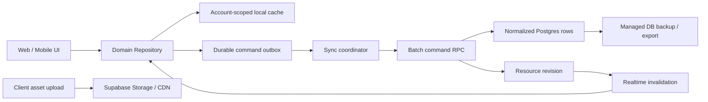

# ADR-015: Offline-Capable Server Authority

- 상태: 채택됨
- 결정일: 2026-07-17
- 결정자: ysjee141
- 관련 문서:
  - `docs/refactor/reports/PRODUCT-DATA-TRANSPORT-COST-EVALUATION.md`
  - `docs/refactor/reports/LOCAL-FIRST-DATA-INTEGRITY-AUDIT.md`
  - `docs/refactor/tasks/README.md`

## 결론

OnVoy의 제품 데이터 최종 권위를 **Supabase normalized row**로 전환한다. Web과 Mobile은 계정별 local cache와
durable domain-command outbox를 사용해 빠른 화면, optimistic update, offline edit를 제공한다. Supabase는
Auth, RLS, canonical row, transaction, Realtime invalidation, Storage, managed backup을 담당한다.

WebRTC/P2P, Yjs CRDT, app-layer E2EE, encrypted document snapshot/update backup은 목표 아키텍처에서 제거한다.
향후 rich text나 whiteboard가 추가될 때만 해당 subdocument에 CRDT를 다시 검토한다.

## 배경

현재 구현은 작은 entity 변경도 전체 `TripDocumentV1`에 가까운 Yjs update로 직렬화한다. 같은 payload를 P2P와
Supabase backup에 모두 보내며, device key 전달과 플랫폼별 restore 경로까지 운영한다. 대표 Trip에서 일정 한 개
추가 update는 39,196 bytes, 같은 의미의 domain command는 425 bytes로 측정됐다.

OnVoy의 여행, 일정, 준비물, 템플릿 데이터는 대부분 독립 row mutation이다. 문자 단위 병합이나 peer-only 협업보다
계정 간 정합성, 권한, offline 재시도, 낮은 운영비가 더 중요하다.

## 승인된 결정

| 질문 | 결정 |
|---|---|
| Supabase를 데이터 최종 권위로 둘 수 있는가 | 예 |
| zero-knowledge E2EE가 필수인가 | 아니오 |
| offline-capable server authority를 허용하는가 | 예 |
| WebRTC/P2P를 제거할 수 있는가 | 예 |
| 현재 V1 document/backup 데이터를 초기화할 수 있는가 | 예 |
| rich content 추가 전까지 CRDT를 제거할 수 있는가 | 예 |

## 목표 구조

## 데이터 및 동기화 원칙

1. Supabase row가 committed data의 최종 권위다.
2. UI는 Repository만 호출한다. 화면에서 Supabase, IndexedDB, SQLite를 직접 호출하지 않는다.
3. local mutation과 outbox append는 하나의 local transaction으로 commit한다.
4. command는 `operation_id`, `base_revision`, entity version을 포함한다.
5. server는 권한, idempotency, conflict를 검증한 뒤 canonical row와 새 revision을 반환한다.
6. outbox는 1~3초 또는 최대 32개 command 단위로 batch한다.
7. Realtime은 `resource_id`, revision, changed entity ID만 전송한다.
8. event가 유실되면 foreground, reconnect, detail enter에서 revision을 비교해 복구한다.
9. Initial 단계에는 영구 change log 없이 full bundle refresh fallback을 사용한다.
10. `updated_at`은 표시와 진단에 사용하고 conflict 판단은 revision/version을 사용한다.

## 권한과 보안

- Supabase Auth와 RLS를 유지한다.
- `document_members`와 invitation registry를 server authority로 유지하되 document key 전달 책임은 제거한다.
- client가 보낸 `user_id`, role, server timestamp를 신뢰하지 않는다.
- 전송은 TLS, 저장은 Supabase provider-managed encryption을 사용한다.
- revoke 시 server write/read를 즉시 차단하고 각 플랫폼은 해당 계정 local cache와 pending outbox를 정리한다.
- plaintext document key, wrapped key, device key material은 신규 경로에서 생성하지 않는다.

## 로컬 저장소

- Web은 IndexedDB를 사용한다.
- Mobile은 transactional outbox를 위해 SQLite를 사용한다.
- 모든 key와 row는 `account_id` namespace를 포함한다.
- 로그아웃은 다른 계정 cache를 삭제하지 않지만 현재 계정 연결을 해제한다.
- 계정 전환 시 이전 계정 데이터가 UI나 query result에 섞이면 안 된다.
- 비로그인 guest draft는 별도 guest namespace에만 저장하고, 로그인 시 authenticated create command로 승격한다.
- guest draft는 승격 전까지 협업, Realtime, cross-device 복구를 지원하는 committed data로 간주하지 않는다.

## 전환 및 데이터 처리

- 현재 V1 Yjs document와 encrypted backup은 새 authority로 자동 migration하지 않는다.
- TASK-055 이후 제품 runtime은 authority-only다. 롤백은 retired runtime feature flag가 아니라
  직전의 검증된 authority-only client와 비파괴 schema/function 복원으로 수행한다.
- Web/Mobile cutover 이후 DEV에서 V1 local/remote 데이터를 reset한다.
- Production destructive cleanup은 export, 지원 client 버전 확인, rollback gate를 통과한 뒤 실행한다.
- 기존 관계형 table은 schema/RLS를 감사한 뒤 canonical authority로 재사용한다.
- 기존 row 데이터를 제품에 다시 노출하는 migration은 이번 전환의 필수 조건이 아니다.

## 대체되는 결정

| 기존 ADR | 처리 |
|---|---|
| ADR-001 | Local-first document engine 목표를 본 ADR로 대체 |
| ADR-003 | app-layer backup encryption/key management를 제거 |
| ADR-004, ADR-012 | P2P signaling 전략을 제거 |
| ADR-005 | Trip 단위 Yjs document를 normalized row로 대체 |
| ADR-010 | 운영비 기준을 비용 평가 보고서와 본 ADR로 대체 |
| ADR-011 | invitation key provisioning을 제거 |
| ADR-013 | full product 범위는 유지하고 document-primary 방식만 대체 |
| ADR-014 | 기존 데이터 reset 결정은 유지하고 sync 기준을 대체 |

## 결과

장점:

- mutation payload와 restore 비용이 document 크기가 아니라 변경 entity 크기에 비례한다.
- Auth, RLS, DB, Realtime, Storage를 Supabase 한 계층에서 운영한다.
- Web/Mobile이 같은 command와 conflict 계약을 사용한다.
- key provisioning, P2P lifecycle, CRDT compaction 운영이 사라진다.

단점:

- server-independent collaboration과 zero-knowledge E2EE를 제공하지 않는다.
- offline conflict와 outbox retry를 제품 도메인별로 명시해야 한다.
- Mobile에 SQLite persistence와 migration lifecycle이 추가된다.

## 후속 작업

구현 순서는 `TASK-046`부터 `TASK-056`까지 따른다. legacy runtime 제거는 Web/Mobile cutover와 통합 검증보다
먼저 수행하지 않는다.

## TASK-056 충돌 및 운영 결정

- 일반 entity upsert/delete는 row `version`을 optimistic concurrency token으로 사용한다.
- stale resource revision이라도 command가 다른 entity의 현재 version과 일치하면 server가 현재
  revision으로 재기준화한다.
- 같은 entity의 version이 바뀌었으면 자동 last-write-wins를 하지 않는다. 사용자가 server 최신
  내용 유지 또는 local 변경 재적용을 선택한다.
- per-user checklist check는 actor-scoped deterministic set이라 stale rebase를 허용한다.
- assignee whole-set은 aggregate version이 없으므로 resource conflict를 유지한다.
- Initial 관측은 GA4/Firebase aggregate event와 Supabase dashboard를 사용한다. 유료 Log Drain과
  PITR은 runbook의 사용량/RPO trigger에서 도입한다.
