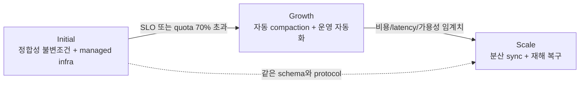
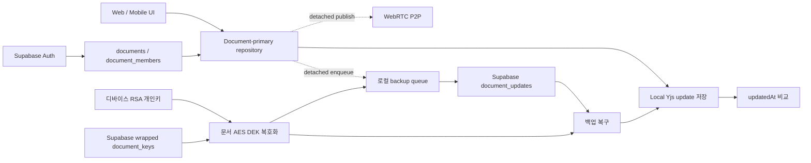
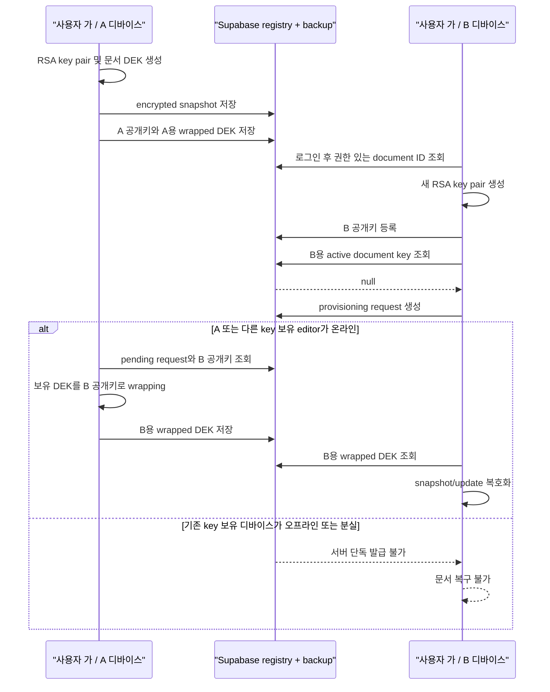
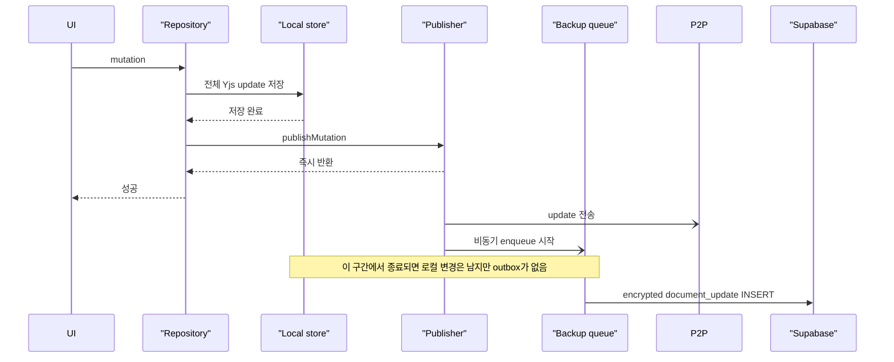
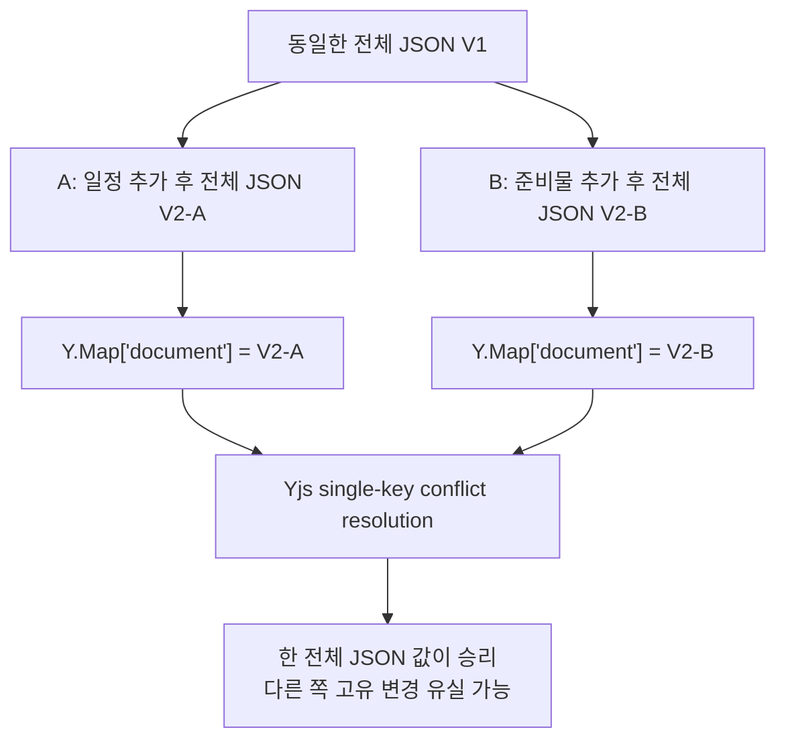
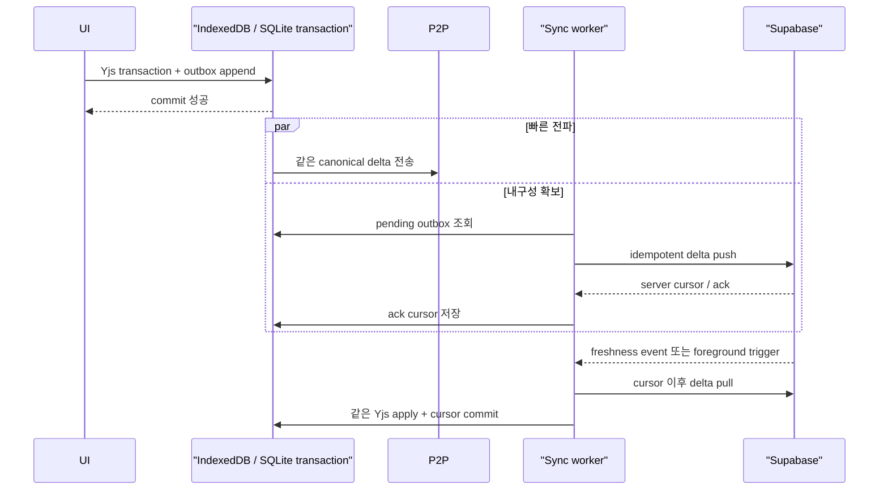
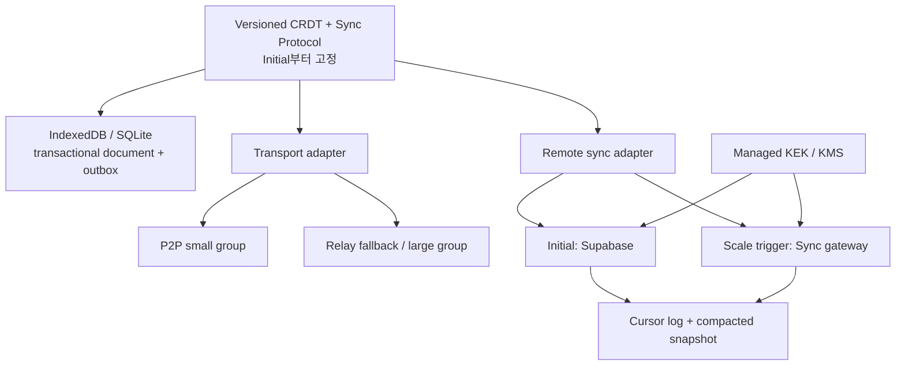

# Local-First Production 데이터 정합성 아키텍처 감사

- 상태: Production lifecycle 재평가 완료, 의사결정 필요
- 기준 브랜치: `refactoring/local-first-architecture`
- 기준 커밋: `77c8566`
- 분석일: 2026-07-17
- 범위: 여행, 일정, 준비물, 템플릿, 동행자 권한, Web/Mobile 저장소, P2P, 백업/복구, 운영 비용 및 확장성

## 결론

현재 구조는 **계정 단위 데이터 가용성, 전송 경로 간 수렴성, 모바일 계정 격리**를 보장하지 못한다.
따라서 Closed Beta뿐 아니라 첫 Production 운영의 최소 기준도 충족하지 못한다. 최근 RLS 보강은 중앙 권한 경계를 개선했지만,
사용자가 겪은 "A 디바이스에서 만든 여행이 B 디바이스에서 보이지 않음"은 RLS만의 문제가 아니다.

핵심 원인은 다음 네 가지다.

1. 문서 복호화 권한이 계정이 아니라 **기존 디바이스가 보유한 개인키**에 종속된다.
2. Yjs가 엔터티별 CRDT가 아니라 **전체 JSON 한 개 값**을 저장한다. Web P2P만 별도 병합을 수행해 전송 경로마다 결과가 달라진다.
3. 로컬 저장과 백업 outbox 기록이 원자적이지 않다. Mobile 복구는 `document_updates`를 적용하지 않는다.
4. Mobile 로컬 문서는 계정 namespace가 없고, 일반 로그아웃이 디바이스 키를 폐기한다.

단편적인 예외 처리나 RLS 추가로는 해결할 수 없다. 암호화 가용성 모델, CRDT 모델, outbox 및
복구 프로토콜을 먼저 결정한 뒤 데이터 경로를 재구성해야 한다.

다만 해결 방향을 Closed Beta에만 맞춰서는 안 된다. **초기 단계에는 Production과 동일한 데이터
불변조건 및 versioned sync protocol을 적용하고, 처리량·운영 자동화·인프라만 단계적으로 확장**해야 한다.
초기 편의를 위해 장기 보안 모델을 임시로 바꾸거나 폐기할 기능을 만드는 전략은 권장하지 않는다.

## 목차

- [제품 불변조건](#제품-불변조건)
- [재평가에서 변경한 판단](#재평가에서-변경한-판단)
- [평가 단계와 초기 목표](#평가-단계와-초기-목표)
- [현재 아키텍처](#현재-아키텍처)
- [권한 정책과 데이터 권위](#권한-정책과-데이터-권위)
- [암호화와 키 교환](#암호화와-키-교환)
- [로컬 저장소](#로컬-저장소)
- [백업, 동기화 및 복구](#백업-동기화-및-복구)
- [Yjs와 데이터 수렴성](#yjs와-데이터-수렴성)
- [P2P 통신](#p2p-통신)
- [위험도별 감사 결과](#위험도별-감사-결과)
- [권장 목표 구조](#권장-목표-구조)
- [단계별 Production 로드맵](#단계별-production-로드맵)
- [비용과 확장성 평가](#비용과-확장성-평가)
- [의사결정 항목](#의사결정-항목)
- [Production 단계 검증 기준](#production-단계-검증-기준)
- [코드 근거](#코드-근거)

## 제품 불변조건

아래 조건은 구현 방식과 관계없이 항상 참이어야 한다.

| ID | 불변조건 | 현재 상태 |
|---|---|---|
| INV-01 | 같은 계정은 새 디바이스에서 권한이 있는 모든 문서를 복구한다. | 불충족 |
| INV-02 | 로컬 저장 성공 후 앱이 종료돼도 백업할 변경이 유실되지 않는다. | 불충족 |
| INV-03 | Web P2P, Mobile P2P, 백업 복구는 같은 변경 집합에 대해 같은 결과를 만든다. | 불충족 |
| INV-04 | 한 디바이스에서 계정을 전환해도 다른 계정의 로컬 문서를 읽지 않는다. | Mobile 불충족 |
| INV-05 | P2P 실패 여부와 무관하게 비동기 백업 및 복구가 완료된다. | 불충족 |
| INV-06 | owner/editor/viewer/revoked 권한을 중앙 registry가 일관되게 강제한다. | 부분 충족 |
| INV-07 | 로컬과 원격이 갈라져도 변경을 버리지 않고 결정적으로 병합한다. | 불충족 |

이 불변조건은 사용자 규모와 무관하다. 초기에는 처리량과 자동화 수준을 낮출 수 있지만 데이터 무손실,
권한 격리, 복구 가능성은 중기나 최종 단계로 미룰 수 없다.

## 재평가에서 변경한 판단

| 항목 | 이전 Closed Beta 중심 판단 | Production lifecycle 판단 |
|---|---|---|
| 아키텍처 목표 | Beta 시작을 위한 결함 제거 | Initial부터 최종 schema/protocol을 사용하고 인프라만 확장 |
| 암호화 | 앱 payload 암호화를 제거하는 Option A 우선 | 관리형 KEK/KMS 기반 Option B를 Initial부터 권장 |
| 새 디바이스 | provisioning 결함 수정 | 기존 디바이스와 무관한 계정 복구를 영구 불변조건으로 설정 |
| P2P | 즉시 정상화 대상 | durable sync가 먼저이며 같은 canonical update 위에서 Initial 후반에 활성화 |
| 비용 | P2P로 Supabase 의존도 감소 | P2P만으로 backup write는 줄지 않으므로 batching/compaction을 주 비용 수단으로 설정 |
| 단계 전환 | task 완료 기준 | SLO, quota, restore latency, TURN/Supabase 비용 trigger 기준 |

## 평가 단계와 초기 목표

단계 구분은 고정 일정이 아니라 사용자 규모와 운영 지표를 함께 사용한다. MAU 범위는 용량 산정을 위한
계획값이며, 실제 단계 전환은 SLO와 비용 임계치가 결정한다.

| 단계 | 계획 구간 | 제품 목표 | 아키텍처 원칙 |
|---|---|---|---|
| Initial | Closed Beta부터 첫 Production, 최대 1,000 MAU | 데이터 무손실과 계정 단위 복구를 검증하고 실제 사용자에게 제공 | 최종 protocol과 데이터 model을 사용하고 managed infrastructure로 운영 |
| Growth | 1,000~50,000 MAU 또는 초기 SLO/비용 임계치 도달 | 동시 편집 품질, 자동 compaction, 운영 관측 및 key/device 관리 확장 | 동일 protocol을 유지하며 worker, partition, transport 정책 확장 |
| Scale | 50,000 MAU 이상 또는 Supabase/TURN/latency 임계치 도달 | 고가용성, 대규모 비용 최적화, 재해 복구 및 인프라 선택권 확보 | sync gateway, storage 분리, multi-region을 측정값에 따라 도입 |

### 현재 단계별 평가

| 단계 | 현재 판정 | 근거 |
|---|---|---|
| Initial | **진입 불가** | DI-01~04 P0, transactional outbox/cursor 부재, 핵심 E2E 부재 |
| Growth | **평가 전제 미충족** | compaction production callsite, partition, key rotation, 운영 dashboard 부재 |
| Scale | **설계 기반 미충족** | protocol version/cursor contract, adapter boundary, DR 및 부하 기준 부재 |

현재 우선순위는 Scale 기능을 미리 구현하는 것이 아니다. Initial의 데이터 model과 protocol을
Production-compatible하게 다시 세우는 것이다.

### 선정한 Initial 목표치

| 항목 | Initial 목표 |
|---|---|
| 사용자/협업 규모 | 최대 1,000 MAU, 여행당 10명, 동시 편집자 5명 이하를 계획 기준으로 사용 |
| 로컬 내구성 | UI가 commit 성공을 표시한 변경의 local RPO 0 |
| 원격 내구성 | 온라인 상태의 committed 변경을 p95 30초 이내 durable backup, offline은 reconnect 후 30초 이내 |
| 새 디바이스 복구 | 기존 디바이스가 오프라인이어도 p95 10초 이내 목록 및 최신 본문 복구 |
| 실시간 전파 | P2P 연결 시 p95 750ms, 실패 시 correctness 영향 없음 |
| 데이터 수렴 | Web/Mobile/P2P/backup이 동일 update 집합에 대해 결정적으로 동등한 logical state 생성 |
| 계정 격리 | 계정 전환 후 다른 계정의 document, key, queue 접근 0건 |
| 지원 문서 크기 | binary asset 제외 logical document 5MB까지 restore/compaction 검증 |
| 운영 기준 | silent missing document 0건, unrecoverable committed change 0건 |

수치는 첫 용량 시험에서 조정할 수 있다. 그러나 `RPO 0 local`, `silent missing 0`, 계정 격리,
기존 디바이스 없는 복구는 완화할 수 없는 출시 조건이다.

## 현재 아키텍처

설계 문서는 로컬 문서를 편집 기준으로 두고 P2P를 빠른 전파 경로, Supabase를 권한 registry와
비동기 백업 경로로 정의한다. 방향 자체는 제품 목표와 맞지만 실제 구현은 세 경로가 동일한
문서 상태와 동기화 프로토콜을 공유하지 않는다.

의도와 구현의 가장 큰 차이는 다음과 같다.

- Supabase 백업은 독립적인 fallback이 아니라 디바이스별 키 provisioning 성공에 종속된다.
- Yjs update가 실제 증분 CRDT 연산이 아니라 매 변경 시 새로 만든 전체 문서 상태다.
- Mobile과 Web이 같은 백업 복구 및 병합 알고리즘을 사용하지 않는다.
- `updatedAt`을 문서 clock처럼 사용하지만 모든 변경이 이를 갱신하지 않으며 클라이언트 시계에도 의존한다.

## 권한 정책과 데이터 권위

### 권위 구분

| 대상 | 신뢰 가능한 권위 | 로컬 역할 |
|---|---|---|
| 로그인 사용자 | Supabase Auth `auth.uid()` | 세션 및 UI 캐시 |
| 문서 소유/참여 권한 | `documents`, `document_members`, SECURITY DEFINER RPC, RLS | 표시용 member snapshot, optimistic guard |
| 편집 중 문서 본문 | Web IndexedDB / Mobile local store | primary source |
| 비동기 복구 본문 | `documents.snapshot`, `document_updates` | 로컬이 없거나 원격이 최신일 때 hydrate |
| 복호화 가능 여부 | 디바이스 개인키 + 해당 디바이스의 `document_keys` | 서버는 wrapped DEK만 저장 |
| P2P 참여 | registry 기반 signaling topic/RLS | 화면이 전달한 role/member 목록으로 연결 계획 생성 |

TASK-043 이후 문서 생성은 `bootstrap_owner_document` RPC가 `documents`와 owner
`document_members`를 한 트랜잭션에서 만든다. 직접적인 `documents` INSERT 및
`document_members` mutation policy도 제거됐다. 다음 중앙 정책은 타당하다.

- accepted member만 문서와 update를 조회한다.
- owner/editor만 `document_updates`를 추가한다.
- owner만 snapshot을 갱신하고 member를 관리한다.
- 자신의 active device key만 조회한다.
- 초대 수락과 키 발급은 대상 사용자 및 owner/editor 조건을 RPC가 검증한다.

### Registry/RLS matrix

| 저장소 | 읽기 | 쓰기 | 현재 역할 |
|---|---|---|---|
| `documents` | accepted member | bootstrap RPC, owner snapshot update/delete | 문서 발견, initial/compacted snapshot |
| `document_members` | 관련 member | owner 관리 RPC, 대상 사용자 accept RPC | owner/editor/viewer authority |
| `document_updates` | accepted member | owner/editor INSERT | 비동기 변경 로그 |
| `user_key_materials` | 본인 | 본인 register/revoke RPC | 디바이스 공개키 registry |
| `document_keys` | 본인의 active key | owner/editor provisioning RPC | 디바이스별 wrapped DEK |
| `document_key_provisioning_requests` | 요청자와 처리 권한자 | 요청자 생성, owner/editor 완료 | 비동기 DEK 전달 queue |
| `document_invitation_links` | 권한 및 초대 대상 조건 | owner/editor 생성, 대상 사용자 accept | 초대 권한 전달 |
| signaling topic/message | accepted member | owner/editor signaling write | P2P 연결 협상 |

그러나 클라이언트의 `actorRole`은 여러 화면이 전달하는 값이다. 이 값은 로컬 mutation을 막는 UX
guard일 뿐 보안 경계가 아니다. 권한 회수 직후 오프라인 클라이언트는 로컬 사본을 계속 수정할 수
있다. 서버는 업로드를 거부할 수 있지만, 로컬 변경을 어떻게 잠그거나 폐기할지는 정의돼 있지 않다.
문서 내부 `members`와 중앙 registry가 달라졌을 때의 명시적 reconciliation 정책도 없다.

권한 회수는 이미 내려받은 plaintext/local copy를 원격으로 삭제할 수 없다. Initial 정책은 revoke 즉시
새 backup/P2P 접근을 차단하고, future update confidentiality가 필요하면 문서 DEK를 회전해야 한다.
사용자에게는 "향후 접근 차단"과 "기존 오프라인 사본 회수 불가"의 경계를 명확히 고지해야 한다.

## 암호화와 키 교환

### 현재 암호화 방식

| 항목 | 구현 |
|---|---|
| 문서 암호화 키(DEK) | 문서별 AES-GCM 256-bit key |
| payload 암호화 | AES-GCM-256, payload마다 12-byte random IV |
| 무결성 | AES-GCM 인증 태그 + 평문 SHA-256 hash 검증 |
| 디바이스 wrapping key | RSA-OAEP 2048-bit, SHA-256 |
| 서버 저장 | 암호화 snapshot/update, 공개 JWK, 디바이스별 wrapped DEK |
| Web 개인키 | export 가능한 private JWK를 IndexedDB에 저장 |
| Mobile 개인키 | native non-exportable RSA key 우선, SecureStore legacy fallback |

암호 알고리즘 선택 자체보다 **복구 주체**가 문제다. 서버는 raw DEK나 서버가 해독할 수 있는
KEK를 보유하지 않는다. 따라서 새 디바이스가 로그인해도 기존 디바이스 또는 editor가 온라인에서
새 디바이스 공개키로 DEK를 다시 wrapping해야 한다.

### 새 디바이스 키 발급 흐름

이 흐름은 ADR-011의 E2EE 선택과 일치한다. 그러나 "계정으로 로그인하면 어느 디바이스에서나
최신 데이터를 본다"는 제품 기대와 양립하지 않는다. 같은 계정의 B 디바이스도 별도 collaborator가
아니라 provisioning 대상이다.

### Snapshot이 있는데 왜 보이지 않는가

신규 여행 생성은 초기 encrypted snapshot을 Supabase에 저장한다. 하지만 snapshot 존재는 복구의
필요조건일 뿐 충분조건이 아니다.

1. B는 RLS를 통과해 `documents.id`를 조회한다.
2. B에는 자신의 RSA 개인키로 wrapping된 DEK가 없다.
3. restore가 `key_unavailable`로 끝나 `null` document를 반환한다.
4. 목록 repository는 hydrate에 실패한 `null` 문서를 필터링한다.
5. 사용자는 권한 또는 키 대기 상태 대신 "여행이 없음"을 보게 된다.

즉, 현재 증상은 snapshot 미생성만으로 설명되지 않는다. **권한 있음, snapshot 있음, 복호화 불가**가
동시에 발생할 수 있다.

신규 문서 생성도 전체가 원자적이지 않다. local document 저장 후 registry bootstrap, device material
등록, encrypted snapshot update, wrapped DEK upsert를 순차 호출한다. registry만 RPC 트랜잭션이다.
중간 실패 시 local-only 문서, snapshot 없는 registry, 또는 wrapped key 없는 encrypted snapshot이
남을 수 있다.

## 로컬 저장소

| 데이터 | Web | Mobile | 평가 |
|---|---|---|---|
| 여행 문서 | IndexedDB `tripDocuments`, `user:<userId>:<documentId>` | AsyncStorage `onvoy:local-first:yjs-update:<documentId>` | Mobile 계정 namespace 없음 |
| 템플릿 | 같은 store, `<namespace>:templates` | AsyncStorage `onvoy:local-first:template-yjs-update:<documentId>` | Mobile 계정 namespace 없음 |
| 디바이스 ID | `localStorage` | SecureStore | install identity로 사용 |
| 디바이스 개인키 | IndexedDB private JWK | native keystore/SecureStore | Web은 same-origin XSS에 노출 가능 |
| 백업 queue | IndexedDB, `<deviceId>:<documentId>` | AsyncStorage, `<deviceId>:<documentId>` | account ID 없음 |
| 일반 로그아웃 | 문서, device ID, key 유지 | key material 폐기, device ID 삭제 | 플랫폼 정책 불일치 |

Mobile repository는 `listTrips(userId)`에 전달된 사용자 ID와 무관하게 prefix에 해당하는 모든 로컬
문서를 열 수 있다. 동일 설치에서 계정을 전환하면 이전 계정의 로컬 문서를 다음 계정이 읽을 수 있는
P0 개인정보 위험이다.

Mobile 일반 로그아웃은 `revoke_user_key_material`을 호출한다. 이 RPC는 해당 디바이스의 모든
`document_keys`도 revoke한다. 이후 로컬 개인키와 device ID까지 삭제한다. 반면 로컬 문서는 남는다.
그 결과 같은 디바이스에 재로그인해도 새 디바이스처럼 provisioning이 필요하고, 기존 queue는 이전
device ID 아래 고립될 수 있다.

브라우저의 `localStorage`는 ID와 작은 marker에는 적합하지만 문서 저장소로 사용하면 안 된다.
현재 Web 문서가 IndexedDB에 있는 선택은 맞다. Mobile은 계정 namespace뿐 아니라 문서와 outbox를
한 트랜잭션으로 기록할 수 있는 SQLite 계열 저장소가 더 적합하다.

## 백업, 동기화 및 복구

### 현재 mutation 경로

`persistAndPublish`는 publisher를 await하지만, Web/Mobile publisher 구현은 내부에서 detached
`void (async () => ...)`를 시작하고 즉시 반환한다. 따라서 로컬 문서 저장과 queue enqueue는 하나의
내구성 경계가 아니다. 탭 또는 앱이 그 사이 종료되면 이후 자동으로 업로드할 변경 기록이 없다.

### Web과 Mobile 복구 차이

| 단계 | Web | Mobile |
|---|---|---|
| 원격 ID 조회 | `documents` | `documents` |
| DEK 조회/unwrap | 수행 | 수행 |
| initial snapshot 적용 | 수행 | 수행 |
| `document_updates` 전체 재생 | 수행 | **수행하지 않음** |
| 병합 알고리즘 | raw single-key Yjs | raw single-key Yjs |
| 최신 판단 | snapshot/update timestamp vs root `updatedAt` | 동일 |

Mobile의 `restoreMobileEncryptedSnapshot`은 snapshot만 내려받아 적용한다. 여행과 템플릿 repository도
`document_updates`를 복구하지 않는다. 한편 `shouldCreateBackupSnapshot` 정책 함수는 core와 테스트에만
있고 production callsite가 없다. 즉 snapshot이 생성 시점 이후 compact되지 않으므로, Mobile 새
디바이스는 키가 있어도 생성 이후 변경을 놓칠 수 있다.

### freshness와 ordering

현재 최신 판단은 다음 문자열 timestamp의 최댓값을 비교한다.

- Supabase `documents.updated_at`
- 마지막 `document_updates.created_at`
- 로컬 root의 `trip.updatedAt` 또는 `template.updatedAt`

이 방식에는 세 문제가 있다.

- update의 `created_at`과 root `updatedAt`은 클라이언트 시계에 의존한다.
- `planUrl.upsert`, `checklist.create`, 일부 checklist mutation은 `trip.updatedAt`을 갱신하지 않는다.
- 양쪽에 고유 변경이 있으면 version/cursor 기반 merge가 아니라 한쪽 전체 문서를 선택하거나 덮어쓴다.

`updatedAt`은 표시용 metadata로는 적합하지만 동기화 순서 또는 충돌 해결 clock으로 사용할 수 없다.

또한 update INSERT는 `(document_id, client_id, seq)` unique constraint로 중복을 막지만 client가
ambiguous network failure 후 같은 update를 재시도했을 때 unique violation을 성공으로 처리하지 않는다.
서버에는 이미 저장됐는데 로컬 queue는 failed에 머무를 수 있다.

## Yjs와 데이터 수렴성

현재 `TripDocumentV1`과 `TemplateDocumentV1`은 각각 Y.Map의 `document` 키 하나에 전체 JSON을
저장한다. 각 mutation은 기존 JSON으로 **새 Y.Doc**을 만들고 전체 state update를 생성한다.

이 모델은 Yjs를 사용하지만 엔터티 또는 필드 단위 CRDT 병합을 제공하지 않는다. 특히 결과가 전송
경로별로 다르다.

| 경로 | 적용 방식 |
|---|---|
| Web P2P | raw Yjs 적용 후 timestamp/union 기반 커스텀 JSON 병합 |
| Mobile P2P | raw Yjs single-key update 적용 |
| Web backup restore | snapshot + update를 raw Yjs로 순서대로 적용 |
| Mobile backup restore | snapshot만 raw Yjs로 적용 |

따라서 같은 변경 집합이라도 Web P2P를 거쳤는지, Mobile 또는 백업을 거쳤는지에 따라 최종 상태가
달라질 수 있다. Web 커스텀 병합도 클라이언트 timestamp를 사용하고 삭제/정렬/동시 수정에 대한
완전한 CRDT 규칙이 아니다.

## P2P 통신

현재 P2P는 Supabase Realtime signaling과 WebRTC ordered reliable DataChannel을 사용한다. 연결 후
Yjs update를 chunking해서 보낸다. Supabase 본문 트래픽을 줄이는 fast path라는 목적은 타당하다.

그러나 현재 연결 모델에는 다음 제약이 있다.

1. peer identity와 signaling `senderId`가 디바이스/session ID가 아니라 `userId`다.
2. 같은 `userId`가 보낸 signaling message를 무시한다.
3. writable member 고유 사용자 수가 2명 이상일 때만 연결한다.
4. 한 client가 하나의 `RTCPeerConnection`만 만들고 room-wide offer를 broadcast한다.
5. offer/answer에 target peer ID 또는 session ID가 없다.
6. 연결 시 Yjs state vector 기반 초기 동기화를 하지 않는다.

따라서 같은 계정의 A/B 디바이스는 서로를 peer로 인식하지 않는다. 3명 이상에서는 여러 answer가 한
`RTCPeerConnection`으로 들어갈 수 있어 mesh 또는 명시적 star topology로 동작하지 않는다. 늦게
접속한 peer도 과거 변경을 P2P로 catch-up하지 못하고 백업 복구에 전적으로 의존한다.

P2P로 받은 update는 로컬에 저장하지만 수신 측 outbox에 넣지 않는다. 원본 송신자의 backup enqueue가
crash gap에서 유실되면 다른 peer가 최신 상태를 가지고 있어도 서버 백업에는 남지 않을 수 있다.

## 위험도별 감사 결과

| ID | 심각도 | 발견 사항 | 사용자 영향 |
|---|---|---|---|
| DI-01 | P0 | 계정 수준 recovery key가 없고 새 디바이스 DEK 발급이 기존 온라인 디바이스에 종속됨 | 로그인해도 여행이 보이지 않음 |
| DI-02 | P0 | Mobile local document key에 account namespace가 없음 | 계정 전환 시 다른 계정 데이터 노출 가능 |
| DI-03 | P0 | Mobile restore가 `document_updates`를 재생하지 않고 snapshot compaction도 미사용 | 생성 이후 일정/준비물 누락 |
| DI-04 | P0 | 전체 JSON single-key Yjs와 전송 경로별 병합 불일치 | 동시 편집 변경 유실 또는 플랫폼별 다른 결과 |
| DI-05 | P1 | 로컬 저장과 backup outbox enqueue가 원자적이지 않음 | 앱 종료 시 영구 백업되지 않는 로컬 전용 변경 발생 |
| DI-06 | P1 | P2P가 user identity와 단일 peer connection을 사용 | 같은 계정 다중 디바이스 및 3명 이상 연결 실패 |
| DI-07 | P1 | 최신 판단과 병합이 클라이언트 `updatedAt`에 의존 | clock skew 및 일부 mutation 누락 |
| DI-08 | P1 | 생성 RPC는 registry만 원자적이며 snapshot/key 저장은 별도 호출 | snapshot만 있거나 local-only인 부분 생성 상태 |
| DI-09 | P1 | 복호화 불가 문서를 목록에서 `null`로 필터링 | 권한/키 대기 오류가 "데이터 없음"으로 오인됨 |
| DI-10 | P1 | Mobile 로그아웃이 device key 및 서버 wrapped key를 폐기 | 같은 기기 재로그인도 복구 대기, queue 고립 |
| DI-11 | P2 | Web private RSA JWK가 export 가능 상태로 IndexedDB에 저장됨 | same-origin XSS가 문서 복호화 권한 획득 가능 |
| DI-12 | P2 | update 중복 INSERT를 idempotent success로 처리하지 않음 | 네트워크 불확실성 후 queue 실패 고착 가능 |
| DI-13 | P1 | 핵심 불변조건을 검증하는 자동화가 없음 | 회귀를 merge 전에 탐지하지 못함 |

## 권장 목표 구조

### 1. 암호화 가용성 모델을 먼저 결정한다

여행 일정과 위치는 민감할 수 있으므로 암호화를 단기 기능으로 취급해서는 안 된다. 동시에 제품은
로그인만으로 새 디바이스에서 복구되는 경험을 요구한다. Production 기본안으로 **Option B의
server-assisted envelope encryption**을 권장한다.

| 선택지 | 새 디바이스 복구 | backend 신뢰 범위 | 복잡도 | Production 판단 |
|---|---|---|---|---|
| A. TLS + RLS + provider at-rest encryption | 즉시 | backend가 본문 조회 가능 | 낮음 | 장기 trust model로 승인할 때만 가능, 임시안으로 사용하지 않음 |
| B. 관리형 KEK/KMS 기반 envelope encryption | 즉시 | 인증된 backend/KMS가 DEK 재발급 가능 | 중간 | **Initial부터 권장** |
| C. 사용자 recovery key/passphrase 기반 zero-knowledge E2EE | recovery 입력 후 가능 | client만 복호화 | 높음 | E2EE가 제품 핵심 가치일 때 Initial부터 선택 |
| D. 현재 device-to-device provisioning | 기존 key device가 온라인일 때만 | client만 복호화 | 높음 | 가용성 요구 불충족, 중단 권장 |

Option B에서는 문서 DEK를 KMS의 KEK로 wrapping하고 `key_id`, `key_version`, `wrapping_scheme`을
저장한다. 인증된 backend는 중앙 membership을 검증한 뒤 KMS를 통해 새 디바이스용 DEK를 wrapping한다.
기존 owner 디바이스는 온라인일 필요가 없다. plaintext DEK와 document content는 DB, log, queue에
저장하지 않으며 KMS 사용을 audit한다.

Option B는 zero-knowledge E2EE가 아니다. 인증된 server runtime은 기술적으로 문서를 복호화할 수 있다.
이 신뢰 범위를 허용할 수 없다면 Option C를 지금 선택해야 한다. OAuth 사용자를 포함한 recovery phrase
등록, 분실 복구 불가 안내, key rotation, collaborator별 wrapping을 Initial 범위에 포함해야 한다.
Option A로 시작한 뒤 Option C로 바꾸는 것은 전체 backup migration이 필요하므로 단계적 최적화가 아니다.

### 2. 하나의 canonical CRDT를 사용한다

- root `Y.Map` 아래 `trip`, `plans`, `checklistItems`, `tombstones` 등을 nested shared type으로 둔다.
- 로컬에서 persistent `Y.Doc`을 유지하고 transaction 안에서 엔터티를 직접 변경한다.
- `Y.encodeStateAsUpdate(doc, stateVector)`로 증분 update를 만든다.
- Web P2P, Mobile P2P, backup push/pull이 **동일한 update bytes와 apply 함수**를 사용한다.
- Web 전용 `mergeTripDocumentSnapshots`를 제거한다.
- schema migration은 Yjs document version과 명시적 migration 함수로 관리한다.

### 3. local transaction + durable outbox를 도입한다

- Web은 한 IndexedDB transaction에서 document와 outbox를 함께 저장한다.
- Mobile은 AsyncStorage 다중 key 대신 transaction을 지원하는 SQLite 저장소를 사용한다.
- outbox key는 `(accountId, installId, documentId, localSeq)`로 구성한다.
- 서버는 idempotency key와 단조 증가 server cursor를 반환한다.
- snapshot은 특정 server cursor까지 compact하고 이후 delta만 재생한다.
- `updatedAt`은 UI 표시용으로만 유지한다.

### 4. 계정과 설치 identity를 분리한다

- install/device ID는 일반 로그아웃에도 유지한다.
- 모든 local key는 `(accountId, documentType, documentId)` namespace를 포함한다.
- 일반 로그아웃은 sync worker와 세션만 중지한다.
- "이 디바이스 제거"와 계정 탈퇴만 key revoke 및 local purge를 수행한다.
- 계정 전환 시 이전 계정 store를 잠그고 현재 계정 namespace만 mount한다.
- viewer/revoked 사용자의 local cache 보존 기간과 purge 정책을 명시한다.

### 5. P2P를 device/session topology로 재구성한다

- signaling identity를 `(userId, installId, sessionId)`로 만든다.
- offer/answer/ICE에 `targetPeerId`를 포함한다.
- peer마다 별도 `RTCPeerConnection`을 관리한다.
- 연결 시 Yjs state vector를 교환해 누락 update를 동기화한다.
- P2P 상태는 transport 연결과 document convergence 상태를 구분한다.
- P2P 실패는 outbox 및 pull cursor에 영향을 주지 않아야 한다.

### 6. Production-compatible protocol boundary를 고정한다

Initial부터 다음 필드를 protocol contract로 둔다.

| 필드 | 목적 |
|---|---|
| `protocol_version` | sync envelope의 backward compatibility 판단 |
| `schema_version` | Yjs logical schema migration |
| `update_id` | 전역 idempotency 및 중복 ack |
| `client_id`, `client_seq` | local outbox 순서와 진단 |
| `server_cursor` | authoritative pull 위치와 snapshot 경계 |
| `snapshot_cursor` | snapshot에 포함된 마지막 update 식별 |
| `encryption_scheme`, `key_id`, `key_version` | 암호화 및 KMS rotation |

Repository와 sync engine은 Supabase SDK 타입이 아니라 이 contract에 의존해야 한다. Initial에는
Supabase adapter 하나만 구현하되 Growth/Scale에서 sync gateway 또는 다른 storage로 바꿀 수 있어야 한다.

## 단계별 Production 로드맵

### Initial: 정합성 기준선과 첫 Production

Initial은 축소판이나 임시 구조가 아니다. 최종 데이터 model과 protocol의 최소 구현이다.

| Initial 필수 | Initial에서 미루는 항목 |
|---|---|
| account-scoped IndexedDB/SQLite와 install identity | multi-region active-active |
| persistent nested Yjs document와 공통 merge | 대규모 document subdocument 자동 분할 |
| document + outbox local transaction | 전용 sync server cluster |
| idempotent push, server cursor pull, snapshot cursor | 자체 signaling/TURN 인프라 |
| Web/Mobile 동일 restore | enterprise key custody |
| 기존 디바이스 없는 계정 복구 | 고급 analytics/BI pipeline |
| revoke 후 future update 차단과 문서 DEK rotation | 조직 단위 key policy 자동화 |
| 2~5 active editor device-aware P2P + fallback | 10명 초과 대규모 realtime topology 최적화 |
| 불변조건 E2E와 최소 운영 지표 | 자동 인프라 확장 |

P0 결함이 남아 있는 동안 기존 P2P를 제품 기능으로 노출하지 않는다. canonical update, durable outbox,
fallback이 완성된 뒤 같은 update transport로 다시 활성화한다.

### Growth: 운영 자동화와 처리량 확장

- update byte volume과 restore latency 기반 snapshot compaction worker를 운영한다.
- `document_updates`를 document/hash 또는 시간 기준으로 partition하고 retention을 적용한다.
- device 목록, 원격 revoke, 정기/대량 KEK·DEK rotation 자동화, 보안 audit UI를 제공한다.
- 3~10명 동시 편집에서 peer별 connection과 adaptive mesh/star 정책을 적용한다.
- sync 실패율, queue age, restore p95, TURN relay ratio, document size를 dashboard와 alert로 관리한다.
- 7일 이상 offline client와 schema 두 버전 간 rolling upgrade를 검증한다.
- encrypted export와 point-in-time restore 절차를 운영한다.

### Scale: 측정값 기반 인프라 분리

- Supabase write/connection/latency 또는 비용이 임계치를 넘을 때 전용 sync ingestion gateway를 검토한다.
- 큰 Trip document만 plans/checklists/assets metadata subdocument로 분할한다.
- registry, update storage, snapshot/object storage의 확장 경계를 분리한다.
- 지역 간 latency와 장애 요구가 확인되면 multi-region read/backup 및 disaster recovery를 도입한다.
- 작은 그룹은 P2P를 유지하고, 큰 그룹 또는 TURN 비율이 높은 환경은 relay transport를 선택한다.
- KMS multi-region, key rotation 자동화, 감사 로그 보존 및 운영자 접근 통제를 강화한다.

## 비용과 확장성 평가

P2P는 동시 사용자에게 빠르게 전달되는 본문 트래픽을 줄이지만 **durable backup write 자체를 없애지
않는다**. 모든 keystroke를 그대로 `document_updates`에 INSERT하면 P2P를 사용해도 Supabase write와
storage 비용은 계속 증가한다. 비용 절감의 주된 수단은 batching, idempotency, cursor pull,
compaction이다.

### Initial 비용 정책

| 항목 | 시작 정책 | 조정 지표 |
|---|---|---|
| update upload | local commit마다 outbox 기록, 원격 upload는 5초 debounce 또는 128KB 도달 시 batch | remote RPO, write count, queue age |
| freshness | Realtime에는 cursor/metadata notification만 전송, 본문은 cursor pull | message count, pull bytes |
| snapshot | 500 ack update, delta bytes가 snapshot의 2배, 또는 restore p95 초과 중 먼저 도달한 조건 | snapshot size, restore p95 |
| P2P | 작은 active group direct 우선, 실패 시 managed TURN | setup p95, relay ratio, TURN bytes |
| binary asset | Yjs에 넣지 않고 object storage reference만 저장 | storage/egress bytes |
| background sync | foreground, reconnect, visibility, OS background opportunity에 queue drain | oldest queue age |

5초 batching은 local durability를 늦추지 않는다. document와 outbox는 즉시 local transaction으로 commit하고
remote 전송만 합친다. Initial 부하 시험에서 p95 30초 remote durability를 지키는 범위로 값을 조정한다.

### 단계 전환 trigger

- Supabase DB/storage/connection 또는 Edge quota의 70%에 도달한다.
- TURN 무료/계약량의 70%에 도달하거나 relay ratio가 목표를 지속 초과한다.
- restore p95가 Initial 10초 또는 제품별 Growth SLO를 초과한다.
- pending outbox p95 age가 온라인 상태에서 30초를 초과한다.
- logical document p95가 5MB 또는 update log가 compaction 목표를 지속 초과한다.
- sync 인프라 월비용이 MAU 증가율보다 빠르게 3개월 연속 증가한다.
- 장애 격리 또는 지역 latency 때문에 Supabase 단일 adapter가 SLO를 충족하지 못한다.

## 의사결정 항목

구현 전에 다음 결정을 승인해야 한다.

| 질문 | 권장 결정 | 영향 |
|---|---|---|
| zero-knowledge E2EE가 OnVoy의 최종 제품 요구인가? | 현재 요구 기준 아니오, server-assisted envelope encryption 선택 | KMS/backend가 신뢰 경계에 포함됨 |
| Production key custody는 무엇인가? | 관리형 KEK/KMS + versioned envelope | 기존 디바이스 없이 복구, key audit/rotation 필요 |
| 기존 디바이스가 오프라인이어도 새 디바이스 복구가 필수인가? | 예 | 현재 provisioning 모델 폐기 필요 |
| 일반 로그아웃 후 같은 설치의 로컬 데이터와 device identity를 유지할 것인가? | 예 | 빠른 재로그인, 명시적 계정 분리 필요 |
| revoked collaborator의 로컬 사본을 어떻게 처리할 것인가? | foreground 확인 후 lock, 정책 기간 후 purge | 오프라인 유출 범위 명시 |
| 충돌 해결 엔진으로 Yjs를 유지할 것인가? | 예, 실제 shared type 구조로 재설계 | 기존 V1 update와 호환되지 않음 |
| 현재 V1 데이터를 다시 초기화할 수 있는가? | Initial 재구성 시 예 | 잘못된 single-key history를 Production protocol로 이관하지 않음 |
| Initial planning band를 승인하는가? | 최대 1,000 MAU, 여행당 10명, 동시 편집자 5명 | 용량 시험과 SLO의 기준이 됨 |

## Production 단계 검증 기준

### Initial release gate

다음 테스트가 자동화되고 DEV/staging 환경에서 반복 통과하기 전에는 Closed Beta 또는 Production
데이터 경로를 완료로 판단하지 않는다.

1. 동일 계정 A/B 새 브라우저에서 생성, 수정, 로그아웃, 복구가 완료된다.
2. owner/editor/viewer 각 2개 디바이스에서 권한과 복구 결과가 일치한다.
3. Mobile 계정 A 로그아웃 후 계정 B가 A의 로컬 문서 ID와 본문을 조회하지 못한다.
4. 로컬 commit 직후 프로세스를 종료해도 재시작 후 outbox가 전송된다.
5. Web/Mobile이 서로 다른 엔터티를 오프라인 수정한 뒤 모든 엔터티가 보존된다.
6. 같은 엔터티를 동시에 수정했을 때 명시한 CRDT 규칙대로 모든 peer가 수렴한다.
7. P2P 차단, TURN 사용, 완전 오프라인 각각에서 backup fallback이 동작한다.
8. 2명, 3명, 같은 계정 2 디바이스 P2P topology가 수립되고 state-vector catch-up을 수행한다.
9. snapshot cursor 전후 update를 복구해 hash와 최종 document state가 일치한다.
10. revoke 직전/직후의 local edit, upload, P2P write가 정책대로 처리된다.
11. 네트워크 응답 유실 후 동일 update 재전송이 성공으로 수렴한다.
12. RLS/RPC matrix를 anon, owner, editor, viewer, pending, revoked별로 검증한다.

현재 Web E2E는 legacy seed 기반 CTA 권한과 같은 브라우저 reload만 확인한다. 새 디바이스 encrypted
restore, 동시 편집 수렴, Mobile 계정 전환, logout key lifecycle, 3-peer P2P를 검증하지 않는다.

### Growth와 Scale gate

| 단계 | 진입 전 검증 |
|---|---|
| Growth | 10명/여행 soak, 7일 offline catch-up, 100,000 update compaction, KEK/DEK rotation, queue/restore alert 및 point-in-time restore 훈련 |
| Scale | 목표 peak의 2배 load test, sync gateway adapter 호환성, regional outage 복구, backup restore drill, KMS failover, 비용 상한 검증 |

단계 전환은 기능 수가 아니라 이전 단계 SLO를 유지하지 못하는 측정값 또는 다음 단계 제품 요구가
발생할 때 수행한다.

## 권장 실행 순서

1. 데이터 경로 기능 개발을 잠시 동결하고 Production trust boundary, Initial SLO, protocol contract를 ADR로 확정한다.
2. Mobile account namespace와 logout key 폐기 문제를 먼저 차단한다.
3. 관리형 KEK/KMS 기반 key recovery를 spike하고 운영 가능한 provider를 선택한다.
4. canonical Yjs schema와 local transactional outbox를 새 schema/protocol version으로 구현한다.
5. idempotent cursor 기반 backup push/pull 및 snapshot compaction을 Web/Mobile 공통 core로 통합한다.
6. device/session 기반 P2P topology와 state-vector sync를 동일 update transport로 활성화한다.
7. Initial release gate를 통과한 뒤 V1 데이터를 초기화하고 새 Production-compatible 기준선을 시작한다.
8. 운영 지표를 수집하고 Growth/Scale trigger에 도달할 때만 인프라를 확장한다.

## 코드 근거

| 영역 | 주요 파일 |
|---|---|
| 문서 저장/목록 필터 | `packages/core/src/repositories/documentPrimaryRepository.ts` |
| single-key Yjs | `packages/core/src/local-first/yjsTripDocument.ts`, `packages/core/src/local-first/templateDocument.ts` |
| 전체 문서 mutation | `packages/core/src/local-first/documentMutationWriter.ts` |
| 암호화/unwrap | `packages/core/src/sync/encryption.ts` |
| Web backup restore | `apps/web/lib/local-first/backupRestoreService.ts` |
| Mobile snapshot-only restore | `apps/mobile/lib/local-first/mobileSnapshotRestoreService.ts`, `apps/mobile/lib/local-first/documentPrimaryRepositories.ts` |
| Web key lifecycle | `apps/web/lib/local-first/keyProvisioningService.ts`, `apps/web/lib/local-first/webCryptoProvider.ts` |
| Mobile key/logout lifecycle | `apps/mobile/lib/auth-context.tsx`, `apps/mobile/lib/local-first/keyProvisioningService.ts` |
| Web local namespace | `apps/web/lib/local-first/indexedDbStore.ts`, `apps/web/lib/local-first/webDocumentStores.ts` |
| Mobile unscoped storage | `apps/mobile/lib/local-first/mobileDocumentStores.ts`, `apps/mobile/lib/local-first/mobileYjsTripDocument.ts` |
| backup queue | `apps/web/lib/local-first/backupSyncService.ts`, `apps/mobile/lib/local-first/mobileBackupSyncService.ts` |
| Web 전용 병합 | `apps/web/lib/local-first/p2pUpdateBridge.ts` |
| P2P identity/topology | `apps/web/lib/local-first/webP2PConnection.ts`, `apps/mobile/lib/local-first/webP2PConnection.ts` |
| 중앙 권한/RLS | `supabase/migrations/20260630000001_local_first_backup_schema.sql`, `supabase/migrations/20260716000001_task043_atomic_owner_document_bootstrap.sql`, `supabase/migrations/20260716000002_task043_document_registry_write_hardening.sql` |
| 현재 설계 결정 | `docs/refactor/adrs/ADR-011-invitation-key-provisioning-strategy.md`, `docs/refactor/adrs/ADR-014-closed-beta-baseline-reset.md` |
| 현재 통합 테스트 | `apps/web/e2e/local-first-product.spec.ts` |
