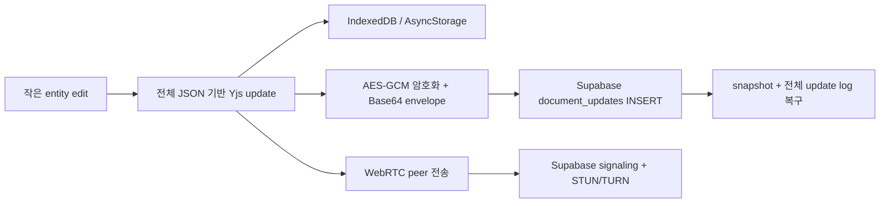
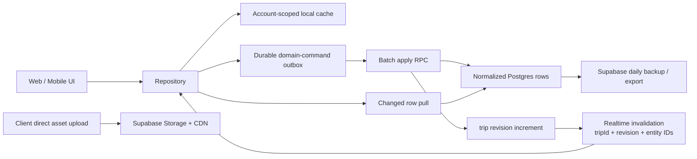
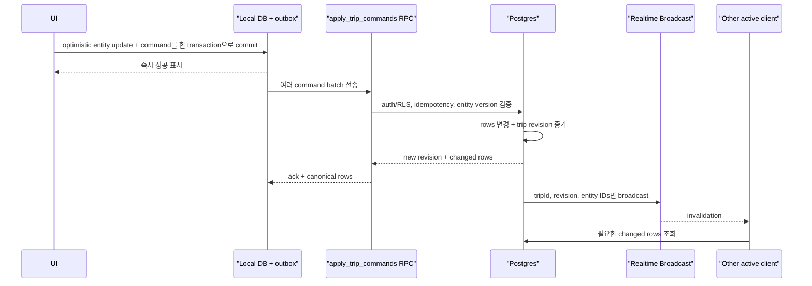
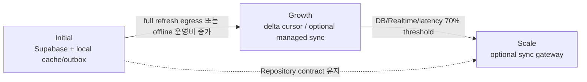

# 제품 기능 기반 데이터 통신 및 운영비용 평가

- 상태: 분석 완료, 아키텍처 방향 결정 필요
- 기준 브랜치: `refactoring/local-first-architecture`
- 기준 커밋: `77c8566`
- 분석일: 2026-07-17
- 가격 기준일: 2026-07-17, 각 서비스 공식 가격/문서
- 평가 전제: WebRTC, P2P-first, local-primary, app-layer E2EE 등 기존 제약을 필수조건에서 제외

## 결론

**현재 Local-first + Yjs + WebRTC + encrypted backup 구조는 OnVoy의 현재 기능을 가장 낮은 통신량과
운영비용으로 제공하는 구조가 아니다.** 특히 현재 구현은 작은 일정/준비물 변경도 전체 Trip JSON에
가까운 Yjs update로 만들고, 이를 P2P와 Supabase backup 양쪽에 보낸다. P2P를 사용해도 durable backup
write는 사라지지 않으므로 전송과 저장이 중복된다.

비용만을 최적화한다면 다음 구조를 권장한다.

> **Supabase normalized row authority + account-scoped local cache + durable domain-command outbox +
> batch RPC + active-screen Realtime invalidation**

이 구조는 순수 local-first가 아니다. 서버 연결이 없을 때도 로컬 조회와 optimistic edit는 가능하지만,
최종 권위와 협업 합류점은 Supabase가 가진다. OnVoy의 일정·준비물·템플릿은 rich text나 whiteboard와
달리 독립 entity mutation으로 표현할 수 있으므로 범용 CRDT와 P2P가 필수적이지 않다.

초기에는 Supabase 하나로 Auth, RLS, Postgres, Realtime, Storage, backup을 운영할 수 있다. 별도 TURN,
signaling, KMS, CRDT sync provider를 운영하지 않는다. Growth 단계에서도 실제 지표가 임계치를 넘기 전에는
추가 sync platform이나 custom gateway를 도입하지 않는다.

## 목차

- [평가 범위](#평가-범위)
- [제품 워크로드](#제품-워크로드)
- [현재 구조의 비용 문제](#현재-구조의-비용-문제)
- [구현 근거](#구현-근거)
- [Repo 기반 전송량 측정](#repo-기반-전송량-측정)
- [현재 서비스 비용 기준](#현재-서비스-비용-기준)
- [후보 아키텍처 비교](#후보-아키텍처-비교)
- [권장 아키텍처](#권장-아키텍처)
- [도메인별 동시 수정 정책](#도메인별-동시-수정-정책)
- [통신량 최적화 정책](#통신량-최적화-정책)
- [초기 비용 모델](#초기-비용-모델)
- [단계별 운영 전략](#단계별-운영-전략)
- [전환 범위](#전환-범위)
- [결정 사항](#결정-사항)
- [공식 자료](#공식-자료)

## 평가 범위

이번 평가는 다음 조건만 유지한다.

1. 여행, 일정, 준비물, 템플릿, 동행자 공유가 정상 동작해야 한다.
2. 같은 계정의 새 디바이스와 collaborator가 최신 데이터를 봐야 한다.
3. 오프라인 조회와 임시 편집을 지원해야 한다.
4. committed data를 잃거나 다른 계정에 노출해서는 안 된다.
5. 초기 현금비용, 네트워크/저장 비용, 운영 복잡도를 함께 최소화한다.

다음 항목은 이번 평가에서 목표가 아니다.

- 서버도 본문을 읽을 수 없는 zero-knowledge E2EE
- 서버 없이 동작하는 peer-only 협업
- WebRTC 또는 Yjs 유지
- Supabase write를 가능한 한 0으로 만드는 것

보안은 포기하지 않는다. Supabase Auth, RLS, TLS, provider-managed encryption, audit 가능한 server mutation을
사용한다. 다만 app-layer E2EE가 만드는 key recovery 비용은 비용 최적화 목표에서 제외한다.

## 제품 워크로드

| 기능 | 데이터 특성 | 일반적인 변경 | 동시성 요구 |
|---|---|---|---|
| 여행 | 수 KB 이하 metadata | 제목, 기간, 인원 변경 | 낮음 |
| 일정 | 독립 row, 정렬 순서 포함 | 일정 생성/수정/삭제, 방문 상태 | 낮음~중간 |
| 준비물 | 작은 독립 row 다수 | 항목 추가, 사용자별 check toggle | 중간 |
| 템플릿 | 작은 목록 | 전체 교체 또는 항목 CRUD | 낮음 |
| 동행자/초대 | 보안 registry | 초대, 수락, role/revoke | 낮음, 서버 권위 필수 |
| 사진/asset | 수백 KB~수 MB binary | 직접 upload/download | metadata보다 훨씬 큼 |
| 실시간 협업 | 여행당 소수 사용자 | 서로 다른 entity를 간헐적으로 수정 | rich text 수준 아님 |

이 워크로드에서는 대부분의 충돌을 entity ID, row version, user-specific state, tombstone으로 해결할 수 있다.
문자 단위 병합이나 자유 형식 canvas를 위한 CRDT 비용을 지불할 이유가 적다.

실제 통신량에서 가장 큰 항목은 일정 JSON보다 사진일 가능성이 높다. 1MB 사진 하나는 이번 측정의
39KB Yjs update 약 26개 또는 425-byte domain command 약 2,400개와 비슷하다. metadata sync를 줄이는
동시에 image resize, CDN cache, direct upload를 우선 관리해야 한다.

## 현재 구조의 비용 문제



현재 비용 증가 요인은 다음과 같다.

- `documentMutationWriter`가 매 mutation마다 새 Y.Doc과 전체 document state update를 만든다.
- 같은 update를 P2P fast path와 Supabase durable backup에 모두 보낸다.
- update마다 Postgres row, index, WAL, encrypted envelope가 생성된다.
- production snapshot compaction callsite가 없어 update log가 계속 증가한다.
- restore는 snapshot뿐 아니라 누적 update를 다시 내려받는다. Mobile은 update를 적용하지 않아 비용을
  지불하고도 정합성을 얻지 못한다.
- P2P를 위해 signaling, device identity, reconnect, STUN/TURN, multi-peer topology를 운영한다.
- app-layer E2EE 때문에 device key registry, provisioning queue, revoke/rotation, KMS 또는 recovery UX가 필요하다.

P2P는 두 사용자가 동시에 접속한 동안 server fan-out payload를 줄일 수 있다. 그러나 나중에 다른
디바이스가 복구해야 하므로 원본 mutation의 durable server write는 여전히 필요하다. 현재 목적에서
P2P는 durable sync를 대체하지 않고 추가 transport가 된다.

## 구현 근거

| 근거 | 현재 구현 | 비용/운영 영향 |
|---|---|---|
| mutation 생성 | `packages/core/src/local-first/documentMutationWriter.ts`가 기존 document로 새 Y.Doc을 만들고 `encodeTripDocumentUpdate`를 호출 | entity patch가 아니라 document 크기에 비례하는 update 생성 |
| document 표현 | `packages/core/src/local-first/yjsTripDocument.ts`가 전체 `TripDocumentV1`을 Y.Map의 단일 `document` key에 저장 | Yjs의 세부 shared type 병합/증분 이점을 사용하지 못함 |
| Web publish | `apps/web/lib/local-first/documentPrimaryRepositories.ts`가 P2P publish 후 같은 update를 backup queue에 enqueue | 활성 peer가 있으면 동일 origin payload가 두 transport로 전송 |
| Mobile publish | `apps/mobile/lib/local-first/documentPrimaryRepositories.ts`도 P2P와 backup enqueue를 함께 실행 | 플랫폼별 key/bootstrap/queue 운영 경로 중복 |
| backup 저장 | `packages/core/src/supabase/backupRepository.ts`가 mutation마다 `document_updates` row를 insert | row, index, WAL, restore payload가 mutation 수와 함께 증가 |
| Web restore | `packages/core/src/sync/restore.ts`가 snapshot 뒤 모든 update를 순서대로 decrypt, verify, apply | compaction 전까지 복구 egress와 CPU가 누적 |
| Mobile restore | `packages/core/src/sync/mobileRestore.ts`는 snapshot만 검증하고 update replay/materialization을 지원하지 않음 | 비용을 지불한 backup이 플랫폼 간 동일 복구를 보장하지 못함 |
| compaction | `shouldCreateBackupSnapshot`과 `markSnapshotCreated`는 core에만 있고 production callsite가 없음 | update log의 상한과 정리 주기가 구현되지 않음 |

따라서 문제는 WebRTC 자체의 단가보다 **full-state update 형식, 이중 publish, 누적 restore, 플랫폼별 복구
불일치가 결합된 것**이다. TURN 단가가 무료 또는 낮아져도 이 네 가지 비용은 남는다.

## Repo 기반 전송량 측정

현재 core 함수를 사용해 다음 representative Trip을 메모리에서 생성했다.

- 일정 20개
- 준비물 100개
- binary asset 제외
- 일정 1개를 추가하는 mutation 실행

측정 결과:

| 항목 | byte |
|---|---:|
| `TripDocumentV1` JSON | 45,539 |
| 변경 전 full Yjs update | 38,803 |
| 일정 1개 추가 후 mutation update | 39,196 |
| 같은 의미의 JSON domain command | 425 |
| 현재 mutation 전송 증폭 | **92.2배** |

측정 명령은 `createEmptyTripDocumentV1`, `createYjsTripDocument`,
`createPlanInTripDocument`를 직접 호출했다. encryption envelope, Base64, Postgres tuple/index/WAL,
Realtime signaling은 포함하지 않았으므로 실제 저장/전송 증폭은 더 크다.

### 예시 월간 workload

가정: 1,000 MAU, 사용자당 월 20회 mutation, representative document 크기가 유지된다.

| 방식 | mutation upload payload | 20,000회 합계 |
|---|---:|---:|
| 현재 full-state Yjs backup | 39,196 B | 약 784 MB |
| compact domain command | 425 B | 약 8.5 MB |

현재 방식은 backup upload만 약 92배 크다. 동시 peer 한 명에게 같은 update를 P2P로 보내면 origin outbound
payload는 약 1.57GB로 증가한다. 반대로 domain command 구조는 server response와 active client pull을
더해도 일반적으로 수십 MB 범위다.

이 예시는 실제 사용자 행동을 예측한 청구액이 아니라 **프로토콜의 byte amplification 비교**다.
100,000 mutation이면 각각 약 3.92GB와 42.5MB다. full-state update log는 저장뿐 아니라 restore egress와
복호화 CPU도 함께 증가시킨다.

## 현재 서비스 비용 기준

2026-07-17 공식 자료 기준이다. 실제 청구는 조직, project, compute size와 quota 사용량에 따라 달라진다.

| 서비스 | 현재 기준 | 비용 판단 |
|---|---|---|
| Supabase Free | 50,000 MAU, DB 500MB, uncached egress 5GB, Realtime 2M messages | 개발/검증 가능, Production은 pause/지원/backup 정책상 부적합 |
| Supabase Pro | 월 $25부터, 100,000 MAU, DB disk 8GB, uncached egress 250GB, Storage 100GB | Initial 단일 backend로 충분한 범위 |
| Supabase Realtime | Pro 5M messages 포함, 초과 1M당 $2.50 | 작은 invalidation message는 초기 비용 핵심이 아님 |
| Supabase backup | Pro daily backup 7일 포함, PITR 약 $100/월부터 | Initial은 daily backup + 별도 export, Growth에서 PITR 판단 |
| Cloudflare TURN/SFU | 1,000GB free, 이후 egress $0.05/GB | 초기 현금비용은 낮지만 P2P 운영 복잡도는 남음 |
| PowerSync Pro | 월 $49부터, sync 30GB와 peak 1,000 connections 포함 | offline sync 개발비를 줄이지만 추가 고정비 발생 |
| Liveblocks Pro | 월 $30, collaboration $0.002/user-minute, storage update $1/1M | rich collaboration에는 유리, 현재 domain에는 별도 provider 중복 |

Supabase Realtime은 event를 보낸 client와 수신 client 각각 message로 계산한다. 한 broadcast를 4명이
받으면 총 5 messages다. 여행당 참여자가 적은 OnVoy에서는 small invalidation payload를 사용하면 quota를
소진하기 어렵다. 반면 full row 또는 full document broadcast는 message 수가 같아도 egress를 키운다.

Supabase는 확장성과 보안을 위해 DB change 구독에 Postgres Changes보다 Broadcast를 권장한다.
Postgres Changes는 subscriber마다 RLS authorization을 수행하며, 한 change와 100 subscribers가 있으면
100번 authorization한다. OnVoy Initial 규모에서는 둘 다 가능하지만 작은 DB-triggered Broadcast가
더 오래 유지할 수 있는 선택이다.

## 후보 아키텍처 비교

| 후보 | 네트워크/저장 | 고정 인프라비 | 운영 복잡도 | offline | 현재 기능 적합성 | 판단 |
|---|---|---|---|---|---|---|
| A. 현재 Yjs + P2P + encrypted backup | 현재 구현은 높음 | Supabase + TURN/KMS 가능성 | 매우 높음 | 목표상 강함, 현재 불안정 | 과도함 | 중단 권장 |
| B. Supabase row authority + local cache/outbox | **낮음** | **Supabase만** | **낮음~중간** | 충분 | **높음** | **권장** |
| C. Trip JSONB document + invalidation | 중간~높음 | Supabase만 | 낮음 | 충분 | 동시 수정/부분 update 취약 | 비권장 |
| D. PowerSync + Supabase | 낮음 | Supabase + 월 $49부터 | 앱 구현 낮음, provider 운영 중간 | 강함 | 높음 | 인력비가 더 중요할 때 후보 |
| E. Liveblocks/Yjs managed collaboration | 중간 | Supabase + 월 $30/usage | provider 통합 중간 | 강함 | rich text가 없어 과도함 | 기능 확장 시 재검토 |
| F. 자체 sync gateway | 조정 가능 | compute/DB/monitoring 추가 | 매우 높음 | 설계에 따라 다름 | 초기 과도함 | Scale trigger 이후 |

### 왜 B가 비용 최저인가

- 이미 Auth, RLS, invitation, Storage를 위해 Supabase가 필요하다.
- 일정/준비물 mutation은 작은 row 또는 command로 표현된다.
- 동일 Postgres transaction에서 권한 검증, write, revision 증가가 끝난다.
- 별도 encrypted backup log 없이 primary row와 Supabase daily backup을 사용한다.
- Realtime은 현재 화면의 invalidation만 담당한다.
- offline은 local cache와 outbox로 해결하고, 범용 sync provider 비용을 지불하지 않는다.

추천안은 과거 코드처럼 UI가 여러 Supabase table을 직접 호출하는 구조가 아니다. Repository와 platform
local store 경계는 유지하고, remote authority adapter를 단순화하는 구조다.

## 권장 아키텍처



### 권장 remote schema 원칙

- `trips`, `plans`, `plan_urls`, `checklists`, `checklist_items`, `checklist_item_checks`, `templates`,
  `template_items`, `document_members`를 normalized authority로 사용한다.
- mutable row에 `revision`, `updated_at`, 필요 시 `deleted_at`을 둔다.
- `trip_sync_state`에 document-level monotonic `revision`을 둔다.
- client command에 UUID `operation_id`, `base_revision`, `entity_version`을 포함한다.
- `applied_operations`를 짧은 retention으로 유지해 retry를 idempotent하게 처리한다.
- 삭제는 offline client catch-up 기간 동안 tombstone으로 유지한 뒤 정리한다.
- role/invitation mutation은 SECURITY DEFINER RPC가 중앙에서 처리한다.

### write protocol



Broadcast가 유실돼도 foreground/reconnect에서 local revision과 server revision을 비교한다. 다르면 full
trip refresh 또는 changed row pull을 수행한다. Initial에는 full refresh fallback을 유지해 별도 영구 sync
event log를 운영하지 않는다.

## 도메인별 동시 수정 정책

| 도메인 | 권장 정책 | CRDT가 불필요한 이유 |
|---|---|---|
| Trip metadata | row version 확인, 같은 field 충돌은 server winner 또는 409 후 재선택 | 변경 빈도가 낮음 |
| Plan create/delete | client UUID, idempotent insert, tombstone delete | 서로 다른 plan은 독립 |
| Plan field update | entity version + field patch | 문자 단위 merge 불필요 |
| Plan order | fractional rank/LexoRank 계열 sort key | 전체 배열 교체를 피함 |
| Checklist item | item별 row version | item 간 독립 |
| 사용자별 check | `(item_id, user_id)` unique row upsert/delete | set semantics로 결정적 |
| Template | item row CRUD, bulk replace는 한 RPC transaction | 동시 편집 빈도가 낮음 |
| Member/role | server RPC만 허용 | 보안 authority이므로 client merge 금지 |
| Asset | upload 완료 후 metadata row 연결 | binary merge 대상 아님 |

같은 사용자가 offline에서 수정한 entity가 서버에서도 변경됐으면 command별 정책을 적용한다. 독립 field
patch는 병합하고, 같은 field의 의미 충돌만 UI에 표시한다. 모든 문서를 자동으로 last-write-wins 처리하는
것보다 데이터 손실 범위가 작고 설명 가능하다.

## 통신량 최적화 정책

### Initial 필수

- 홈은 Trip summary만 조회하고 detail entity를 prefetch하지 않는다.
- detail 진입 시 local cache를 즉시 표시하고 server `revision`만 먼저 확인한다.
- outbox는 즉시 local commit하되 remote command는 1~3초 또는 32개 단위로 batch한다.
- Realtime connection은 로그인 전체가 아니라 활성 Trip detail과 invitation inbox에만 유지한다.
- Broadcast payload는 `trip_id`, `revision`, changed entity IDs만 포함한다.
- create/update RPC는 UI에 필요한 canonical row만 반환하고 `select=*`를 피한다.
- reconnect 후 revision이 한 단계면 changed row, gap이 크거나 불명확하면 full refresh한다.
- asset은 client에서 Storage로 직접 upload하고 앱 API가 binary를 proxy하지 않는다.
- thumbnail을 생성하고 list에는 thumbnail만 사용한다. full image는 명시적으로 열 때 요청한다.
- Web HTTP cache와 Storage CDN cache를 사용하고 content hash 기반 filename을 사용한다.

### 하지 말아야 할 것

- 모든 mutation 후 Trip 전체 refetch
- 전체 JSONB document overwrite
- 영구 update log를 compaction 없이 유지
- document 본문을 Realtime Broadcast로 fan-out
- binary를 Yjs/JSON/Base64에 포함
- 동일 payload를 P2P와 server에 각각 durable copy로 보관
- 모든 화면에서 상시 Realtime subscription 유지

## 초기 비용 모델

### 권장 Initial 인프라

| 구성 | 권장 |
|---|---|
| Production backend | Supabase Pro project |
| DEV | 별도 Free project 또는 필요할 때만 활성화한 project |
| Web hosting | 현재 Vercel 유지 |
| Mobile | 기존 Expo/EAS 배포 체계 |
| Realtime | Supabase private Broadcast |
| Object storage | Supabase Storage/CDN |
| Backup | Pro daily backup 7일 + 주기적 off-site logical export |
| TURN/signaling | 사용하지 않음 |
| KMS/app E2EE | 사용하지 않음 |
| PowerSync/Liveblocks | 사용하지 않음 |

현금비용 기준으로 Supabase Pro는 월 $25부터다. 같은 paid organization의 추가 project에는 compute 비용이
추가될 수 있으므로 DEV/preview project를 모두 상시 paid로 두지 않는다. Production 데이터에 daily backup이
필요하므로 Free tier를 Production 기준으로 삼지 않는다.

### Initial usage 예상

1,000 MAU와 월 20,000 mutation 가정에서:

- command upload는 representative payload 기준 약 8.5MB다.
- 각 batch가 평균 4 commands면 약 5,000 server transactions/invalidation events다.
- active peer 2명 기준 Realtime은 대략 수만 messages 수준으로 Pro 5M quota보다 충분히 작다.
- metadata egress보다 사진 egress가 먼저 250GB quota에 접근할 가능성이 높다.

따라서 Initial 비용 최적화의 핵심은 Realtime/P2P가 아니라 **상시 paid project 수, image egress,
full-state write 제거, 불필요한 refetch 방지**다.

## 단계별 운영 전략

### Initial: 0~1,000 MAU

- Supabase normalized authority, local cache/outbox, batch RPC, Broadcast invalidation을 구현한다.
- full refresh fallback으로 sync protocol을 단순화한다.
- Web IndexedDB와 Mobile SQLite를 account namespace로 분리한다.
- error rate, mutation batch size, full refresh bytes, image egress, Realtime message 수를 측정한다.
- 동시 편집 5명, 여행당 member 10명까지 검증한다.
- 별도 P2P, CRDT provider, KMS, PITR는 도입하지 않는다.

### Growth: 1,000~50,000 MAU 또는 비용 trigger

- full refresh egress/latency가 목표를 넘을 때만 retention이 짧은 `trip_changes` cursor log를 추가한다.
- Realtime은 Postgres Changes가 아니라 private Broadcast와 indexed authorization을 사용한다.
- `applied_operations`, tombstone, change log를 시간/document 기준 partition하고 만료한다.
- image transformation/CDN hit rate를 높이고 asset lifecycle policy를 운영한다.
- offline sync 구현 유지비가 커지면 PowerSync PoC를 수행한다. 월 $49 이상의 provider 비용과 내부 개발/온콜
  시간을 함께 비교한다.
- 데이터 중요도와 매출이 PITR 월 비용을 정당화할 때 활성화한다.

### Scale: 50,000 MAU 이상 또는 Supabase 한계 도달

- Realtime subscriber, DB connection, write latency, egress, compute 비용이 70% 임계치에 도달할 때 검토한다.
- private Broadcast fan-out이 충분하면 Supabase를 계속 유지한다.
- 필요할 때만 command ingestion/sync gateway를 분리하고 repository remote adapter를 교체한다.
- rich text, 공동 메모, whiteboard가 제품에 추가될 때 해당 subdocument에만 managed CRDT를 도입한다.
- 모든 Trip 데이터를 CRDT provider로 옮기지 않는다.
- multi-region과 read replica는 실제 regional latency/SLA 요구가 생길 때 도입한다.



## 전환 범위

### 유지할 것

- Repository boundary와 `packages/core` domain logic
- Supabase Auth와 central member/invitation authority
- Web IndexedDB / Mobile local DB를 통한 빠른 화면과 offline outbox
- Supabase RLS, RPC, Storage, analytics/observability
- entity UUID와 tombstone 개념

### 교체할 것

- `TripDocumentV1` single-key Yjs primary state
- `documents.snapshot` + 무기한 `document_updates` backup primary path
- device-to-device document key provisioning
- Web/Mobile P2P signaling 및 update bridge
- `updatedAt` 기반 freshness 선택
- detached backup enqueue

### 그대로 되돌리면 안 되는 것

과거 row-primary 코드에는 UI의 direct Supabase query, 여러 번의 waterfall fetch, platform별 중복 query가
남아 있다. 이전 구조를 복원하는 것이 아니라 다음 경계를 새로 구현해야 한다.

```text
UI -> Repository -> Local cache/outbox -> Supabase authority adapter
```

remote write는 batch RPC를 사용하고 remote read는 summary/detail projection으로 제한한다.

## 결정 사항

이 비용 최적화안을 선택하려면 다음을 승인해야 한다.

| 질문 | 권장 결정 |
|---|---|
| Supabase를 데이터 최종 권위로 둘 수 있는가? | 예 |
| zero-knowledge E2EE가 필수인가? | 아니오 |
| 순수 local-first 대신 offline-capable server authority를 허용하는가? | 예 |
| WebRTC/P2P를 제품 요구에서 제거할 수 있는가? | 예 |
| 현재 V1 document/backup 데이터를 초기화할 수 있는가? | 예 |
| rich text/canvas가 추가되기 전까지 CRDT를 제거할 수 있는가? | 예 |

하나라도 아니오라면 이 보고서의 비용 순위가 달라진다. 특히 zero-knowledge E2EE 또는 server-independent
collaboration이 필수면 이전 Production 감사 문서의 envelope/recovery 및 canonical CRDT 설계를 따라야 한다.

## 공식 자료

- [Supabase Pricing](https://supabase.com/pricing)
- [Supabase Realtime message usage](https://supabase.com/docs/guides/platform/manage-your-usage/realtime-messages)
- [Supabase Egress usage](https://supabase.com/docs/guides/platform/manage-your-usage/egress)
- [Supabase Realtime: Postgres Changes scaling](https://supabase.com/docs/guides/realtime/postgres-changes)
- [Supabase Realtime: Broadcast recommendation](https://supabase.com/docs/guides/realtime/subscribing-to-database-changes)
- [Supabase Database Backups](https://supabase.com/docs/guides/platform/backups)
- [Cloudflare Realtime TURN/SFU Pricing](https://developers.cloudflare.com/realtime/sfu/pricing/)
- [PowerSync Pricing](https://powersync.com/pricing)
- [Liveblocks Pricing](https://liveblocks.io/docs/pricing/plans)
