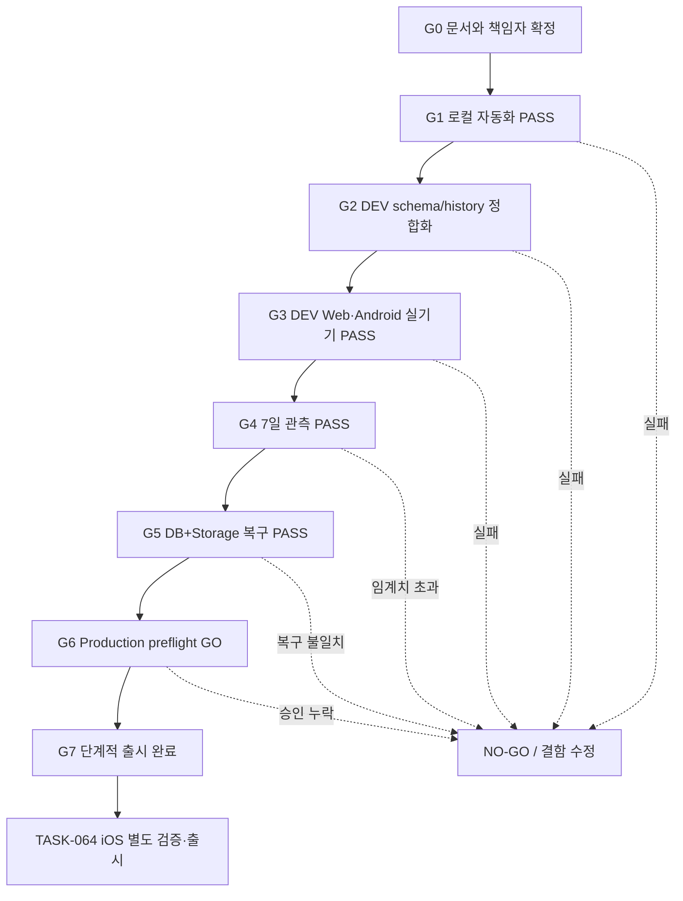

# TASK-057 Production 최종 검증 마스터 계획

## 결론

현재 OnVoy는 **코드 게이트 PASS, Web·Android Production 운영 게이트 NO-GO**다. Android
Production GO는 코드 병합이 아니라 `G0`~`G7`의 증적 완료로 판정한다. 데이터 손실, 계정 간 노출,
권한 우회, 복구 실패 중 하나라도 발생하면 즉시 NO-GO를 유지한다.

## 초기 출시 플랫폼 결정

- 초기 Production 지원 범위는 Web과 Android다.
- iOS 실기기, TestFlight/App Store, iOS OAuth·push·lifecycle 검증은 `TASK-064`로 이관한다.
- iOS typecheck, Expo export와 simulator launch는 공유 코드 파손을 막는 비차단 회귀 Gate로 유지한다.
- `G0`~`G7`과 100% rollout은 Android 지원 대상만 의미하며 iOS 지원 또는 출시 완료를 의미하지 않는다.

## 목차

- [초기 출시 플랫폼 결정](#초기-출시-플랫폼-결정)
- [현재 상태](#현재-상태)
- [Gate 흐름](#gate-흐름)
- [남은 차단 항목](#남은-차단-항목)
- [후속 작업 분리](#후속-작업-분리)
- [단계별 실행 계획](#단계별-실행-계획)
- [역할과 책임](#역할과-책임)
- [출시 판정 기준](#출시-판정-기준)
- [예상 일정과 산출물](#예상-일정과-산출물)

## 현재 상태

| 영역 | 상태 | 근거 | 다음 조치 |
|---|---|---|---|
| Core/저장소/SQL | PASS | TASK-056 자동 테스트 | release SHA마다 재실행 |
| Web 제품 E2E | PASS | Production P0 Playwright 23건 | release SHA마다 재실행 |
| Mobile 정적/저장소 | PASS | typecheck, lint, Expo export, SQLite tests | Android Preview 실기기 검증 |
| DEV schema/history | PASS | TASK-059 drift 0, strict fingerprint 12/12·185/185, authenticated smoke | release 전 read-only 재확인 |
| Production schema/history | NO-GO | TASK-058/059 적용, fingerprint 183/185, ledger/nullability 차이 잔존 | TASK-063 독립 감사·승인 |
| Web·Android 실기기 | GO | TASK-060 실제 기기 Gate PASS, PR #381 회귀 재검증 | release SHA마다 핵심 smoke 유지 |
| iOS | 후속 출시 | simulator build·launch PREPASS | TASK-064에서 실기기·스토어 검증 |
| 운영 관측 | NO-GO | 7일 지표 없음 | 임계치 기반 관찰 |
| 복구 | NO-GO | DB+Storage 동시 복구 증적 없음 | 격리 프로젝트 rehearsal |
| Production preflight | NO-GO | history·backup·책임자 미확정 | 독립 감사와 승인 |

## Gate 흐름

## 남은 차단 항목

| ID | 차단 항목 | 완료 기준 | 필수 증적 | Gate |
|---|---|---|---|---|
| B-01 (완료) | DEV historical history gap | TASK-059 repair 후 drift 0 | migration list, fingerprint 결과 | G2 |
| B-02 (완료) | TASK-056 객체·grant·history | TASK-059 grant hardening·authenticated smoke PASS | schema dump, smoke 결과 | G2 |
| B-03 (완료) | 제품 E2E 자동화 공백 | TASK-058과 Production P0 23건 PASS | CI URL과 리포트 | G1 |
| B-04 (완료) | Android 실기기·플랫폼 조합 | TASK-060에서 Web/Web, Web/Android, Android/Android P0/P1 PASS | Android 기기/OS/build와 사용자 확인 기록 | G3 |
| B-05 | 7일 운영 지표 없음 | 연속 7일 동안 임계치와 무사고 기준 충족 | GA4/Firebase/Supabase 대시보드 export | G4 |
| B-06 | DB+Storage 복구 미검증 | 격리 프로젝트에서 동일 기준 시점 데이터와 object 복구 검증 | dump/checksum, object manifest, row count, RTO/RPO | G5 |
| B-07 | Production history·schema drift·backup 미확정 | 원격 전용 version 4건과 `public` schema 차이 분류·승인, ledger 정합화, pre-deploy DB/Storage backup 완료 | 독립 감사 기록, schema diff, backup 위치·checksum | G6 |
| B-08 | Android 최소 버전·출시 책임 미확정 | Android 최소 지원 버전과 강제 업데이트 정책, 배포·on-call 담당자 승인 | release ticket, 연락망, Google Play 설정 | G6 |
| B-09 | 제품 운영 준비 미확정 | Web·Android 환경변수, OAuth, 이메일, Android push, 도메인, 약관·개인정보, alert test PASS | 설정 inventory와 각 검증 링크 | G6 |
| B-10 | Android 단계적 rollout 미실행 | 내부→5%→25%→100% 각 hold 구간 통과 | 단계별 지표와 GO 승인 | G7 |
| B-11 | asset 운영 수명주기 미완료 | canonical path/write RLS는 TASK-058 완료; cleanup scheduler·secret 설정과 DEV thumbnail network 검증 PASS 필요 | scheduler 실행 로그, path fixture, network log, orphan 보존·삭제 결과 | G3/G6 |

## 후속 작업 분리

TASK-057은 검증 기준과 실행 절차를 확정하는 문서 작업이다. 실제 Gate는 다음 작업으로 나누어 진행한다.
각 작업은 독립 PR과 증적을 남기며, 선행 Gate가 실패하면 후속 작업을 시작하지 않는다.

| 작업 | 실행 범위 | 해소 차단 항목 | 선행 작업 |
|---|---|---|---|
| `TASK-058` | P0 제품 통합 테스트 자동화와 asset path 계약 통일 | B-03, B-11의 계약 부분 | TASK-057 |
| `TASK-059` | DEV 객체 fingerprint와 migration history 정합화 | B-01, B-02 | TASK-058 |
| `TASK-060` | Web·Android 실기기·다중 계정·asset 검증 | B-04, B-11의 실환경 검증 부분 | TASK-059 |
| `TASK-061` | Web·Android DEV 7일 안정성·비용 관측 | B-05 | TASK-060 |
| `TASK-062` | DB+Storage 복구와 Web·Android smoke | B-06 | TASK-060 |
| `TASK-063` | Web·Android Production preflight와 단계적 출시 | B-07~B-10, B-11 운영 설정 | TASK-061, TASK-062 |
| `TASK-064` | iOS 실기기·TestFlight/App Store 검증과 출시 | iOS 지원 선언에 필요한 별도 Gate | TASK-063 |

## 단계별 실행 계획

### G0. 문서와 책임자 확정

- 본 계획, 통합 테스트 명세, runbook의 버전을 release ticket에 고정한다.
- Release manager가 각 역할의 실명 담당자와 대체 담당자를 지정한다.
- DEV와 Production project ref를 ticket에 기록한다.
- 테스트 계정은 전용 이메일과 가명만 사용한다.
- 실제 고객 데이터와 service-role key를 테스트 도구에 넣지 않는다.

### G1. 로컬 자동화 Gate

- 기존 Core, Web/Mobile store, SQL, Playwright, build를 모두 실행한다.
- 초대, role/revoke, 계정 격리, 템플릿, asset 권한의 P0 자동화 공백을 먼저 닫는다.
- Playwright의 `assertLocalSupabaseUrl`을 우회하지 않는다.
- CI와 로컬 결과가 다르면 원인을 해소하기 전 DEV로 진행하지 않는다.

### G2. DEV schema와 migration Gate

- DEV `ivgkqzwosbjukonlpfdw`의 historical gap 9건과 TASK-056 version을 migration별로 fingerprint한다.
- 2026-07-23 schema dump에서 TASK-055/056 핵심 함수·정책은 확인됐지만, 이것만으로 전체 SQL 일치를
  판정하지 않는다.
- 양쪽 환경에서 stale-batch helper, command wrapper와 일부 internal authority function에 명시적인
  `anon` 실행 grant가 확인됐다. 내부 `auth.uid()` 검사가 익명 쓰기는 차단하지만 목표 RPC 노출 범위와
  다르므로 새 forward migration에서 권한을 회수하고 익명 호출 테스트를 추가한다.
- object와 권한이 migration 전체와 일치하는 version만 `repair --status applied`로 history에 등록한다.
- 부분 적용 또는 정의 차이가 있으면 원본 SQL을 재실행하지 않는다. 별도 forward reconciliation
  migration을 검토한 뒤 원래 version의 history 처리 근거를 남긴다.
- 정합화 후 `db push --dry-run`은 적용 대상이 없어야 한다.
- authenticated test account로 function, grant, revision, role/revoke 동작을 검증한다.

### G3. DEV Web·Android 제품·실기기 Gate

- Web/Web, Web/Android, Android/Android를 검증한다.
- 동일 계정의 새 브라우저·새 설치와 서로 다른 collaborator 계정을 모두 포함한다.
- 여행·일정·준비물·템플릿·초대·권한·asset을 online/offline/restart/reconnect 조건에서 검증한다.
- `P0` 또는 `P1` 결함이 생기면 테스트를 중단하고 release candidate를 폐기한다.
- iOS 정적 build·simulator launch는 계속 수행하지만 iOS 기능 매트릭스는 TASK-064로 이관한다.

### G4. DEV 7일 관측 Gate

- 테스트와 내부 사용 traffic을 매일 발생시킨다.
- queue age, retry, reject, conflict, invalidation gap, full refresh, RPC latency, Realtime/egress를 기록한다.
- 데이터 손실, 계정 간 노출, 권한 우회, 중복 row incident는 허용하지 않는다.
- 임계치 초과는 원인과 재검증 기간을 새로 시작한다.

### G5. 복구 Gate

- DEV와 분리된 복구 프로젝트를 사용한다.
- 같은 release 시점의 DB dump와 `place-photos` object export를 복구한다.
- row count, membership, revision, operation receipt, asset metadata와 object manifest를 비교한다.
- Web과 Android가 복구 프로젝트에서 핵심 여행을 읽고 수정할 수 있는지 확인한다.

### G6. Production Preflight

- Production `runbcaegpefqnljsswhv`를 DEV와 독립적으로 감사한다.
- Production history에만 있는 `20260403070821`, `20260423112332`, `20260427021704`,
  `20260427023948`의 출처와 객체를 보존·분류한다.
- Production 전용 `public` 객체와 DEV 전용 객체가 의도된 차이인지 migration 누락인지 판정한다.
- migration dry-run이 승인 대상만 표시되는지 확인한다.
- DB와 Storage backup을 생성하고 checksum과 보관 위치를 기록한다.
- Web·Android release SHA, 환경변수, OAuth redirect, 이메일, Android push, 약관·개인정보 URL을
  검증한다.
- asset cleanup scheduler와 `ASSET_CLEANUP_SECRET`을 설정하고 실패 alert를 시험한다.
- rollback owner와 on-call 연락 경로를 실제 호출해 확인한다.

### G7. Web·Android 단계적 출시

| 단계 | 대상 | 최소 관찰 | 확대 조건 |
|---|---:|---:|---|
| 내부 | 운영·QA 계정 | 1영업일 | P0/P1 0건, 지표 정상 |
| 5% | 제한된 외부 사용자 | 1영업일 | 데이터/권한 incident 0건, 임계치 이내 |
| 25% | 확대 사용자 | 2영업일 | retry/reject/latency 안정 |
| 100% | 전체 | 지속 관찰 | on-call과 rollback 준비 유지 |

## 역할과 책임

| 역할 | 주요 책임 | 승인 대상 |
|---|---|---|
| Release manager | 일정, Gate 상태, 최종 GO/NO-GO 회의 | G0, G6, G7 |
| DB operator | fingerprint, repair, migration, backup, restore | G2, G5, G6 |
| Web 담당 | Web build, 브라우저 E2E, Vercel·OAuth | G1, G3, G6 |
| Android 담당 | Android build, 설치, Logcat, Google Play rollout | G1, G3, G6, G7 |
| iOS 담당 | 공통 변경의 typecheck/export/simulator 회귀, TASK-064 준비 | G1, TASK-064 |
| QA 담당 | fixture, 테스트 실행, 결함·증적 관리 | G1, G3 |
| Security/Privacy 담당 | RLS, 로그·analytics, 약관·개인정보 검토 | G3, G6 |
| On-call 담당 | alert 수신, incident 판단, rollback 실행 | G4, G6, G7 |

한 사람이 여러 역할을 맡을 수 있다. 단, Production migration과 최종 GO 승인은 동일인이 단독 수행하지 않는다.

## 출시 판정 기준

### 즉시 NO-GO 조건

- committed data 손실 또는 변질
- 계정 간 cache·row·asset 노출
- owner/editor/viewer/revoked 권한 우회
- duplicate operation으로 canonical row 중복 생성
- DB 또는 Storage 복구 불일치
- migration history drift 또는 미승인 migration 발견
- 미해결 P0/P1 결함

### 정량 기준

| 신호 | GO 기준 |
|---|---|
| 필수 자동·수동 테스트 | 100% PASS |
| online outbox age | p95 30초 이하 |
| rejected command | membership 의도 차단 제외 0.1% 이하 |
| retryable command | 2% 이하 |
| conflict | applied command 대비 1% 이하, 모두 사용자 해결 가능 |
| RPC latency | p95 2초 이하 |
| invalidation gap | received event 대비 0.5% 이하 |
| full bundle fallback | received invalidation 대비 5% 이하 |
| Supabase 주요 quota | 월 예상 70% 미만 |

## 예상 일정과 산출물

| 단계 | 최소 기간 | 산출물 |
|---|---:|---|
| 자동화 공백 보완 | 2~4영업일 | 테스트 PR, CI 결과 |
| DEV schema/history | 1영업일 | migration ledger 증적 |
| Android 실기기 통합 테스트 | 2~3영업일 | 케이스별 증적, 결함 목록 |
| DEV 관측 | 연속 7일 | 일별 지표와 최종 요약 |
| 복구 rehearsal | 1~2영업일 | RTO/RPO와 정합성 보고서 |
| Production preflight | 1영업일 | 최종 승인서와 backup 증적 |
| Web·Android 단계적 rollout | 최소 4영업일 | 단계별 GO 기록 |
| iOS 검증·rollout | TASK-063 이후 별도 산정 | TASK-064 증적과 GO 기록 |

기간은 병렬 실행 여부에 따라 달라진다. Gate를 생략해 일정을 단축하지 않는다.
