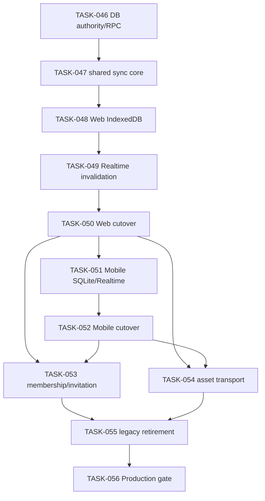

# Data Architecture Refactor Tasks

이 디렉토리는 OnVoy 데이터 아키텍처 전환 작업의 phase별 실행 문서를 보관한다. `TASK-046`부터는
`ADR-015`의 offline-capable server authority를 현재 기준으로 사용한다. 이전 Local-first/Yjs/P2P task는
구현 이력이며 신규 설계 기준이 아니다.

상위 문서:

- `docs/refactor/adrs/ADR-015-offline-capable-server-authority.md`
- `docs/refactor/reports/PRODUCT-DATA-TRANSPORT-COST-EVALUATION.md`
- `docs/refactor/progress.md`
- `docs/refactor/TECHNICAL-SPEC.md` (TASK-001~045 역사적 명세)
- `docs/refactor/adrs/ADR-001-local-first-data-engine.md` (대체됨)
- `docs/refactor/adrs/ADR-014-closed-beta-baseline-reset.md` (부분 대체됨)
- `docs/plans/PLAN-008-local-first-architecture-review.md`

## 문서 네이밍

작업 문서는 아래 형식을 사용한다.

```text
TASK-001-trip-document-model.md
TASK-002-row-to-document-converter.md
TASK-003-document-materialized-read-model.md
TASK-004-repository-abstraction.md
TASK-005-web-indexeddb-yjs-checklist-spike.md
TASK-008a-web-checklist-read-through-hydration.md
```

## 권장 템플릿

```markdown
# TASK-NNN: 제목

## 목적

## 범위

## 선행 조건

## 변경 대상

## 구현 단계

## 데이터 호환성 고려사항

## 검증 방법

## 롤백 방법

## 완료 조건
```

## 실행 원칙

- Local-first refactor 작업의 기준 브랜치와 PR base는 항상 `refactoring/local-first-architecture`로 둔다.
- 새 task를 시작하기 전 `git checkout refactoring/local-first-architecture && git pull origin refactoring/local-first-architecture`로 기준 브랜치를 최신화한다.
- 각 task는 가능한 한 하나의 PR로 끝낼 수 있는 크기를 유지한다.
- UI는 Supabase, Yjs, WebRTC를 직접 호출하지 않고 Repository 또는 platform adapter를 통해 접근한다.
- `packages/core`에는 IndexedDB, SQLite, WebRTC, Next.js, Expo/RN API를 넣지 않는다.
- Supabase normalized row를 committed data의 최종 권위로 사용한다.
- Web IndexedDB와 Mobile SQLite는 account-scoped cache와 durable outbox를 담당한다.
- local mutation과 outbox append는 하나의 local transaction으로 처리한다.
- remote write는 authenticated batch RPC, live update는 작은 Realtime invalidation을 사용한다.
- WebRTC/P2P, Yjs, app-layer E2EE, encrypted document backup을 신규 제품 경로에 추가하지 않는다.
- 기존 V1 document/backup은 자동 hydrate/migration하지 않고 TASK-055에서 단계적으로 reset한다.

## 진행 현황

| Task | 상태 | 결과 |
|------|------|------|
| `TASK-001-trip-document-model.md` | 완료 | PR [#255](https://github.com/ysjee141/nexvoy-frontend/pull/255) |
| `TASK-002-row-to-document-converter.md` | 완료 | PR [#257](https://github.com/ysjee141/nexvoy-frontend/pull/257) |
| `TASK-003-document-materialized-read-model.md` | 완료 | PR [#259](https://github.com/ysjee141/nexvoy-frontend/pull/259) |
| `TASK-004-repository-abstraction.md` | 완료 | PR [#261](https://github.com/ysjee141/nexvoy-frontend/pull/261) |
| `TASK-005-web-indexeddb-yjs-checklist-spike.md` | 완료 | PR [#263](https://github.com/ysjee141/nexvoy-frontend/pull/263) |
| `TASK-006-backup-schema-and-rls.md` | 완료 | 로컬 구현 및 검증 완료 |
| `TASK-007-document-key-model.md` | 완료 | 로컬 구현 및 검증 완료 |
| `TASK-008-backup-queue-and-restore.md` | 완료 | 로컬 구현 및 검증 완료 |
| `TASK-008a-web-checklist-read-through-hydration.md` | 완료 | 로컬 구현 및 검증 완료 |
| `TASK-009-mobile-webrtc-native-feasibility.md` | 완료 | 로컬 구현 및 검증 완료 |
| `TASK-010-cloudflare-ice-config.md` | 완료 | 로컬 구현 및 검증 완료 |
| `TASK-011-dual-write-and-mismatch-detector.md` | 완료 | 로컬 구현 및 검증 완료 |
| `TASK-012-guest-auth-promotion.md` | 완료 | 로컬 구현 및 검증 완료 |
| `TASK-013-invitation-permission-registry.md` | 완료 | 로컬 구현 및 검증 완료 |
| `TASK-014-notification-and-observability.md` | 완료 | 로컬 구현 및 검증 완료 |
| `TASK-015-owner-side-document-key-provisioning.md` | 완료 | 로컬 구현 및 검증 완료 |
| `TASK-016-mobile-native-key-provisioning-and-background-sync.md` | 완료 | Mobile Native Key Provisioning MVP 구현 및 검증 완료 |
| `TASK-017-mobile-background-provisioning-sync.md` | 완료 | Mobile background task 기반 provisioning sync 구현 및 검증 완료 |
| `TASK-018-mobile-non-exportable-key-storage.md` | 완료 | Mobile native non-exportable key storage hardening 구현 및 검증 완료 |
| `TASK-019-mobile-first-owner-key-bootstrap.md` | 완료 | 로컬 구현 및 검증 완료 (restore 재시도는 TASK-020으로 이관) |
| `TASK-020-mobile-encrypted-snapshot-restore.md` | 완료 | 로컬 구현 및 검증 완료 (reviewer APPROVE, qa-engineer PASS) |
| `TASK-021-web-signaling-channel-and-data-channel-handshake.md` | PR 리뷰 대기 | typecheck/test/build 통과, PR [#300](https://github.com/ysjee141/nexvoy-frontend/pull/300), 실브라우저 2세션 수동 검증은 후속 |
| `TASK-022-document-registry-bootstrap-for-regular-trips.md` | 완료 | 일반 Web trip의 documents/document_members lazy bootstrap 구현 및 검증 완료 |
| `TASK-023-mobile-signaling-channel-wiring.md` | 완료 | Mobile signaling channel, native data-channel handshake, P2P 조립 지점 구현 및 자동 검증 완료 |
| `TASK-024-p2p-data-channel-yjs-update-exchange.md` | 완료 | Web-to-Web data channel Yjs update 교환 구현 및 자동 검증 완료 |
| `TASK-025-p2p-connection-status-ui.md` | 완료 | Web 준비물 화면 P2P 연결 자동 시도 및 사용자 대상 연결 상태 UI 구현 |
| `TASK-026-p2p-connection-lifecycle-hardening.md` | 완료 | Web checklist P2P 재연결/backoff, 탭 종료 정리, Mobile lifecycle hook point 구현 |
| `TASK-027-mobile-yjs-runtime-adapter.md` | 완료 | Mobile Yjs runtime adapter, AsyncStorage persistence, P2P update apply 경로 구현 및 자동 검증 완료 |
| `TASK-028-rotating-room-secret-hardening.md` | 완료 | server-issued signaling topic, active topic RLS, Web/Mobile adapter 전환 구현, Issue [#312](https://github.com/ysjee141/nexvoy-frontend/issues/312) |
| `TASK-029-full-local-first-product-scope-adr.md` | 완료 | ADR-013으로 전체 제품 Local-first 범위, `TemplateDocumentV1` boundary, migration/rollback 정책 채택, Issue [#316](https://github.com/ysjee141/nexvoy-frontend/issues/316) |
| `TASK-030-document-primary-repository-layer.md` | 완료 | Trip/Plan/Checklist/Template/Member document-primary repository contract, mutation writer, TemplateDocumentV1 구현, Issue [#318](https://github.com/ysjee141/nexvoy-frontend/issues/318) |
| `TASK-031-web-full-document-primary-transition.md` | 완료 | Web checklist/plans/templates/collaborators document-primary 전환, PR #321 |
| `TASK-032-mobile-full-document-primary-transition.md` | 완료 | Mobile checklist/plans/templates/collaborators document-primary 전환, Issue #322 |
| `TASK-033-backup-sync-productization.md` | 완료 | Web/Mobile document-primary mutation encrypted backup update queue/upload 제품화, Issue #324, PR #325 |
| `TASK-034-p2p-all-domain-wiring.md` | 완료 | Trip document-level P2P lifecycle 승격, Web/Mobile reconnect/status 하드닝, Issue #326, PR #327 |
| `TASK-035-full-integration-test-suite.md` | 완료 | Web document-primary 권한/reload E2E, observability safety E2E, Mobile/P2P/backup smoke runbook, Issue #328, PR #329 |
| `TASK-036-closed-beta-readiness.md` | 완료 | Closed Beta go/no-go gate, secret inventory, deployment rollback, tester 운영 runbook, Issue #330, PR #331 |
| `TASK-037-web-document-primary-key-bootstrap-and-photo-storage.md` | 완료 | Web document-primary key bootstrap, backup restore/status, place photo storage 호환성 보완, Issue #334, PR #335 |
| `TASK-038-closed-beta-baseline-reset-plan.md` | 완료 | 기존 데이터 자동 보존 전제를 제거하고 Closed Beta 기준선을 신규 document-primary 데이터로 재정의 |
| `TASK-039-new-document-bootstrap.md` | 완료 | 신규 여행/템플릿 생성 시 local document + encrypted snapshot + owner key bootstrap, Issue #337 |
| `TASK-040-document-primary-product-path-cutover.md` | 완료 | 여행/일정/준비물/템플릿 제품 경로에서 legacy hydrate/fallback 제거, Issue #339 |
| `TASK-041-backup-freshness-and-cost-control.md` | 완료 | local-first freshness, metadata 기반 backup pull/upload, Supabase 비용 최소화, Issue #341 |
| `TASK-042-legacy-migration-tool.md` | 완료 | 기존 row 데이터를 명시적으로 document-primary로 전환하는 Web dev migration tool, Issue #343 |
| `TASK-044-targeted-document-invitation-authority.md` | 완료 | 이메일 대상 초대 authority, pending 초대, 안전한 메일 발송, document member registry 통합 |
| `TASK-045-invitation-join-and-key-delivery-productization.md` | 구현 완료 | Web/Mobile join UX, 자동 key provisioning, restore 구현. DEV 다중 사용자 검증 대기 |
| `TASK-046-relational-authority-and-command-rpc.md` | 완료 | normalized row authority, revision, idempotency, batch RPC, RLS |
| `TASK-047-shared-offline-sync-core.md` | 완료 | 공통 domain command, Repository, outbox, conflict/retry core |
| `TASK-048-web-indexeddb-cache-outbox.md` | 완료 | Web account-scoped IndexedDB cache와 transactional outbox |
| `TASK-049-realtime-invalidation-and-revision-recovery.md` | 완료 | private Broadcast invalidation과 Web revision gap 복구 |
| `TASK-050-web-server-authority-product-cutover.md` | 구현 완료 | Web 전체 기능 server-authority 전환, 로컬 Supabase E2E 실행 대기 |
| `TASK-051-mobile-sqlite-cache-outbox.md` | 구현 완료 | Mobile SQLite cache/outbox, lifecycle flush, Realtime adapter, Android development build |
| `TASK-052-mobile-server-authority-product-cutover.md` | 구현 완료 | Mobile 전체 기능 server-authority 제품 경로 전환, 실기기 smoke 대기 |
| `TASK-053-membership-invitation-without-document-keys.md` | 구현 완료 | keyless invitation accept, role/revoke revision 전파, revoke cache/outbox purge, Issue #362 |
| `TASK-054-direct-asset-storage-and-delivery.md` | 대기 | Storage 직접 업로드, thumbnail, CDN, orphan cleanup |
| `TASK-055-retire-yjs-p2p-encrypted-backup.md` | 대기 | Yjs/P2P/key/custom backup runtime 제거와 V1 reset |
| `TASK-056-production-data-integrity-and-cost-gate.md` | 대기 | Production 정합성·권한·비용 gate와 rollout runbook |

## 이전 단계 이력

현재 `Phase 0: 모델과 변환 기반`, `Phase 1: Repository 경계와 Web 스파이크`, `Phase 2: Backup, 암호화, Restore`, `Phase 2.5: Web Read-through 보완`은 완료되었다. `TASK-038`부터는 ADR-014에 따라 Closed Beta 기준선을 기존 row 자동 migration에서 신규 document-primary 데이터로 재설정한다. 기존 row 데이터는 제품 경로에서 자동 hydrate하지 않고, `TASK-042`의 명시적 migration tool source로만 남긴다.

`TASK-021`은 `ADR-004`가 유보했던 시그널링 전송 계층을 `ADR-012`(Supabase Realtime Broadcast)로
결정하고, Web에서 시그널링 채널과 데이터 채널을 실제로 연결해 P2P fast path의 최초 연결을 증명했다
(PR #300, 자동 검증 완료·실브라우저 수동 검증 후속). 수동 검증 중 일반 trip이 `documents`/
`document_members`에 전혀 등록되지 않는다는 선결 문제를 발견해 `TASK-022`로 분리했다. P2P를 완전한
기능으로 만들기 위한 나머지 작업 중 `TASK-025` 사용자 UI, `TASK-026` 생명주기 하드닝, `TASK-028`
rotating room secret 보안 하드닝을 완료했다.

## Phase별 작업 목록

### Phase 0: 모델과 변환 기반

- [x] `TASK-001-trip-document-model.md`: Trip 단위 `TripDocumentV1` 타입과 entity boundary 정의
- [x] `TASK-002-row-to-document-converter.md`: 기존 Supabase row bundle을 document로 변환
- [x] `TASK-003-document-materialized-read-model.md`: document에서 화면용 read model 생성

### Phase 1: Repository 경계와 Web 스파이크

- [x] `TASK-004-repository-abstraction.md`: Supabase query 앞 Repository interface 도입
- [x] `TASK-005-web-indexeddb-yjs-checklist-spike.md`: Web IndexedDB + Yjs checklist local-first 스파이크

### Phase 2: Backup, 암호화, Restore

- [x] `TASK-006-backup-schema-and-rls.md`: Supabase backup schema 및 RLS 추가
- [x] `TASK-007-document-key-model.md`: Server-wrapped key 기반 document 암호화 PoC
- [x] `TASK-008-backup-queue-and-restore.md`: backup queue와 snapshot/update restore flow 구현

### Phase 2.5: Web Read-through 보완

- [x] `TASK-008a-web-checklist-read-through-hydration.md`: Web checklist local-first 최초 진입 시 기존 Supabase row를 document로 hydrate

### Phase 3: P2P Optional Fast Path

- [x] `TASK-009-mobile-webrtc-native-feasibility.md`: Expo dev client/EAS Build 기반 모바일 WebRTC 검증
- [x] `TASK-010-cloudflare-ice-config.md`: Cloudflare STUN/TURN ICE config 발급 경로 구현
- [x] `TASK-021-web-signaling-channel-and-data-channel-handshake.md`: Web 시그널링 채널(Supabase Realtime Broadcast) + 데이터 채널 배선으로 P2P fast path 최초 연결 증명 (자동 검증 완료, 실브라우저 2세션 수동 검증은 후속)

### Phase 4: 이관 안정화

- [x] `TASK-011-dual-write-and-mismatch-detector.md`: dual-write와 mismatch detector 도입
- [x] `TASK-012-guest-auth-promotion.md`: guest local document를 Supabase Auth 계정으로 승격

### Phase 5: 협업/알림/관측

- [x] `TASK-013-invitation-permission-registry.md`: 초대/권한 registry와 invite RPC 구현
- [x] `TASK-014-notification-and-observability.md`: notification metadata, local notification, 비용 관측 이벤트 정리
- [x] `TASK-015-owner-side-document-key-provisioning.md`: 초대 수락 멤버의 wrapped document key 발급
- [x] `TASK-016-mobile-native-key-provisioning-and-background-sync.md`: Mobile native key provisioning MVP와 foreground/resume sync
- [x] `TASK-017-mobile-background-provisioning-sync.md`: Mobile background task 기반 provisioning sync
- [x] `TASK-018-mobile-non-exportable-key-storage.md`: Mobile non-exportable key storage hardening
- [x] `TASK-019-mobile-first-owner-key-bootstrap.md`: 첫 Mobile owner device key bootstrap
- [x] `TASK-020-mobile-encrypted-snapshot-restore.md`: Mobile encrypted snapshot restore와 restore 후 key bootstrap 연결

### Phase 6: P2P Fast Path 완성

- [x] `TASK-021-web-signaling-channel-and-data-channel-handshake.md`: Web 시그널링 채널(Supabase Realtime Broadcast) + 데이터 채널 배선으로 P2P fast path 최초 연결 증명 (PR #300, 실브라우저 2세션 수동 검증은 후속)
- [x] `TASK-022-document-registry-bootstrap-for-regular-trips.md`: 일반 trip이 documents/document_members에 자동 등록되도록 bootstrap
- [x] `TASK-023-mobile-signaling-channel-wiring.md`: TASK-021을 Mobile까지 확장(Web-Mobile, Mobile-Mobile 연결 조립 지점)
- [x] `TASK-024-p2p-data-channel-yjs-update-exchange.md`: Web-to-Web 데이터 채널로 실제 Yjs update 교환
- [x] `TASK-025-p2p-connection-status-ui.md`: 사용자 대상 연결 상태 UI/UX
- [x] `TASK-026-p2p-connection-lifecycle-hardening.md`: 재연결/생명주기 하드닝
- [x] `TASK-027-mobile-yjs-runtime-adapter.md`: Mobile Yjs runtime adapter로 Web/Mobile 공통 update format 적용
- [x] `TASK-028-rotating-room-secret-hardening.md`: signaling topic rotating room secret 하드닝

### Phase 7: Full Product Document-primary 전환

- [x] `TASK-029-full-local-first-product-scope-adr.md`: 전체 제품 Local-first 범위와 migration/rollback 정책 확정
- [x] `TASK-030-document-primary-repository-layer.md`: 모든 핵심 도메인의 공통 document-primary repository 계약 도입
- [x] `TASK-031-web-full-document-primary-transition.md`: Web 핵심 기능을 document-primary read/write로 전환
- [x] `TASK-032-mobile-full-document-primary-transition.md`: Mobile 핵심 기능을 document-primary read/write로 전환
- [x] `TASK-033-backup-sync-productization.md`: encrypted backup/update sync를 모든 도메인 mutation에 연결
- [x] `TASK-034-p2p-all-domain-wiring.md`: P2P update 전파를 모든 도메인으로 확장하고 late join을 하드닝
- [x] `TASK-035-full-integration-test-suite.md`: 전체 제품 통합 테스트와 실기기 smoke 검증
- [x] `TASK-036-closed-beta-readiness.md`: 완성 제품 기준 Closed Beta 출시 준비

### Phase 8: Invitation Closed Beta Blocker

- [x] `TASK-044-targeted-document-invitation-authority.md`: 이메일·pending UI·링크·코드 초대를 document authority로 통합
- [x] `TASK-045-invitation-join-and-key-delivery-productization.md`: 참여 UX, 자동 key 전달, restore 구현 (DEV 수동 검증 필요)

### Phase 9: Offline-Capable Server Authority

- [x] `TASK-046-relational-authority-and-command-rpc.md`: 관계형 authority와 atomic batch command RPC
- [x] `TASK-047-shared-offline-sync-core.md`: 공통 command/repository/outbox/conflict core
- [x] `TASK-048-web-indexeddb-cache-outbox.md`: Web IndexedDB cache/outbox adapter
- [x] `TASK-049-realtime-invalidation-and-revision-recovery.md`: Realtime invalidation과 Web revision recovery
- [x] `TASK-050-web-server-authority-product-cutover.md`: Web 전체 제품 경로 전환 (로컬 Supabase E2E 실행 대기)
- [x] `TASK-051-mobile-sqlite-cache-outbox.md`: Mobile SQLite cache/outbox와 Realtime adapter
- [x] `TASK-052-mobile-server-authority-product-cutover.md`: Mobile 전체 제품 경로 전환
- [x] `TASK-053-membership-invitation-without-document-keys.md`: keyless membership/invitation 전환
- [ ] `TASK-054-direct-asset-storage-and-delivery.md`: asset 직접 전송과 egress 최적화
- [ ] `TASK-055-retire-yjs-p2p-encrypted-backup.md`: legacy runtime 제거와 데이터 reset
- [ ] `TASK-056-production-data-integrity-and-cost-gate.md`: Production gate와 rollout

## 권장 시작 순서



1. `TASK-046`과 `TASK-047`로 server와 shared contract를 먼저 고정한다.
2. `TASK-048`~`TASK-050`에서 Web adapter, Realtime, 제품 경로를 먼저 검증한다.
3. `TASK-051`과 `TASK-052`에서 검증된 계약을 Mobile SQLite와 제품 경로에 재표현한다.
4. `TASK-053`과 `TASK-054`는 두 플랫폼 cutover 이후 병렬 진행할 수 있다.
5. `TASK-055`는 신규 경로 검증 전 실행하지 않는다.
6. `TASK-056`에서 Initial Production go/no-go를 판정한다.
