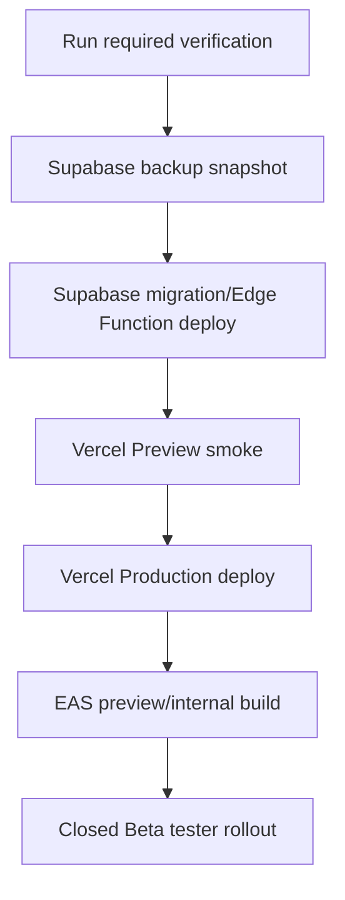

# Deployment & Rollback Runbook

## 결론

Closed Beta rollback은 먼저 **사용자 데이터 손실을 막는 방향**으로 판단한다. Web/Mobile UI rollback보다 Supabase migration rollback이 더 위험하므로, DB는 forward-fix 또는 feature disable을 우선한다.

## Release Order

## Web Rollback

| 상황 | 조치 |
| --- | --- |
| Vercel deploy failure | 이전 successful deployment로 rollback |
| auth/share callback regression | `NEXT_PUBLIC_APP_URL`, Supabase Auth redirect, Kakao redirect를 먼저 확인 |
| document-primary Web regression | `NEXT_PUBLIC_WEB_DOCUMENT_PRIMARY=0` 또는 query/localStorage `documentPrimary=0`로 legacy fallback 검증 |
| feedback/invite abuse | endpoint 임시 차단 또는 env secret rotation 후 rate limiting task 우선 처리 |

## Mobile Rollback

| 상황 | 조치 |
| --- | --- |
| EAS build install failure | 이전 preview/internal build로 tester 재배포 |
| OTA-capable JS regression | EAS Update channel을 이전 runtime-compatible update로 rollback |
| native module regression | 새 native build를 중단하고 이전 store/internal build 유지 |
| key provisioning failure | `EXPO_PUBLIC_ONVOY_ENABLE_LEGACY_SECURESTORE_KEY_MATERIAL_FALLBACK`는 incident owner 승인 후 임시 활성화 |

## Supabase Rollback

| 상황 | 우선 조치 |
| --- | --- |
| migration apply failure | 즉시 중단, backup snapshot 보존, failed migration 로그 첨부 |
| RLS blocks legitimate access | narrow forward-fix migration 작성 후 RLS smoke |
| RLS allows excessive access | affected policy disable/fix migration, service role audit, incident 기록 |
| Edge Function regression | 이전 function bundle redeploy 또는 function secret/config rollback |
| data corruption suspicion | writes stop, backup snapshot 복구 가능성 평가, 사용자 공지 여부 결정 |

## Local-first Kill Switch Matrix

| 경로 | Disable 방법 | 영향 |
| --- | --- | --- |
| Web document-primary | `NEXT_PUBLIC_WEB_DOCUMENT_PRIMARY=0`, URL `?documentPrimary=0` | Web repository가 legacy Supabase fallback으로 전환 |
| Web checklist spike/dual-write | `NEXT_PUBLIC_LOCAL_FIRST_CHECKLIST_SPIKE=0`, `NEXT_PUBLIC_LOCAL_FIRST_CHECKLIST_DUAL_WRITE=0` | 이전 checklist fallback 검증 |
| P2P fast path | Cloudflare TURN secret 제거/ICE failure 허용 또는 client rollout 중단 | local write와 backup sync는 계속 유지되어야 함 |
| Mobile legacy key fallback | `EXPO_PUBLIC_ONVOY_ENABLE_LEGACY_SECURESTORE_KEY_MATERIAL_FALLBACK=false` | native key path만 사용 |
| Backup sync | 신규 배포 중단, backup RPC/RLS forward-fix | 데이터 복구 기준 경로이므로 disable보다 forward-fix 우선 |

## Incident Severity

| Severity | 예시 | 목표 |
| --- | --- | --- |
| SEV1 | 데이터 손실, 권한 우회, secret 노출 | 즉시 rollout 중단, 1시간 내 사용자 영향 판단 |
| SEV2 | 로그인/동기화 주요 기능 장애 | 당일 rollback 또는 forward-fix |
| SEV3 | 일부 UI/알림/분석 문제 | 다음 beta build 또는 patch |

## Required Incident Record

| 항목 | 내용 |
| --- | --- |
| 시간 | 감지/대응/복구 시각 |
| 영향 | 플랫폼, 사용자 수, 데이터 범위 |
| 원인 | deploy, migration, env, vendor, app bug |
| 조치 | rollback, forward-fix, secret rotation, user notice |
| 후속 | test/runbook/code 보강 task |
