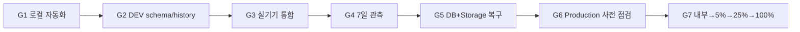
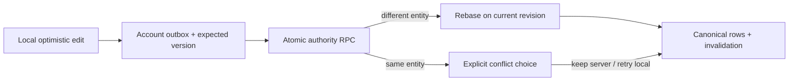
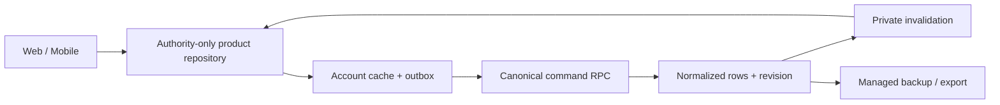
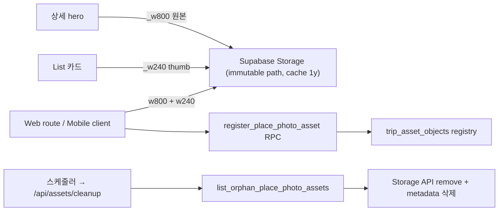
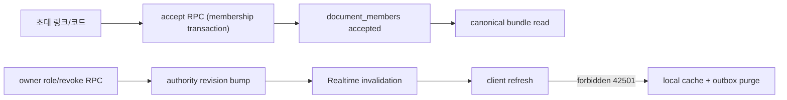
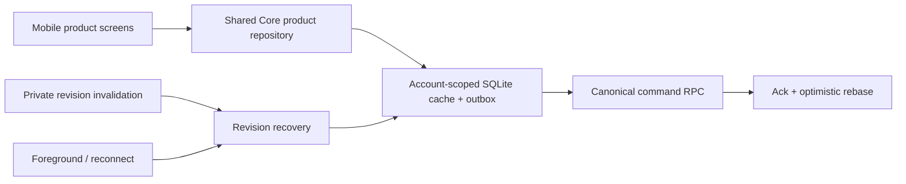
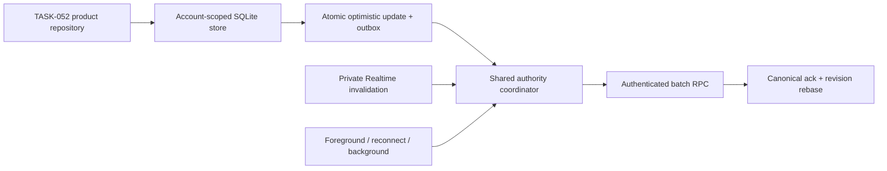
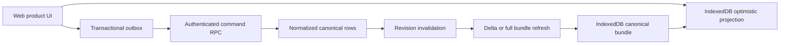
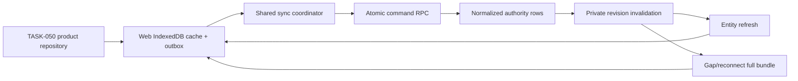

# Walkthrough: 모바일 프로필 여행 통계 복구

## 원인

- Web 프로필은 여행 목록 refresh를 기다린 뒤 통계를 계산하지만 Mobile 프로필과 여행 기록 화면은
  로컬 목록을 먼저 집계하고 refresh를 별도로 시작했다. 첫 진입이나 빈 캐시에서는 0건을 계산한 뒤
  refresh 결과를 명시적으로 다시 읽지 않아 저장소 이벤트 발생 여부에 따라 값이 갱신되지 않았다.
- 프로필 화면은 통계 조회 오류를 `null`로 바꿔 통계 영역 전체를 숨겼으므로 0건과 조회 실패를
  구분할 수 없었다.
- 개발 환경의 Strict Mode가 effect를 재실행하면 cleanup에서 `false`가 된 `isMounted` ref를 다시
  활성화하지 않아 비동기 결과가 화면에 반영되지 않을 수 있었다.
- 최초 수정 후 Android 실기기를 다시 조사한 결과 홈에는 editor로 참여한 여행이 정상 표시됐지만,
  통계 helper가 `ownerId === 현재 사용자` 조건을 적용해 해당 여행을 집계 직전에 제거하고 있었다.
  Authority 목록은 이미 현재 계정이 접근 가능한 여행으로 제한되므로 이 추가 필터는 동행자의 여행
  기록을 누락시키는 잘못된 정책이었다.

## 조치

- 최초 통계 조회는 authority 목록 refresh를 기다린 뒤 최신 로컬 read model을 집계한다.
- refresh가 실패해도 로컬 여행이 있으면 오프라인 통계를 표시하고, 로컬 목록까지 비어 있으면 오류와
  `다시 계산` 동작을 노출해 정상적인 0건과 구분한다.
- 저장소 변경 알림에서는 네트워크를 다시 호출하지 않고 로컬 값만 재집계한다.
- 여행 기록은 소유 여부와 무관하게 현재 계정이 owner/editor/viewer로 참여할 수 있는 여행을 집계한다.
  Web 프로필과 Web 여행 기록에도 같은 기준을 적용했다.
- 날짜별 여행 일수, 완료/예정 분류, 목적지 수와 refresh/local fallback을 순수 helper로 분리하고,
  동행자 여행 포함 회귀 테스트를 추가했다.

## 검증

- Android 실기기에서 홈의 editor 여행과 프로필/여행 기록의 0건 표시를 함께 재현해 원인을 확인
- Mobile authority/data 테스트 18건 PASS
- 모노레포 `pnpm typecheck` PASS
- Mobile Expo lint PASS
- Web·iOS·Android Expo export PASS

---

# Walkthrough: TASK-065 온여정 앱 브랜드 자산

## 결과

승인된 v6 `ㅇㅇㅈ` 심벌로 앱과 웹 브랜드 자산을 통일했다. 첫 `ㅇ`의 시계는 계획, 둘째 `ㅇ`의 체크는 준비 완료, `ㅈ` 윗획의 종이비행기는 출발을 나타낸다.

## 구현

- `docs/brand/v6`을 Git이 추적하는 단일 원본으로 만들고 `pnpm brand:apply` 재생성 명령을 추가했다.
- iOS/공통 icon, Android adaptive/themed/notification, splash PNG를 v6로 교체했다.
- Play Store icon과 feature graphic, Web ICO·SVG favicon, Apple Touch 및 PWA icon을 교체했다.
- Web manifest에 온여정 이름, Primary 테마와 192/512px 설치 아이콘을 연결했다.
- 인증 proxy에서 `manifest.webmanifest`를 정적 자산으로 제외해 비로그인 설치 요청을 허용했다.
- [앱 브랜드 자산 가이드](docs/brand/APP-BRAND-ASSET-GUIDE.md)에 플랫폼 적용·검증 규칙을 기록했다.

## 시각 보정

첫 실기기 설치에서 런처 마스크 안의 `ㅇㅇㅈ`이 좌우로 과밀하게 보이는 것을 확인했다. 공통 앱 아이콘은 78% 배치 영역(실제 심벌 폭 약 68%), Android adaptive와 themed icon은 런처 확대를 고려한 58% 배치 영역으로 보완했다. 96px 알림 아이콘은 작은 상태바 식별성을 위해 기존 75% 배치 영역을 유지했다. Web 화면 내부의 작은 로고는 전용 favicon 심벌을 사용한다.

## 검증

- `pnpm brand:apply` 반복 실행 전후 asset hash 일치 PASS
- PNG 규격과 alpha, SVG 파싱, ICO 16/32/48px entry PASS
- Mobile lint/typecheck와 Web·iOS·Android Expo export PASS
- Web production build와 `/icon.svg`, `/apple-icon.png`, `/manifest.webmanifest` 정적 route PASS
- 브라우저에서 favicon·Apple Touch·manifest link와 버전 경로의 UI logo 확인 PASS
- Android clean prebuild와 `assembleDebug` PASS
- 연결된 Android 기기가 없어 v6 APK의 launcher mask와 splash 실기기 시각 확인은 남아 있다.

---

# Walkthrough: Android 목록 카드 그림자 정리

## 변경

- 여행 상세 일정 카드의 `shadowColor`, `shadowOpacity`, `shadowRadius`, `shadowOffset`, `elevation`을
  제거했다.
- 홈 여행 목록과 템플릿 목록 카드의 `shadows.card` 적용도 제거했다.
- 1px `hairline` 테두리, 흰 배경과 기존 radius는 유지해 카드 경계가 사라지지 않도록 했다.
- 모달과 FAB 등 실제 부유 요소의 그림자는 변경하지 않았다.

## 검증

- Mobile typecheck와 Expo lint PASS
- Web·Android·iOS Expo export PASS
- 초기 일정 카드 변경의 Android Preview release APK build 및 연결된 실기기 업데이트 설치 PASS
- 홈 여행·템플릿 카드 추가 변경 후 Web·Android·iOS Expo export 재검증 PASS
- 기기가 PIN 잠금 상태여서 자동 화면 캡처는 수행하지 못했다.

# Walkthrough: TASK-060 완료 및 TASK-061/062 운영 Gate 착수

## TASK-060 완료

- Android 실제 기기에서 Web/Web, Web/Android, Android/Android의 여행·일정·준비물·템플릿·초대,
  권한, asset과 offline/reconnect를 통과했다.
- PR #381의 초대 수락 인박스와 오프라인 준비물 저장도 재검증했다.
- TASK-060은 `PASS`, Production 마스터 계획의 `G3`는 `GO`다.

## 운영 Gate 준비

- TASK-061 Issue #382와 TASK-062 Issue #383을 등록했다.
- `task061-soak-report.mjs`는 동일 release SHA의 7일 연속성, authority 오류율·p95, quota와 incident를
  판정한다.
- `task062-recovery-audit.mjs`는 DEV/Production을 Recovery 대상으로 차단하고 backup checksum,
  canonical table과 Storage digest를 비교한다.
- 실제 증적은 Git에서 제외된 `_workspace` 또는 repository 밖의 암호화 저장소에만 둔다.

## 현재 판정

TASK-061의 7일 DEV 관측과 TASK-062의 별도 Recovery 프로젝트 복원이 남아 `G4`, `G5`와 Android
Production은 `NO-GO`다. 두 작업 통과 후 TASK-063 preflight와 단계적 rollout을 진행한다.

# Walkthrough: TASK-060 Android 초대 수락·오프라인 준비물 회귀

## 발견 원인

- Core에는 대상 이메일 초대 조회와 수락·거절 RPC가 있었지만 Mobile 홈에서 호출하지 않아 초대받은
  계정이 응답할 UI가 없었다.
- 준비물 authority mutation은 SQLite와 outbox에 낙관적으로 commit할 수 있었지만, 화면 reload가
  원격 `checklist_categories` 조회를 기다렸다. 오프라인에서는 로컬 저장 결과를 다시 읽고도 화면에
  반영하지 못했다.
- 신규 카테고리 insert도 준비물 commit보다 먼저 실행돼 네트워크 오류가 핵심 데이터 저장을
  차단했다.

## 조치

- Mobile 홈에 수신 초대 인박스를 추가하고 수락·거절, 오류 재시도를 연결했다. 수락 후에는 새 멤버
  권한으로 trip authority 목록을 hydrate한 뒤 여행 상세로 이동한다.
- 준비물 snapshot은 로컬 repository에서 읽은 즉시 화면에 적용한다. 원격 카테고리 catalog 조회와
  생성은 비차단 보조 동기화로 분리했다.
- 오프라인에서 만든 카테고리명은 준비물 canonical 데이터에서 로컬 선택지로 복원하므로 catalog
  요청 실패와 무관하게 추가·수정 결과를 즉시 확인할 수 있다.

## 검증

- Core invitation 수락·거절 RPC와 offline checklist 낙관적 read 회귀 테스트를 추가했다.
- Mobile typecheck와 lint, Core 전체 테스트를 통과했다.
- Android 실기기에서는 초대받은 계정의 수락/거절, airplane mode 준비물 추가·수정·삭제·체크,
  reconnect 후 다른 기기 수렴을 다시 확인해야 한다.

# Walkthrough: TASK-060 Android 동행자 초대 정합성

## 문제와 원인

- Web에서 만든 이메일 초대는 `document_invitation_links`에 `pending`으로 저장되지만 Mobile은 승인된
  `document_members`만 조회해 같은 owner 계정에서도 수락 대기를 표시하지 않았다.
- DEV Android preview는 Vercel Deployment Protection이 적용된 Web Preview API를 호출했다. 401
  응답의 `error` 객체가 문자열로 변환되면서 Alert에 `[object Object]`가 노출됐다.

## 조치

- Mobile 동행자 화면이 승인 멤버와 대상 이메일 초대를 함께 조회하고 `수락 대기`를 별도 표시한다.
- Mobile 이메일 초대는 현재 Supabase 프로젝트의 인증 Edge Function
  `send-document-invitation`을 호출한다. 함수는 사용자 JWT와 기존 invitation RPC 권한을 그대로
  사용하고, 메일 실패 시 생성한 초대를 취소한다.
- 오류 응답을 구조적으로 파싱해 문자열 메시지만 Alert에 전달하며 관련 단위 테스트를 추가했다.
- DEV `ivgkqzwosbjukonlpfdw`에 함수와 `RESEND_API_KEY`,
  `ONVOY_APP_ORIGIN=https://preview.nexvoy.xyz`를 적용했다. 인증 스모크에서 초대 생성, 이메일 전송,
  owner 수락 대기 조회와 취소를 확인하고 테스트 계정을 제거했다.
- Production 함수와 secret은 배포하지 않았으며 TASK-063 preflight에서 별도 승인·검증한다.

## 검증

- Mobile invitation/authority 테스트 12건, typecheck, lint, export와 Android release build가
  통과했다.
- 최종 APK 생성 후 실제 Android 기기의 ADB 연결이 끊겨 화면 재검증은 TASK-060 실기기 Gate에
  남겼다.

# Walkthrough: Android 우선 Production 작업 재구성

## 결정

초기 Production 지원 범위를 Web과 Android로 확정했다. iOS 미검증은 Android 출시 차단 항목에서
제외하되 iOS 지원을 선언하지 않으며, 공유 코드의 typecheck·export·simulator launch만 비차단 회귀
Gate로 유지한다.

## 작업 재구성

- TASK-060: Web/Web, Web/Android, Android/Android 실기기 통합 검증
- TASK-061: Web·Android release candidate의 DEV 7일 안정성·비용 관측
- TASK-062: DB·Storage 복구와 Web·Android 권한·데이터 smoke
- TASK-063: Web·Android Production preflight와 Android 단계적 rollout
- TASK-064: iOS 실기기·OAuth·push·lifecycle·TestFlight/App Store 검증과 별도 rollout

## 판정

Android 실제 기기, 외부 연동, 관측과 복구가 남아 Web·Android Production은 계속 `NO-GO`다. iOS
simulator PREPASS는 유지하지만 iOS Production 판정은 TASK-064 전까지 `DEFERRED`다.

---

# Walkthrough: TASK-060 Web·Android 통합 검증 Simulator PREPASS

## 판정

Issue [#378](https://github.com/ysjee141/nexvoy-frontend/issues/378)에 따라 DEV에서 Android 두 대와
iOS 두 대의 설치 빌드를 검증했다. Android 동일 계정·asset 수렴과 iOS release 앱 실행은
`PREPASS`지만, 실제 기기와 전체 역할·offline 매트릭스가 남아 TASK-060은 진행 중이고 Production은
`NO-GO`다.

## 발견 결함과 수정

- React Native에서 `crypto.randomUUID()`가 제공되지 않을 때 생성되던 `plan-*` ID가 PostgreSQL
  UUID 변환에서 거부됐다. Core 공통 secure UUID v4 생성기를 추가하고 Mobile entity 생성 경로를
  통일했다.
- 장소 사진 upload가 plan command의 canonical 반영보다 먼저 실행돼 Storage RLS가 거부됐다.
  outbox가 `synced`가 된 뒤 upload하고 image URL command를 다시 flush하도록 순서를 고정했다.
- DEV 테스트 계정 도구는 정확한 project ref guard, mode `0600` credential과 장소 사진 정리를
  포함한다.

## 검증

- Production P0 자동화, typecheck, package/Web/Mobile build와 Mobile lint PASS
- Android preview APK 빌드·설치·실행 PASS
- Android A에서 만든 여행·일정·Google 장소 사진을 Android B 새 설치에서 복구 PASS
- DEV canonical revision 3, plan UUID v4, 사진 URL, 240/800 asset metadata 확인
- iOS simulator release archive 빌드 및 iPhone 16 Pro/16e 설치·실행 PREPASS
- Google/Kakao OAuth와 실제 초대 이메일 수락은 사용자 승인에 따라 Simulator Gate에서 제외
- Android 실제 기기 검증은 장비 미제공으로 BLOCKED
- iOS 실기기 검증은 TASK-064로 이관해 Android Gate에서 제외

## 다음 단계

Android 실제 기기에서 Web/Android·Android/Android, 다중 역할, offline/background/force-stop,
초대·revoke와 asset 전체 P0/P1 수동 매트릭스를 실행한다.

---

# Walkthrough: TASK-059 DEV Migration Ledger 정합화

## 요약

Issue [#376](https://github.com/ysjee141/nexvoy-frontend/issues/376)에 따라 SQL Editor로 적용된 DEV 객체와
미등록 migration history를 재현 가능하게 판정했다. 원본 historical SQL을 다시 실행하지 않고,
검증된 version은 repair하고 실제 누락된 TASK-058/059만 forward migration으로 적용하는 절차를
확정했다. 사용자 승인 후 DEV에 전체 절차를 실행하고, 추가 승인 후 Production에는 TASK-058/059만
target-only 방식으로 적용했다.

## 주요 변경

- 12개 version, 185개 객체의 function/table/constraint/index/policy/trigger/RLS/grant manifest와
  `pg_dump` 비교 도구를 추가했다.
- Supabase 기본 함수 권한에서 남은 internal authority RPC의 `anon`/`authenticated` EXECUTE를
  `service_role`로 제한했다.
- 제품 RPC는 authenticated allowlist로 재구성하고, trip/template/topic helper를 `auth.uid()`에
  결속해 타 사용자 ID 대입을 차단했다.
- SQL 회귀 테스트는 internal RPC 접근, 역할별 공개 RPC, 초대 요약 익명 접근과 신원 결속을 검증한다.
- remote-safe smoke는 service role 없이 전용 QA 네 계정으로 초대, 권한, revision, 멱등성과 revoke를
  검증하고 QA 여행을 soft-delete한다.

## DEV 적용

- 적용 전 history 미등록: `20260712000001`~`20260723000002` 중 10건, TASK-058, TASK-059
- historical 10건은 객체 재실행 없이 history만 repair
- dry-run에서 TASK-058/059만 확인한 뒤 두 forward migration 적용
- 적용 후 migration drift 0, strict fingerprint 12/12 version·185/185 객체 일치
- 임시 owner/editor/viewer/outsider 네 계정의 authenticated smoke PASS
- QA 여행 soft-delete와 임시 Auth 계정 4/4 삭제

## Production 적용

- 기존 원격 전용 history 4건을 보존하는 격리 workspace 사용
- dry-run에서 TASK-058/059만 확인한 뒤 두 migration 적용
- 적용 후 target-only dry-run 0건, fingerprint 11/12 version·183/185 객체 일치
- anonymous public write wrapper와 internal command RPC `42501` 차단 PASS
- 실제 사용자, QA 계정과 여행 데이터 생성 없음
- 남은 historical ledger gap과 두 checklist `is_private NOT NULL` 차이는 TASK-063에서 처리

## 검증

- `pnpm test:production:p0` PASS: Core, Web/Mobile store, 전체 SQL, Playwright 23건
- `pnpm typecheck`, `pnpm build:packages`, `pnpm build:web` PASS
- `pnpm build:mobile`, `pnpm lint:mobile` PASS
- fingerprint 자기 비교 12/12, 185/185 PASS
- DEV 적용 후 fingerprint 12/12, 185/185와 migration drift 0 PASS
- authenticated remote-safe smoke PASS
- Production TASK-058/059 target-only 적용과 anonymous denial smoke PASS

## 다음 단계

TASK-059 Gate를 모두 통과했다. TASK-060에서 DEV 기준 Web·Android·iOS 실기기, 다중 계정과 asset
통합 매트릭스를 검증한다.

---

# Walkthrough: TASK-058 Production P0 통합 테스트 자동화

## 요약

Issue [#374](https://github.com/ysjee141/nexvoy-frontend/issues/374)에 따라 Production G1을 막던
`NEW-A01`~`NEW-A13`을 로컬 Supabase 기반 자동 Gate로 구현했다. 원격 DEV/Production service role
seed는 사용하지 않으며, URL guard가 원격 endpoint에서 즉시 실패한다.

## 주요 변경

- 초대, role 하향/revoke, 계정 전환, 템플릿 적용, 충돌 재적용을 실제 제품 UI와 canonical row로 검증한다.
- Web IndexedDB와 Mobile SQLite에서 stale `sending` 회수와 중복 ACK 멱등성을 검증한다.
- SQL에서 cross-trip entity ID 변조, outsider RPC, 초대 수락과 revoke 직후 read/write/Realtime 차단을 검증한다.
- 장소 사진 hash를 공통 Core SHA-256으로 통일하고 Storage write와 metadata를 trip authority에 결합했다.
- Realtime role 변경 시 일정 화면의 `userRole`도 다시 읽도록 제품 결함을 수정했다.
- legacy direct trip E2E fixture를 authority command seed로 교체했다.
- CI가 고정 Supabase CLI와 로컬 스택에서 `pnpm test:production:p0`를 실행하고 SHA별 artifact를 남긴다.

## Asset 보안 경계

`place-photos` byte는 Google 장소 사진 public cache다. owner/editor만 canonical
`{user}/{trip}/{plan}_{sha256-8}_w{240|800}.jpg` path를 쓸 수 있고 viewer/outsider/revoked는
write/delete와 `trip_asset_objects` metadata에 접근할 수 없다. 향후 비공개 사용자 미디어는 이
bucket을 재사용하지 않고 private bucket과 인증 delivery endpoint로 분리한다.

## 검증

- `pnpm test:production:p0` PASS
  - Core, Web IndexedDB, Mobile SQLite authority 테스트
  - TASK-046~058 SQL smoke 7개
  - `NEW-A01`~`NEW-A13`을 포함한 Playwright 23건
- `pnpm typecheck`, `pnpm build:packages`, `pnpm build` PASS
- `pnpm lint:mobile`, `pnpm build:mobile` PASS
- PR [#375](https://github.com/ysjee141/nexvoy-frontend/pull/375)의 Quality, E2E, Vercel이 동일
  release SHA에서 모두 PASS했다.

## 배포 주의

`20260723000003_task058_place_photo_write_policy.sql`은 로컬 reset에서 검증했다. TASK-058에서는 원격
migration을 적용하지 않으며, TASK-059가 DEV/Production fingerprint와 history를 확인한 뒤 forward
migration으로 적용한다. Production GO는 TASK-059~063 완료 전 선언하지 않는다.

---

# Walkthrough: TASK-057 Migration Ledger 판정 정정

## 결과

Issue [#372](https://github.com/ysjee141/nexvoy-frontend/issues/372)에서 SQL Editor 수동 실행으로 생성된
실제 객체와 Supabase migration history를 분리해 판정하도록 TASK-057·TASK-059 문서를 정정했다.

| 환경 | 객체 확인 | History 상태 |
|---|---|---|
| DEV `ivgkqzwosbjukonlpfdw` | TASK-055/056 핵심 함수·정책 확인 | historical 9건과 TASK-056 미등록 |
| Production `runbcaegpefqnljsswhv` | TASK-055/056 핵심 함수·정책 확인 | 로컬 version 대부분 미등록, 원격 전용 4건 |

## 핵심 결정

- TASK-055/056 원본 SQL은 다시 실행하지 않는다.
- 핵심 객체 존재만으로 완료 처리하지 않고 migration 전체 statement를 fingerprint한다.
- 양쪽 환경에 남은 authority helper·wrapper의 `anon` 실행 grant는 forward migration과 SQL test로
  회수한다.
- 일치하는 version만 하나씩 `migration repair --status applied`로 history에 등록한다.
- 부분 적용 또는 실제 정의 차이는 새 forward reconciliation migration으로 정리한다.
- Production의 원격 전용 history와 `public` schema 차이는 삭제·일괄 repair하지 않고 TASK-063에서
  독립적으로 분류·승인한다.

## 검증

- DEV와 Production의 `supabase migration list`를 읽기 전용으로 확인했다.
- 양쪽 `public,realtime` schema dump에서 TASK-055/056 핵심 결과를 확인했다.
- Supabase 연결은 확인 후 DEV로 복원했다.

---

# Walkthrough: TASK-057 Production 최종 검증 계획

## 결과

Issue [#370](https://github.com/ysjee141/nexvoy-frontend/issues/370)에 따라 TASK-056 이후 남은 작업을
Production 출시 Gate, 통합 테스트, 증적, 배포·복구 Runbook으로 재구성했다. 현재 판정은 코드 Gate
PASS, DEV/Production NO-GO이며, 실제 실행은 `TASK-058`~`TASK-063`으로 분리했다.

## 작성 문서

- `TASK-057-production-final-validation-plan.md`: 차단 항목, 역할, Gate, 정량 GO/NO-GO 기준
- `TASK-057-production-integration-test-cases.md`: 현재·추가 자동화, 플랫폼 매트릭스, 수동 P0/P1 케이스
- `TASK-057-production-validation-runbook.md`: Local/DEV/Recovery/Production 실행 순서와 증적 템플릿
- `docs/production-readiness.md`: Web, Mobile, Supabase, 외부 연동, 보안·법무·운영을 포함한 상위 출시 기준

## 핵심 결정

- 현재 Playwright와 SQL smoke는 Local 전용으로 유지한다. Service role guard를 우회해 DEV에 실행하지 않는다.
- DEV 원격 검증은 authenticated test account와 자체 `QA-` fixture만 사용하는 안전한 smoke로 분리한다.
- 초대, role/revoke, 계정 격리, 템플릿, asset 권한 자동화를 P0로 추가한 뒤 실기기 Gate를 시작한다.
- asset cleanup scheduler와 Web/Mobile object path 불일치를 Production 차단 항목으로 관리한다.
- DB managed backup과 logical export는 Storage object byte를 포함하지 않으므로 `place-photos`를 별도 복구한다.
- TASK-055 이후 롤백은 직전 authority-only client와 비파괴 function 복원만 사용한다.

## 다음 작업

1. `TASK-058`에서 `NEW-A01`~`NEW-A13` P0 자동 테스트를 구현한다.
2. `TASK-059`에서 DEV historical 9건과 TASK-056 전체를 fingerprint하고 history를 정합화한다.
3. `TASK-060`에서 TASK-059에서 정합화한 schema를 기준으로 전체 실기기·asset 매트릭스를 실행한다.
4. `TASK-061`·`TASK-062`의 7일 관측과 복구 후 `TASK-063` Production preflight를 진행한다.

---

# Walkthrough: TASK-056 Production 데이터 정합성 및 비용 Gate

## 결과

Issue [#368](https://github.com/ysjee141/nexvoy-frontend/issues/368)의 자동화 가능한 Production
gate를 구현했다. 서로 다른 entity의 stale 변경은 row version으로 안전하게 재기준화하고, 같은
entity 충돌은 Web/Mobile 사용자에게 server 최신본 유지 또는 local 변경 재적용을 선택하게 한다.

## 구현

- Core/Web/Mobile command path에 entity versioning과 conflict metadata/resolution을 연결했다.
- SQL wrapper는 stale batch의 모든 신규 command가 entity-level 검증 가능할 때만 현재 revision으로
  rebase한다. per-user check는 허용하고 assignee whole-set은 보수적 conflict를 유지한다.
- Web dialog와 Mobile modal에서 대기 건수와 두 해결 선택을 제공한다.
- GA4/Firebase에 queue age, bytes, duration, conflict/retry/reject, gap/full refresh를 전송하되
  account/resource ID와 사용자 콘텐츠는 Core allowlist에서 제거한다.
- UTF-8 command/invalidation budget과 여행/템플릿 concurrency를 자동 gate로 고정했다.

## 검증 및 판정

- Core/Web/Mobile authority tests, typecheck, TASK-056 SQL test를 통과했다.
- 두 Web context의 offline outbox를 동시에 reconnect해 동일 entity 충돌과 server 선택 후 수렴을
  Playwright로 검증했다.
- 코드 gate는 PASS지만 DEV migration ledger gap, 실기기 matrix, 7일 관찰, DB+Storage restore
  rehearsal이 남아 DEV/Production과 legacy 물리 삭제는 NO-GO다.
- 실행 순서는 `TASK-056-production-rollout-and-recovery.md`, 판정은
  `TASK-056-production-go-no-go.md`를 따른다.

---

# Walkthrough: TASK-055 Retire Yjs, P2P, and Encrypted Backup Runtime

## 결과

Issue [#366](https://github.com/ysjee141/nexvoy-frontend/issues/366)의 legacy runtime 정리를 구현했다.
OnVoy 제품 데이터 경로는 Supabase normalized row authority, Web IndexedDB/Mobile SQLite
account cache, durable command outbox, canonical RPC, Realtime revision recovery로 단일화됐다.
Pull Request: [#367](https://github.com/ysjee141/nexvoy-frontend/pull/367)

## 구현

- Core의 제품 모델/변경/read model/repository 계약을 `packages/core/src/product`로 분리하고,
  authority sync를 `packages/core/src/authority`로 이동했다.
- Core/Web/Mobile의 Yjs, WebRTC/P2P, signaling, encrypted backup, key provisioning, document-primary
  compatibility 코드와 테스트를 삭제했다.
- Mobile의 WebRTC/quick crypto/Yjs/native crypto dependency, Expo plugin/permission, background key task를
  제거했고 lockfile/workspace를 정리했다.
- Web/Mobile auth/join/share/invitation/collaboration/product CRUD를 keyless authority 경로로 고정했다.
- 웹의 사장된 downloaded-trip bundle/offline route를 제거해 일반 상세 화면이 권위 cache/
  outbox를 그대로 사용하게 했다.
- 현재 authority store를 보존하는 멱등적 V1 local reset과 DEV-only remote reset script를 추가했다.
- `20260723000001_task055_revoke_legacy_sync_runtime.sql`은 legacy API 권한과 signaling policy를
  차단하되, Production rollback을 위해 table/function/data는 삭제하지 않는다.
- Web/Mobile private Broadcast는 구독 전 access token을 명시적으로 설정한다. Realtime channel
  authorization probe를 막던 `event` RLS 조건을 제거해 동행자 화면의 실시간 수렴을 복구했다.
- 퇴역한 backup/key provisioning 성공을 검사하던 TASK-006/007/015 SQL 테스트를 제거하고,
  legacy API 접근 차단을 검증하는 TASK-055 테스트로 교체했다.

## 검증

- Core/Web/Mobile authority 단위 테스트, 전체 typecheck, Mobile lint를 통과했다.
- Web production build와 Expo Web/iOS/Android export를 통과했다.
- TASK-046/049/053/054/055 SQL 회귀 테스트를 로컬 Supabase에서 통과했다.
- Playwright에서 offline outbox 재연결, 편집자 Realtime 수렴, 일정 canonical 저장,
  observability payload safety 4개 시나리오를 통과했다.
- 활성 앱/패키지에서 Yjs, WebRTC, P2P, document key, backup queue 참조가 없음을 확인했다.

## 배포

1. Authority-only client를 먼저 배포하고 지원 Mobile 최소 버전을 강제한다.
2. DEV `ivgkqzwosbjukonlpfdw`에 revoke migration과 전체 smoke를 적용한다.
3. 관찰 후 Production `runbcaegpefqnljsswhv`에 동일 순서로 적용한다.
4. 물리 object 삭제는 TASK-056의 export/minimum-version/zero-traffic/restore gate 승인 후 실행한다.

상세 절차는 `docs/refactor/runbooks/TASK-055-legacy-runtime-retirement.md`를 따른다.

---

# Walkthrough: TASK-054 Direct Asset Storage and Delivery

## 결과

Issue [#364](https://github.com/ysjee141/nexvoy-frontend/issues/364)의 asset 전송 정리를 구현했다. place photo는 width suffix immutable path(`_w800`/`_w240`)로 저장되고, list 화면은 thumbnail만 요청하며, 모든 object는 `trip_asset_objects` metadata registry에 등록되어 plan 삭제/사진 교체 후 retention이 지나면 orphan cleanup 대상이 된다. asset binary는 여전히 Repository command와 Realtime을 통과하지 않는다.

## 구현

- core `storagePaths.ts`: `placePhotoObjectPath`(width suffix), `derivePlacePhotoThumbUrl`(`_w800→_w240` 파생, legacy는 null) + 단위 테스트. 실제 경로와 불일치하던 미사용 `planPhotoPath` 제거.
- `20260718000002_task054_trip_asset_objects.sql`: metadata 테이블(RLS: member SELECT만, client 직접 쓰기 금지), `register_place_photo_asset`(본인 폴더 + trip 쓰기 권한 검증), `list_orphan_place_photo_assets`(service_role 전용, plan soft-delete·사진 교체 + retention 기준).
- Web `/api/places/photo/store`: Google w800/w240 이중 fetch(썸네일 실패 non-fatal) 후 upload + metadata 등록, 응답 `{ imageUrl, thumbUrl }`. Google→서버→Storage ingest는 ADR-006(API key 보호·CORS) 때문에 유지 — client binary proxy는 없다.
- Mobile `storePlanPlacePhoto`: 동일한 이중 direct upload + 등록.
- Web `PlanImage`(thumbnail variant)와 Mobile plan 카드: thumb 우선, onError 시 원본 1회 fallback. 상세 hero는 원본 유지.
- 신규 `/api/assets/cleanup`: `x-cron-secret`(=`ASSET_CLEANUP_SECRET`) 검증, dryRun/retentionDays 지원, orphan을 Storage API로 삭제 후 metadata 정리. SQL은 storage.objects를 직접 조작하지 않는다.
- `packages/types/database.generated.ts` 재생성 (신규 테이블·RPC 반영, 원격 전용 `delete_user` 타입 수동 유지).

## 검증

- core/web/mobile typecheck, core 테스트(storagePaths 포함), `pnpm build`, `pnpm build:mobile` 통과.
- 로컬 Supabase 마이그레이션 적용 + `supabase/tests/task054_asset_objects.sql` 통과: 본인 폴더 외/비멤버 등록 42501, 직접 INSERT RLS 차단, outsider 조회 0건, retention 내 orphan 0건, plan 삭제·사진 교체 orphan 판정.
- 회귀: `task053_membership_invitation.sql` 통과.

## 남은 항목

- 스케줄러(cron)에서 `/api/assets/cleanup` 주기 호출 연결과 `ASSET_CLEANUP_SECRET` 설정.
- DEV 실기기/실브라우저에서 신규 ingest 후 list가 `_w240`을 요청하는지 network 확인.
- placeIdHash8 플랫폼 불일치(web sha256-8 / mobile djb2) 통일은 후속 과제.

---

# Walkthrough: TASK-053 Membership and Invitation Without Document Keys

## 결과

Issue [#362](https://github.com/ysjee141/nexvoy-frontend/issues/362)의 keyless membership/invitation 전환을 구현했다. 초대 수락은 이제 accepted membership transaction으로 끝나고, 참여자는 key 전달·snapshot restore 대기 없이 canonical bundle을 즉시 읽는다. role 변경과 revoke는 server RPC로만 수행되며 authority revision을 bump해 Realtime로 전파되고, revoke된 client는 해당 resource의 local cache와 pending outbox를 purge한다.

## 구현

- `20260718000001_task053_keyless_membership_invitation.sql`: `accept_document_invitation_unchecked`와 `accept_my_document_invitation`에서 key provisioning 큐잉·알림을 제거하고 membership accept를 완료 조건으로 확정했다. `bump_authority_revision_for_membership`으로 accept/role change/revoke가 trip/template authority revision을 bump한다.
- Core `ServerAuthoritySyncCoordinator`: `authority_(trip|template)_*_forbidden`(42501) 오류를 membership 상실로 분류해 `AuthorityLocalStore.purgeResource`(resource+outbox 원자 삭제)를 호출하고 `authority_membership_revoked` metric과 `onMembershipRevoked` 콜백을 발행한다. offline 중 revoke된 command는 `markRejected` terminal로 끝나고 재시도하지 않는다.
- Web IndexedDB store와 Mobile SQLite store에 `purgeResource`를 구현했고, 양 플랫폼 sync service는 revoke 시 해당 topic Realtime 구독을 해제한다.
- Web `JoinClient`·`InvitationBanner`, Mobile `join.tsx`: server-authority mode에서 수락 즉시 여정 상세로 이동한다. `데이터 준비 중` 상태·polling·device key material 생성은 legacy flag 경로에만 남는다. 대상 이메일 불일치 오류는 별도 문구로 분리했다.
- `CollaboratorModal`: server-authority mode에서 key provisioning 섹션을 노출하지 않는다. role 변경/revoke RPC 경로는 유지된다.

## 검증

- core typecheck/전체 테스트(회수 purge·refresh denied 케이스 추가), mobile typecheck·sqliteStore 테스트 통과.
- `pnpm build`와 `pnpm build:mobile` 통과.
- 로컬 Supabase에 마이그레이션 적용 후 `supabase/tests/task053_membership_invitation.sql` 통과: 이메일 불일치 수락 차단, keyless accept(0 provisioning rows) 즉시 bundle read, viewer write 차단, 직접 `document_members` UPDATE 차단, role change/revoke revision bump, revoked member의 row/Realtime/summaries 차단.
- 회귀: `task046_server_authority.sql`, `task049_realtime_authority_invalidation.sql` 통과.

## 남은 항목

- DEV 다중 사용자 실브라우저/실기기 초대·revoke 수동 시나리오.
- legacy key table/RPC 물리 제거와 V1 데이터 reset은 `TASK-055`.

---

# Walkthrough: TASK-052 Mobile Server-Authority Product Cutover

## 결과

Issue [#360](https://github.com/ysjee141/nexvoy-frontend/issues/360)의 Mobile 제품 경로 전환을 구현했다. 여행, 일정, 준비물, 템플릿은 이제 account-scoped SQLite cache를 먼저 읽고 durable outbox와 canonical command RPC로 저장한다. Pull Request: [#361](https://github.com/ysjee141/nexvoy-frontend/pull/361)

## 구현

- Web의 제품 repository 로직을 Core factory로 추출해 Web과 Mobile의 command shape, 권한, projection을 일치시켰다.
- Mobile 홈/상세/템플릿/프로필 파생 조회를 authority repository로 전환하고 local-first rendering과 background refresh를 연결했다.
- 모든 제품 mutation을 SQLite optimistic transaction과 outbox append로 처리하며 foreground, reconnect, debounce trigger에서 flush한다.
- 상세 화면에 Realtime revision recovery와 동기화 상태 badge를 추가했다.
- 신규 resource의 첫 server ack 전에는 초대와 이미지 업로드를 제한한다.
- authority mode에서는 legacy key provisioning, encrypted backup, P2P 실행을 차단한다.

## 리뷰 및 검증

- 목록의 여행별 원격 조회를 summary projection으로 제거했다.
- revision 0 신규 resource의 첫 구독 실패 후 ack 시 자동 재구독하도록 보완했다.
- foreground/reconnect 목록 refresh와 화면 subscription 정리를 검증했다.
- Core/Web authority/Mobile tests, 전체 typecheck, Mobile lint, Web build, Expo export를 통과했다.
- Android development local build는 통과했다. 연결된 기기가 없어 계정 전환, 비행기 모드, Web/Mobile 교차 동기화는 `docs/refactor/runbooks/TASK-052-mobile-authority-product-smoke.md` 절차로 남겼다.

---

# Walkthrough: TASK-051 Mobile SQLite Cache and Transactional Outbox

## 결과

Issue [#358](https://github.com/ysjee141/nexvoy-frontend/issues/358)의 Mobile server-authority persistence 기반을 구현했다. Mobile 화면은 아직 기존 repository를 유지하지만, TASK-052가 사용할 SQLite cache/outbox와 lifecycle sync 경계가 준비됐다. Pull Request: [#359](https://github.com/ysjee141/nexvoy-frontend/pull/359)

## 구현

- `authority_resources`, `authority_outbox`, `authority_sync_state`를 포함하는 version 1 SQLite migration과 WAL/foreign-key 설정을 추가했다.
- optimistic mutation과 command append, acknowledgement, retry/conflict, stale sending recovery, guest promotion, account/resource purge를 exclusive transaction으로 구현했다.
- 로그인 시 sync runtime/background task를 시작하고 foreground, network reconnect, retry 시각에 queue를 재개한다.
- logout에서는 namespaced cache를 보존하고 withdrawal에서는 account purge 실패 시 전체 authority DB 삭제로 local data 잔존을 막는다.
- Realtime invalidation/revision recovery adapter를 추가하되 제품 화면의 실제 구독은 TASK-052로 남겼다.
- Expo Web export의 SQLite WASM asset을 위해 Metro에 `wasm` 확장자를 등록했다.

## 검증

| 항목 | 결과 |
|---|---|
| Mobile authority transaction tests | PASS, 5 tests |
| Core tests | PASS |
| `pnpm typecheck` | PASS |
| Mobile lint | PASS |
| Web production build | PASS |
| Web/iOS/Android Expo export | PASS |
| Android development local build | PASS |
| Expo dependency compatibility | PASS |

실기기 계정 전환, 비행기 모드, OS background smoke 절차는 `docs/refactor/runbooks/TASK-051-mobile-sqlite-authority-smoke.md`에 정리했다. 실제 제품 화면의 offline mutation과 Realtime 구독 검증은 TASK-052에서 수행한다.

# Walkthrough: TASK-050 Plan Command Recovery

## Summary

TASK-050 Web 전환 후 일정 명령이 `plan` 대신 `trip`으로 생성되어 optimistic trip root를 덮어쓰고,
신규 여행의 첫 server batch 전체를 `22023`으로 rollback하던 결함을 수정했다. 기존 브라우저에 이미 거절된
배치는 canonical base에서 자동 재구축해 여행·준비물·일정을 함께 재전송한다.

## Artifacts

- GitHub Issue [#356](https://github.com/ysjee141/nexvoy-frontend/issues/356)
- Pull Request [#357](https://github.com/ysjee141/nexvoy-frontend/pull/357)
- 브랜치: `codex/fix-task050-plan-command`
- `apps/web/lib/data/authorityProductRepositories.ts`
- `apps/web/lib/server-authority/indexedDbStore.ts`
- `packages/core/src/sync/serverAuthorityMaterialize.ts`
- `apps/web/e2e/server-authority-product.spec.ts`

## Key Changes

- 일정 create/update/delete command를 `entityType: plan`으로 교정했다.
- trip/template root command가 resource ID와 다른 entity ID를 대상으로 하면 즉시 거부한다.
- 기존 오분류 command와 같은 `22023` 거절 batch를 pending으로 되돌리고 canonical bundle에서 projection을 재구축한다.
- 서버 권위 일정 이미지 복구는 direct plan RLS 조회 대신 document owner/editor write 권한을 사용한다.
- 일정 생성 후 trip root 유지, canonical plan 반영, IndexedDB 거절 batch 복구 회귀 테스트를 추가했다.

## Verification

| 검증 | 결과 |
| --- | --- |
| `pnpm --filter nexvoy-web test:authority` | PASS |
| `pnpm --filter @nexvoy/core test` | PASS |
| `pnpm --filter nexvoy-web exec tsc --noEmit --pretty false` | PASS |
| `pnpm typecheck` | PASS |
| `pnpm build` | PASS |
| `pnpm build:mobile` | PASS |
| `pnpm --filter nexvoy-web exec playwright test --list` | PASS, 15 tests |
| 일정 생성 Playwright 실제 실행 | BLOCKED, 원격 DEV cleanup 방지 안전장치 |
| 기존 실패 draft 브라우저 복구 | PASS, 일정 1개 및 `동기화 완료` 확인 |

## Rollback

plan command 교정만 되돌리면 데이터 손상 결함이 재발하므로 부분 rollback은 허용하지 않는다. 전체 rollback 시
runtime의 local repair 호출, IndexedDB repair 함수, root 불변식, 이미지 권한 분기를 함께 제거한다. DB migration은 없다.

---

# Walkthrough: TASK-050 Web Server-Authority Product Cutover

## Summary

Web의 여행, 일정, 준비물, 템플릿 제품 경로를 Supabase normalized row authority로 전환했다. 화면은 계정별
IndexedDB cache를 먼저 읽고, 수정은 optimistic projection과 durable outbox에 원자 기록한다. 서버 반영은
authenticated batch RPC로 수행하며 Realtime은 revision invalidation만 전달한다.

## Artifacts

- GitHub Issue [#354](https://github.com/ysjee141/nexvoy-frontend/issues/354)
- Pull Request [#355](https://github.com/ysjee141/nexvoy-frontend/pull/355)
- 브랜치: `codex/task-050-web-authority-cutover`
- `apps/web/lib/data/authorityProductRepositories.ts`
- `apps/web/lib/server-authority/indexedDbStore.ts`
- `apps/web/components/trips/AuthoritySyncStatusBadge.tsx`
- `apps/web/e2e/server-authority-product.spec.ts`

## Key Changes

- authority mode를 Web 기본 repository로 지정하고 환경 변수 또는 query flag로 document-primary 롤백을 유지했다.
- 여행 생성은 client UUID의 trip과 기본 준비물 checklist command를 한 local transaction에 기록한다.
- 여행·일정·URL·준비물·개인 체크·담당자·템플릿·공유 command를 optimistic materializer와 RPC에 연결했다.
- canonical bundle과 optimistic projection을 분리해 remote refresh나 out-of-order ack가 미전송 변경을 덮지 않도록 했다.
- outbox는 1초 debounce, 정확한 retry 시각, online/foreground trigger, 계정 세션 일치 검사를 사용한다.
- active resource는 private Realtime invalidation을 구독하고 revision gap이면 full bundle로 복구한다.
- 여행 상세에 오프라인 저장, 저장 대기, 동기화 완료, 충돌, 저장 오류 상태를 표시한다.
- 신규 제품 경로는 document key, encrypted backup, Yjs update, WebRTC signaling을 호출하지 않는다.

## Verification

| 검증 | 결과 |
| --- | --- |
| `pnpm --filter nexvoy-web test:authority` | PASS |
| `pnpm --filter @nexvoy/core test` | PASS |
| `pnpm typecheck` | PASS |
| `pnpm build:packages` | PASS |
| `pnpm build` | PASS |
| `pnpm build:mobile` | PASS |
| `pnpm --filter nexvoy-web exec playwright test --list` | PASS, 14 tests |
| TASK-050 Playwright 실제 실행 | BLOCKED, 원격 DEV cleanup 방지 안전장치 |

## Remaining Work

- 로컬 Supabase에 TASK-046/049 migration을 적용하고 TASK-050 다중 사용자 E2E를 실제 실행한다.
- Mobile SQLite/cache/outbox와 제품 전환은 TASK-051/052에서 진행한다.
- invitation의 document key 의존 제거, asset 전송, legacy runtime 삭제는 TASK-053~055 범위다.

---

# Walkthrough: TASK-046~049 Server Authority Sync Foundation

## Summary

TASK-046부터 TASK-049를 하나의 전환 기반으로 구현했다. Supabase 정규화 행을 committed data의 최종 권위로
고정하고, Web IndexedDB는 account-scoped cache와 durable outbox를 담당한다. Realtime은 데이터 본문 대신
resource revision과 entity ID만 전달한다. 기존 Yjs/WebRTC/암호화 backup 제품 경로는 TASK-050 전환과
TASK-055 제거 전까지 그대로 유지한다.

## Artifacts

- GitHub Issue [#352](https://github.com/ysjee141/nexvoy-frontend/issues/352)
- Pull Request [#353](https://github.com/ysjee141/nexvoy-frontend/pull/353)
- 브랜치: `codex/task-046-049-server-authority`
- `supabase/migrations/20260717000001_task046_relational_authority_and_command_rpc.sql`
- `supabase/migrations/20260717000002_task049_realtime_authority_invalidation.sql`
- `packages/core/src/sync/serverAuthoritySync.ts`
- `apps/web/lib/server-authority/indexedDbStore.ts`
- `_workspace/01_planner_analysis.md`
- `_workspace/03_review_result.md`
- `_workspace/04_qa_result.md`

## Key Changes

- `version`, server `updated_at`, `deleted_at`, `sort_key` metadata와 trip/template authority revision state를 추가했다.
- `apply_trip_commands` / `apply_template_commands`가 최대 32개 command를 한 transaction으로 적용한다.
- operation receipt가 retry를 멱등 처리하고 payload가 다른 operation ID 재사용을 거부한다.
- base revision과 entity version conflict를 구조화해 반환하며 batch 중간 conflict는 전체 변경을 rollback한다.
- 신규 authority state가 없는 기존 행은 신규 summary/bundle에 노출하지 않는다.
- authority state가 있는 리소스는 restrictive RLS로 직접 table 접근을 차단하고 canonical RPC만 허용한다.
- security-definer canonical read가 private checklist item의 기존 사용자 가시성 규칙을 유지한다.
- Core에 command union, repository/local-store port, retry/backoff, canonical materialization, 100개 batching/rebase를 추가했다.
- Web은 별도 `onvoy-server-authority` DB에서 cache와 outbox를 원자 저장하고 계정 namespace를 격리한다.
- Realtime private topic은 최대 6개 entity ID의 1KB 미만 invalidation만 발행한다.
- 연속 revision은 entity change RPC로 최소 행만 갱신한다. gap, 빈 변경, reconnect는 full bundle로 수렴한다.

## Verification

| 검증 | 결과 |
| --- | --- |
| `pnpm exec supabase migration up --local` | PASS |
| `supabase/tests/task046_server_authority.sql` | PASS |
| `supabase/tests/task049_realtime_authority_invalidation.sql` | PASS |
| `pnpm --filter @nexvoy/core test` | PASS |
| `pnpm typecheck` | PASS |
| `pnpm build:packages` | PASS |
| `pnpm --filter nexvoy-web test:authority` | PASS |
| `pnpm build:web` | PASS |

## Rollback

- TASK-050 전에는 제품 호출 지점이 없으므로 신규 sync session 사용을 중지하면 기존 runtime이 유지된다.
- Realtime trigger를 비활성화해도 detail-enter/foreground revision 조회와 명시적 refresh로 복구할 수 있다.
- 신규 IndexedDB는 레거시 DB와 이름이 다르므로 기존 local data를 손상시키지 않는다.
- migration object 제거는 가능하지만 정규화 행의 신규 metadata는 TASK-055 전까지 destructive cleanup하지 않는다.

## Remaining Work

- DEV와 PROD Supabase에 두 migration을 각각 적용해야 한다.
- 실제 Web 제품 repository 전환과 두 브라우저 협업 검증은 TASK-050 범위다.
- Mobile SQLite/cache/outbox와 제품 경로 전환은 TASK-051/052 범위다.
- 기존 Yjs, WebRTC, document key, encrypted backup 제거와 V1 reset은 TASK-055 전까지 실행하지 않는다.

---

# Walkthrough: TASK-045 Invitation Join and Key Delivery Productization

## Summary

TASK-045는 초대 membership 성공과 encrypted document 준비 상태를 분리했다. key를 보유한 owner/editor는
pending 요청을 자동 처리한다. invitee는 active key 확인뿐 아니라 snapshot 복호화와 local 저장까지 성공해야
여행 상세로 이동한다.

## Artifacts

- GitHub Issue [#350](https://github.com/ysjee141/nexvoy-frontend/issues/350)
- Pull Request [#351](https://github.com/ysjee141/nexvoy-frontend/pull/351)
- 브랜치: `feature/task-045-invitation-key-delivery-350`
- `apps/web/app/join/JoinClient.tsx`
- `apps/web/lib/local-first/keyProvisioningService.ts`
- `apps/web/lib/local-first/backupRestoreService.ts`
- `apps/web/app/trips/detail/TripLayoutClient.tsx`
- `apps/mobile/app/join.tsx`

## Key Changes

- Web owner/editor가 자기 document key를 보유해도 pending key request를 먼저 처리한다.
- detail foreground, 10초 interval, visibility 복귀 trigger를 중복 실행 방지와 함께 적용한다.
- Web join을 명시적 참여·준비·완료·오류 상태로 분리하고 Panda CSS로 재구현했다.
- Web restore 성공 시 복호화한 document를 현재 사용자 IndexedDB namespace에 저장한다.
- Mobile join도 key 완료 후 encrypted snapshot restore 성공을 상세 이동 조건으로 사용한다.
- 홈 pending 수락과 local document 없는 상세 진입은 accepted document join 준비 화면으로 이동한다.
- 이메일 초대 API의 실패·비정상 응답을 검증해 `undefined.id` 대신 서버의 실제 오류를 표시한다.
- 일반 로그아웃은 인증 UI 캐시만 제거하고 local document, Web device ID, private key를 보존한다.
- 로그아웃으로 device ID 포인터가 유실된 기존 브라우저는 IndexedDB의 이전 키를 대조해 자동 재연결한다.

## Verification

| 명령/검증 | 결과 |
| --- | --- |
| `pnpm --filter @nexvoy/core test` | PASS |
| Web/Mobile `tsc --noEmit` | PASS |
| `pnpm build` | PASS |
| `pnpm lint:mobile` | PASS |
| `pnpm build:mobile` | PASS, 기존 WebRTC export warning만 발생 |
| In-app browser desktop 1280x800 | PASS |
| In-app browser mobile 390x844 | PASS |
| Browser console warn/error | 없음 |

## Remaining DEV Verification

- TASK-044 migration 적용 후 Web owner와 Web invitee의 link/code 수락 및 자동 restore를 확인한다.
- owner offline 수락 후 owner 재접속 시 10초 이내 자동 key completion을 확인한다.
- Web owner와 Mobile invitee 조합에서 동일 snapshot과 viewer write 차단을 확인한다.

# Walkthrough: TASK-044 Targeted Document Invitation Authority

## Summary

TASK-044는 이메일, 홈 pending UI, 링크, 코드 초대를 `document_invitation_links`와
`document_members` authority로 통합했다. targeted 초대는 대상 이메일 계정만 수락할 수 있고,
메일 API는 인증된 서버 세션과 document editor 권한으로 invitation을 생성한다.

## Artifacts

- GitHub Issue [#348](https://github.com/ysjee141/nexvoy-frontend/issues/348)
- Pull Request [#349](https://github.com/ysjee141/nexvoy-frontend/pull/349)
- 브랜치: `feature/task-044-targeted-document-invitation-authority-348`
- `supabase/migrations/20260716000003_task044_targeted_document_invitations.sql`
- `packages/core/src/supabase/invitationRepository.ts`
- `apps/web/app/api/invite/route.ts`
- `apps/web/components/trips/InvitationBanner.tsx`
- `apps/web/components/trips/CollaboratorModal.tsx`

## Key Changes

- targeted invitation의 정규화 이메일, 유형, 여행 표시 metadata를 registry에 저장한다.
- 현재 계정의 pending 목록, 수락, 거절, document collaborator 목록 RPC를 추가했다.
- token/code 수락 시 JWT email과 target email 일치를 강제한다.
- 기존 generic invitation과 share token 경로는 유지한다.
- 메일 API가 임의 URL/code를 받지 않고 서버에서 생성한 `/join` URL만 발송한다.
- 메일 실패 시 생성한 invitation을 회수한다.
- 홈 배너와 협업자 모달의 legacy `trip_members` 의존을 제거했다.
- accepted registry member를 local `TripDocumentV1.members` snapshot에 반영한다.

## Verification

| 명령 | 결과 |
| --- | --- |
| `pnpm --filter @nexvoy/core exec tsx src/supabase/__tests__/invitationRepository.test.ts` | PASS |
| `pnpm --filter @nexvoy/core test` | PASS |
| `pnpm typecheck` | PASS |
| `pnpm build` | PASS |
| `pnpm lint:mobile` | PASS |
| `pnpm build:mobile` | PASS, 기존 WebRTC export warning만 발생 |

## Deployment Note

- migration은 DEV `ivgkqzwosbjukonlpfdw`에 먼저 적용하고 다중 사용자 초대 검증을 수행한다.
- PROD `runbcaegpefqnljsswhv`에는 사용자 승인 후 별도로 적용한다.
- 참여 후 wrapped document key 자동 전달과 준비 화면은 TASK-045 범위다.

# Walkthrough: TASK-043 Document-Primary Trip Entry Fix

## Summary

TASK-043은 Closed Beta 테스트 중 확인된 Web trip entry 회귀를 수정했다. 홈 목록이 legacy row-only 여행을
직접 읽던 경로를 제거하고 document-primary repository 목록으로 전환했으며, 여행 상세 진입도 `trips` row가 아니라
`TripDocumentV1` read model을 우선 사용하도록 정리했다. 신규 Web 여행 생성 시 owner member snapshot을
문서에 포함해 협업/초대 UI가 owner 권한을 안정적으로 판정하도록 보강했다. 추가로 신규 document snapshot/key
bootstrap이 owner member 생성 전에 `get_my_active_document_key`를 호출해 `권한이 없습니다.`로 실패하던 순서를
수정했다. 후속 권한 감사에서는 원격 DB migration 누락과 client-side registry upsert가 함께 문제를 만들고 있음을
확인해, document authority 초기화를 `auth.uid()` 기반 원자 RPC로 단일화했다.

## Artifacts

- GitHub Issue [#346](https://github.com/ysjee141/nexvoy-frontend/issues/346)
- 브랜치: `feature/task-043-document-primary-trip-entry`
- `apps/web/app/HomeClient.tsx`
- `apps/web/app/trips/detail/TripLayoutClient.tsx`
- `apps/web/app/trips/detail/TripClient.tsx`
- `apps/web/lib/local-first/documentPrimaryRepositories.ts`
- `apps/web/lib/local-first/tripReadModelAdapters.ts`

## Key Changes

- Home trip list에서 `trips`/`trip_members`/`checklists` row 직접 조회를 제거하고 `repositories.trips.listTrips()`를 사용한다.
- `TripSummaryReadModel`/`TripDetailReadModel`을 기존 Web 카드/상세 row shape로 변환하는 adapter를 추가했다.
- Trip detail layout이 `repositories.trips.getTrip()` 결과를 기준으로 trip header와 member rows를 구성한다.
- TripClient role 조회가 document owner/member snapshot을 우선 사용하고 legacy role query는 fallback으로만 사용한다.
- Web 신규 trip document에 owner member snapshot을 추가해 owner read model이 비어 있지 않게 했다.
- Home/Global modal의 `NewTripModal` 생성 경로도 legacy `trips.insert().select()`에서 `createWebTripDocument()`로 전환했다.
- Web/Mobile 신규 document 생성 시 `documents` owner row와 `document_members` owner row를 먼저 확보한 뒤 active key RPC를 호출한다.
- `ensureDocumentBootstrapped()`가 trip/template type과 schema version을 입력받도록 확장했다.
- `hasSnapshot()`은 빈 `documents` bootstrap row가 아니라 실제 snapshot payload 존재 여부를 반환하도록 정정했다.
- 이메일 동행자 초대 경로가 legacy `trip_members.insert()`를 호출하지 않고 document invitation link RPC를 생성한 뒤 해당 링크/코드를 메일로 발송하도록 변경했다.
- 로컬 IndexedDB에는 여행이 있지만 Supabase `documents`/`document_members` registry가 비어 있는 중간 상태에서도, owner가 초대 생성 전에 원격 snapshot/key/read-model을 재부트스트랩하도록 보강했다.
- 신규 Web/Mobile document-primary trip 생성 및 초대 전 원격 부트스트랩에서 legacy `trips.upsert()` dual-write를 제거했다. 원격 기준은 `documents` encrypted snapshot과 `document_members` registry로 단일화한다.
- Web trip detail 진입 시 owner 세션은 key readiness/backup flush 전에 로컬 문서의 원격 registry/snapshot/key bootstrap을 먼저 시도한다.
- `bootstrap_owner_document()` RPC가 `documents`와 owner `document_members`를 한 transaction에서 생성하며 client 입력 owner id를 받지 않는다.
- snapshot 저장은 기존 `documents` row의 owner RLS UPDATE만 사용하고 document INSERT/upsert를 수행하지 않는다.
- Web guest promotion과 Mobile 초기 snapshot도 동일한 registry bootstrap 순서를 사용한다.
- document owner/member/editor 판정에서 legacy `trips`/`trip_members` fallback을 제거했다.
- `documents` 직접 INSERT와 `document_members` 직접 쓰기 정책을 제거해 document authority 변경은 검증 RPC로만 수행한다.
- 원격 Supabase에 누락되어 있던 TASK-037 member conflict index와 TASK-043 document authority migration을 적용했다.
- NewPlanModal이 장소 미선택 상태에서 조용히 return하지 않고 오류 메시지를 표시한다.
- NewPlanModal form에 `noValidate`를 적용하고 방문 날짜/시간/체류 시간 검증을 React 경로에서 명시 처리한다.
- 일정 저장 후 mutation 결과 document에서 저장된 plan을 즉시 materialize해 화면 state에 반영한다.
- RouteMapView의 일정 조회/수정/삭제/저장 경로도 Supabase row 직접 접근에서 document-primary repository로 전환했다.

## Verification

| 명령 | 결과 |
| --- | --- |
| `pnpm --filter @nexvoy/core test` | PASS |
| `pnpm typecheck` | PASS |
| `pnpm -C apps/web exec tsc --noEmit` | PASS |
| `pnpm build` | PASS |
| `pnpm build:mobile` | PASS, 기존 `react-native-webrtc`/`event-target-shim` export warning만 발생 |
| `supabase db lint --local --level error` | PASS |
| Local RLS/RPC SQL integration | PASS: owner bootstrap/update 허용, 타 사용자 bootstrap 및 직접 INSERT 차단 |

## Notes

- 이미 Supabase `documents`에 존재하는 과거 snapshot은 document-primary 데이터로 간주되어 목록에 표시될 수 있다.
  이번 수정은 legacy row-only 여행이 제품 목록에 섞이는 경로를 제거한 것이다.
- 오류 기간에 encrypted snapshot 없이 특정 브라우저 IndexedDB에만 저장된 여행은 새 로그인/기기에서 자동 복원할 수 없다.
  원본 브라우저의 local document가 남아 있다면 owner detail bootstrap으로 원격 복구할 수 있다.
- 원격 DB에서 `20260712` 이후 migration이 누락되어 있었고, TASK-021/025/028 signaling migration은 관리 스키마
  `realtime.messages`가 `supabase_realtime_admin` 소유라 일반 migration 계정으로 적용되지 않는다. 이 세 migration은
  완료 처리하지 않았으며 P2P private channel 권한 배포 방식을 별도 인프라 작업으로 해결해야 한다.

# Walkthrough: TASK-042 Legacy Migration Tool

## Summary

TASK-042는 Closed Beta 제품 경로에서 제외한 기존 Supabase row 데이터를, 향후 필요 시 사용자가 명시적으로 선택해
document-primary snapshot으로 전환할 수 있는 Web dev migration tool을 추가했다. 자동 migration/hydrate는
되살리지 않고, 로그인된 Web 세션의 현재 device key material로 encrypted snapshot, owner member, document key를
함께 bootstrap한다.

## Artifacts

- `docs/refactor/tasks/TASK-042-legacy-migration-tool.md`
- GitHub Issue [#343](https://github.com/ysjee141/nexvoy-frontend/issues/343)
- 브랜치: `feature/task-042-legacy-migration-tool`
- `packages/core/src/local-first/migrations.ts`
- `apps/web/lib/local-first/legacyMigrationService.ts`
- `apps/web/app/dev/legacy-migration/page.tsx`
- `docs/runbooks/legacy-document-migration.md`

## Key Changes

- `LegacyTemplateRowBundle`과 `convertLegacyTemplateRowsToDocument()`를 추가해 legacy template rows를
  `TemplateDocumentV1`로 변환한다.
- `/dev/legacy-migration`에서 current user 소유 row-only trip/template 후보를 scan한다.
- dry-run report가 변환 entity count와 validation message를 표시한다.
- migration 실행 시 local IndexedDB document update와 Supabase encrypted snapshot/member/key를 함께 생성한다.
- migration 직후 backup restore smoke를 수행해 current Web device key로 복구 가능한지 확인한다.

## Verification

| 명령 | 결과 |
| --- | --- |
| `pnpm --filter @nexvoy/core test` | PASS |
| `pnpm -C packages/core typecheck` | PASS |
| `pnpm -C apps/web exec tsc --noEmit` | PASS |
| `pnpm build` | PASS |

## Follow-up

- Mobile에서 마이그레이션된 snapshot restore smoke는 실제 기기/시뮬레이터 계정으로 수동 확인한다.
- 이 도구는 public/default template migration을 다루지 않는다. 필요하면 별도 정책 결정 후 확장한다.

# Walkthrough: TASK-041 Backup Freshness and Cost Control

## Summary

TASK-041은 local-first 제품 경로가 local document를 우선 사용하되, Supabase backup metadata가 더 최신일 때만
encrypted payload를 pull/restore하도록 정리했다. repository read/document enter 성격의 호출에서
`documents.updated_at`과 최신 `document_updates.created_at`만 먼저 확인하고, remote가 local `updatedAt`보다
최신일 때에만 trip/template backup restore를 수행한다.

## Artifacts

- `docs/refactor/tasks/TASK-041-backup-freshness-and-cost-control.md`
- GitHub Issue [#341](https://github.com/ysjee141/nexvoy-frontend/issues/341)
- 브랜치: `feature/task-041-backup-freshness-cost-control`
- `packages/core/src/sync/backupTypes.ts`
- `packages/core/src/supabase/backupRepository.ts`
- `apps/web/lib/local-first/webDocumentStores.ts`
- `apps/mobile/lib/local-first/mobileDocumentStores.ts`
- `apps/web/lib/local-first/documentPrimaryRepositories.ts`
- `apps/mobile/lib/local-first/documentPrimaryRepositories.ts`

## Key Changes

- `DocumentFreshnessRecord`와 `getDocumentFreshness()`를 추가해 snapshot/update blob 없이 metadata만 조회한다.
- Web/Mobile document store에 `refreshDocument` hook을 추가했다.
- local document가 이미 있을 때도 remote metadata가 더 최신이면 backup restore를 수행한다.
- remote가 최신이 아니면 encrypted snapshot/update payload를 다운로드하지 않는다.
- Web/Mobile template mutation도 backup update queue에 enqueue되도록 연결했다.
- Realtime payload는 도입하지 않고, metadata query 기반으로 통신량을 제한했다.

## Verification

| 명령 | 결과 |
| --- | --- |
| `pnpm -C packages/core typecheck` | PASS |
| `pnpm -C apps/web exec tsc --noEmit` | PASS |
| `pnpm -C apps/mobile typecheck` | PASS |
| `pnpm --filter @nexvoy/core test` | PASS |
| `pnpm build` | PASS |
| `pnpm build:mobile` | PASS, 기존 `react-native-webrtc`/`event-target-shim` export warning만 발생 |

## Follow-up

- full conflict-free merge 정책은 이번 범위에서 제외했다. 현재는 remote metadata가 더 최신이면 restore/replay하고,
  local이 최신이면 pull을 skip한다.
- Realtime metadata notification은 이번 PR에서 추가하지 않았다. 비용 최소화를 위해 document enter/list read trigger를
  먼저 기준선으로 둔다.

# Walkthrough: TASK-040 Document-Primary Product Path Cutover

## Summary

TASK-040은 Web/Mobile document-primary repository의 제품 read path에서 legacy row hydrate/fallback을 제거했다.
이제 repository 목록은 local document id와 Supabase `documents` metadata id를 기준으로 구성하고, local document가
없을 때는 encrypted backup restore만 시도한다. 기존 row-only 여행/템플릿은 document repository 목록/상세로
자동 hydrate되지 않는다.

## Artifacts

- `docs/refactor/tasks/TASK-040-document-primary-product-path-cutover.md`
- GitHub Issue [#339](https://github.com/ysjee141/nexvoy-frontend/issues/339)
- 브랜치: `feature/task-040-document-primary-product-path-cutover`
- `packages/core/src/sync/restore.ts`
- `apps/web/lib/local-first/backupRestoreService.ts`
- `apps/web/lib/local-first/documentPrimaryRepositories.ts`
- `apps/web/lib/local-first/webDocumentStores.ts`
- `apps/mobile/lib/local-first/documentPrimaryRepositories.ts`
- `apps/mobile/lib/local-first/mobileDocumentStores.ts`

## Key Changes

- Web/Mobile document-primary repositories에서 `getLegacyTripRowBundle` 기반 trip hydrate를 제거했다.
- Web/Mobile template repository에서 `checklist_templates`/`checklist_template_items` 기반 hydrate/list를 제거했다.
- local document list에 Supabase `documents` metadata id를 병합해 다른 기기에서 생성된 신규 document-primary 문서를
  목록 후보로 볼 수 있게 했다.
- Web backup restore service에 `TemplateDocumentV1` restore를 추가했다.
- core `restore.ts`에 template Yjs backup replay helper를 추가했다.
- Mobile은 template snapshot을 복호화한 뒤 `TemplateDocumentV1`로 materialize하는 restore path를 추가했다.

## Verification

| 명령 | 결과 |
| --- | --- |
| `pnpm -C packages/core typecheck` | PASS |
| `pnpm -C apps/web exec tsc --noEmit` | PASS |
| `pnpm -C apps/mobile typecheck` | PASS |
| `pnpm --filter @nexvoy/core test` | PASS |
| `pnpm build` | PASS |
| `pnpm build:mobile` | PASS, 기존 `react-native-webrtc`/`event-target-shim` export warning만 발생 |

## Follow-up

- TASK-041에서 backup update enqueue/freshness 정책을 정리한다. 특히 template mutation update backup은 이번 범위에서
  생성 snapshot restore까지만 닫았고, 후속 freshness/update 정책에서 보강한다.
- TASK-039의 신규 trip `trips` read model upsert는 일부 화면 호환용으로 남아 있다. 완전한 row read model 의존
  제거는 별도 UI/layout 정리와 함께 다룬다.

# Walkthrough: TASK-039 New Document Bootstrap

## Summary

TASK-039는 신규 여행과 신규 템플릿 생성 경로를 document-primary bootstrap으로 전환했다. 생성 화면은 더 이상
legacy row insert를 primary write로 사용하지 않고, local document 저장과 encrypted initial snapshot,
owner `document_members`, current device `document_keys` bootstrap을 생성 완료 조건으로 사용한다.

현재 상세/목록 화면 중 일부가 아직 `trips` row read model에 의존하므로, 신규 여행 생성 시에는 같은 id로
최소 `trips` row를 비권위 read model로 upsert한다. 이 row는 TASK-040 product path cutover에서 제거할
호환 계층이며, 실제 생성 기준은 document snapshot/key다.

## Artifacts

- `docs/refactor/tasks/TASK-039-new-document-bootstrap.md`
- GitHub Issue [#337](https://github.com/ysjee141/nexvoy-frontend/issues/337)
- 브랜치: `feature/task-039-new-document-bootstrap`
- `apps/web/app/trips/new/page.tsx`
- `apps/mobile/app/trip/new.tsx`
- `apps/web/lib/local-first/documentPrimaryRepositories.ts`
- `apps/mobile/lib/local-first/documentPrimaryRepositories.ts`
- `apps/web/lib/local-first/keyProvisioningService.ts`
- `apps/mobile/lib/local-first/documentBootstrapService.ts`

## Key Changes

- Web 신규 여행 생성이 `createWebTripDocument()`를 통해 `TripDocumentV1` local document를 만들고,
  같은 Yjs initial update를 encrypted snapshot으로 bootstrap한다.
- Mobile 신규 여행 생성이 `createMobileTripDocument()`를 통해 동일한 document-primary contract를 사용한다.
- Web/Mobile 템플릿 생성 helper가 local 저장만 하던 상태에서 encrypted snapshot, owner member, current device key
  bootstrap까지 수행하도록 보강했다.
- Web owner key bootstrap을 trip 전용 document 입력에서 generic snapshot payload 입력도 받을 수 있게 확장했다.
- Mobile owner key bootstrap도 실제 snapshot payload를 받아 trip/template initial snapshot을 같은 경로로 암호화한다.
- 기존 화면 호환을 위해 신규 trip에 한해 `trips` row를 비권위 read model로 upsert한다.

## Verification

| 명령 | 결과 |
| --- | --- |
| `pnpm --filter @nexvoy/core test` | PASS |
| `pnpm -C packages/core typecheck` | PASS |
| `pnpm -C apps/mobile typecheck` | PASS |
| `pnpm -C apps/web exec tsc --noEmit` | PASS |
| `pnpm build` | PASS |
| `pnpm build:mobile` | PASS, 기존 `react-native-webrtc`/`event-target-shim` export warning만 발생 |

## Follow-up

- TASK-040에서 여행/일정/준비물/템플릿 제품 경로의 legacy hydrate/fallback과 `trips` row read model 의존을 제거한다.
- TASK-041에서 신규 document backup freshness와 비용 최소화 trigger 정책을 정리한다.

# Walkthrough: TASK-037 Web Document-Primary Key Bootstrap and Photo Storage

## Summary

TASK-037은 Web document-primary 일정 생성 후 실제 backup sync가 `key_unavailable`로 실패하고,
place photo 저장 API가 `plans` row 부재로 `Plan not found` 404를 반환하던 통합 갭을 보완했다.
후속 재검토에서 P2P fallback, encrypted backup upload, fresh Web restore가 하나의 제품 flow로 닫히지
않았음이 확인되어 Web sync stabilization까지 범위를 확장했다. 이제 Web은 IndexedDB에 문서가 없을 때
Supabase encrypted backup restore를 legacy row hydrate보다 먼저 시도하고, key가 아직 없으면 stale row로
덮어쓰지 않고 key provisioning 대기 상태로 남긴다.

## Artifacts

- `docs/refactor/tasks/TASK-037-web-document-primary-key-bootstrap-and-photo-storage.md`
- GitHub Issue [#334](https://github.com/ysjee141/nexvoy-frontend/issues/334)
- 브랜치: `feature/task-037-web-document-primary-key-bootstrap-and-photo-storage-334`
- `apps/web/lib/local-first/keyProvisioningService.ts`
- `apps/web/lib/local-first/backupRestoreService.ts`
- `apps/web/lib/local-first/backupSyncService.ts`
- `apps/web/lib/local-first/documentPrimaryRepositories.ts`
- `apps/web/app/trips/detail/TripLayoutClient.tsx`
- `apps/web/components/trips/P2PConnectionStatusBadge.tsx`
- `apps/web/app/api/places/photo/store/route.ts`
- `apps/web/services/PlacePhotoService.ts`
- `apps/web/components/trips/NewPlanModal.tsx`
- `apps/web/app/trips/detail/TripClient.tsx`
- `supabase/migrations/20260715000001_task037_legacy_member_key_provisioning_list.sql`
- `supabase/migrations/20260715000002_task037_document_members_upsert_conflict_target.sql`

## Key Changes

- `ensureWebOwnerDocumentKey()`를 추가해 첫 owner mutation에서 encrypted snapshot과 현재 Web device용
  RSA-wrapped `document_keys` row를 보장한다.
- Web document-primary publisher가 backup enqueue 전에 registry와 owner key bootstrap을 순서대로 수행한다.
- trip 화면 진입 시 editor/viewer device가 key provisioning request를 자동 생성하고, owner는 열린 화면에서
  pending request를 주기적으로 처리한다.
- legacy `trip_members` 기반 accepted 멤버의 pending key request도 owner provisioning 목록에 보이도록 RPC를 보강했다.
- 현재 device의 active key row가 있지만 IndexedDB private key로 unwrap할 수 없는 경우 stale device key로 간주하고,
  해당 device key material을 revoke/recreate한 뒤 provisioning request를 다시 생성한다.
- `flushWebBackupQueue()`도 같은 stale key 복구 helper를 사용해 unwrap 실패가 unhandled rejection으로 터지지 않게 했다.
- Web document-primary hydrate가 IndexedDB miss 시 encrypted backup snapshot/update restore를 먼저 수행한다.
- backup이 존재하지만 현재 device key가 없거나 restore가 실패하면 legacy row hydrate로 stale data를 저장하지 않는다.
- `key_unavailable` queue는 `failed`로 고착하지 않고 retryable `pending` 상태로 유지한다.
- trip 화면 진입 후 key readiness/backup flush/read-through restore를 이어서 수행해 key provisioning 완료 후 복구가 화면에 반영되도록 했다.
- 상태 배지는 P2P fallback을 “백업 동기화 중”으로 오인시키지 않고, backup key 대기/동기화/실패/완료를 구분한다.
- `/api/places/photo/store`에 `documentPrimary` 요청 분기를 추가해 `plans` row가 없는 plan도 Storage upload를
  완료하고 URL을 반환한다.
- `NewPlanModal`의 document-primary 저장 경로가 photo store 요청에 `documentPrimary: true`를 전달한다.
- photo upload 성공 후 기존 callback이 document-primary plan `imageUrl` mutation을 수행하도록 의존성을 보정했다.

## Verification

| 명령 | 결과 |
| --- | --- |
| `pnpm --filter nexvoy-web exec tsc --noEmit` | PASS |
| `pnpm --filter @nexvoy/core test` | PASS |
| `pnpm --filter nexvoy-app run typecheck` | PASS |
| `pnpm run typecheck` | PASS |
| `pnpm run build` | PASS |
| `pnpm run build:mobile` | PASS |

## Deployment Note

- 운영 Supabase에는 `supabase/migrations/20260715000001_task037_legacy_member_key_provisioning_list.sql` 적용이 필요하다.
  이 migration이 없으면 legacy `trip_members` 사용자들의 key provisioning request가 owner 처리 목록에 나타나지 않을 수 있다.
- `supabase/migrations/20260715000002_task037_document_members_upsert_conflict_target.sql`도 함께 적용해야
  `document_members` PostgREST upsert가 `on_conflict=document_id,user_id`로 동작한다.
- 완전히 새 기기가 기존 document key를 가진 어떤 owner/editor 기기와도 만나지 못하면 E2EE 모델상 즉시 복구할 수 없다.
  이 경우 UI는 backup key 대기 상태를 표시하고, key provisioning이 완료되는 즉시 restore/flush를 재시도한다.

## Follow-up

- `RouteMapView`에는 별도 legacy `plans` row 의존이 남아 있다. 지도 탭의 document-primary 완전 전환은 후속
  hardening으로 분리 가능하다.

# Walkthrough: Fix Document Key RPC Legacy Permission

## Summary

일정 생성 후 document-primary backup flush가 `get_my_active_document_key` RPC를 호출할 때 legacy trip이 아직 `document_members`에 bootstrap되지 않아 `권한이 없습니다.`가 발생하던 문제를 보강했다. 전환기 동안 legacy `trips`/`trip_members` 권한을 document permission helper가 인정하도록 migration을 추가하고, Web/Mobile document-primary mutation 경로에서 owner registry bootstrap을 backup enqueue 전에 시도한다.

## Artifacts

- GitHub Issue [#332](https://github.com/ysjee141/nexvoy-frontend/issues/332)
- PR [#333](https://github.com/ysjee141/nexvoy-frontend/pull/333)
- 브랜치: `fix/document-key-rpc-legacy-member-permission`
- `supabase/migrations/20260714000002_document_permission_legacy_trip_compat.sql`
- `apps/web/lib/local-first/documentPrimaryRepositories.ts`
- `apps/web/lib/local-first/backupSyncService.ts`
- `apps/mobile/lib/local-first/documentPrimaryRepositories.ts`
- `apps/mobile/lib/local-first/mobileBackupSyncService.ts`

## Key Changes

- `check_is_document_owner/member/editor`가 legacy `trips`/`trip_members`를 fallback으로 인정하도록 migration을 추가했다.
- Web/Mobile document-primary publisher가 owner mutation 후 backup enqueue 전에 `documents`/`document_members` bootstrap을 시도한다.
- Web/Mobile backup flush가 active auth session이 없으면 RPC를 호출하지 않고 pending queue를 유지하도록 guard를 추가했다.

## Verification

| 명령 | 결과 |
| --- | --- |
| `pnpm --filter nexvoy-web exec tsc --noEmit` | PASS |
| `pnpm --filter nexvoy-app typecheck` | PASS |
| `pnpm --filter @nexvoy/core test` | PASS |
| `pnpm typecheck` | PASS |
| `pnpm build` | PASS |
| `pnpm build:mobile` | PASS |

# Walkthrough: TASK-036 Closed Beta Readiness

## Summary

TASK-036은 Local-first document-primary 제품을 Closed Beta로 공개하기 위한 운영 기준선을 문서화했다. 기능 코드는 변경하지 않았고, production readiness, secret inventory, deployment/rollback, tester 운영 runbook을 Expo/EAS와 Local-first sync/P2P/backup 구조에 맞춰 정리했다.

## Artifacts

- `docs/refactor/tasks/TASK-036-closed-beta-readiness.md`
- GitHub Issue [#330](https://github.com/ysjee141/nexvoy-frontend/issues/330)
- PR [#331](https://github.com/ysjee141/nexvoy-frontend/pull/331)
- 브랜치: `feature/task-036-closed-beta-readiness-330`
- `docs/production-readiness.md`
- `docs/runbooks/secret-inventory.md`
- `docs/runbooks/deployment-rollback.md`
- `docs/runbooks/closed-beta-runbook.md`
- `_workspace/01_planner_analysis.md`
- `_workspace/implementation_plan.md`

## Key Changes

- `docs/production-readiness.md`: 기존 Capacitor/구버전 readiness를 Closed Beta go/no-go gate 중심으로 갱신했다.
- `docs/runbooks/secret-inventory.md`: Web, server/API, Mobile/EAS, Supabase Edge Function secret을 값 없이 inventory로 정리했다.
- `docs/runbooks/deployment-rollback.md`: Vercel, EAS, Supabase, Local-first kill switch rollback matrix를 추가했다.
- `docs/runbooks/closed-beta-runbook.md`: tester onboarding, daily smoke, feedback triage, privacy/data request, beta exit criteria를 정의했다.

## Verification

문서-only 변경이지만 release readiness 문서가 build/test 명령과 앱 설정을 참조하므로 아래 검증을 실행했다.

| 명령 | 결과 |
| --- | --- |
| `pnpm --filter @nexvoy/core test` | PASS |
| `pnpm typecheck` | PASS |
| `pnpm build` | PASS |
| `pnpm build:mobile` | PASS |

## Follow-up

- 실제 Closed Beta 시작 전 Supabase 운영 migration list, RLS/RPC smoke, Android Internal Testing, iOS TestFlight, monitoring alert test 결과를 readiness 문서의 evidence로 남긴다.
- `/api/invite`, `/api/feedback`, `/api/places/photo/store` rate limiting은 별도 hardening task로 분리한다.

# Walkthrough: TASK-035 Full Integration Test Suite

## Summary

TASK-035는 Closed Beta 전 Local-first 제품 경로를 검증하기 위한 자동 테스트와 실기기 smoke runbook을 추가했다. 자동화는 deterministic한 Web document-primary 권한/reload와 observability payload safety에 집중했고, Web/Mobile/Mobile P2P 및 backup restore는 기기/network timing 의존성을 고려해 runbook 검증으로 고정했다.

## Artifacts

- `docs/refactor/tasks/TASK-035-full-integration-test-suite.md`
- GitHub Issue [#328](https://github.com/ysjee141/nexvoy-frontend/issues/328)
- PR [#329](https://github.com/ysjee141/nexvoy-frontend/pull/329)
- 브랜치: `feature/task-035-full-integration-test-suite-328`
- `apps/web/e2e/local-first-product.spec.ts`
- `apps/web/e2e/observability-safety.spec.ts`
- `docs/qa/local-first-integration-runbook.md`
- `_workspace/01_planner_analysis.md`
- `_workspace/implementation_plan.md`
- `_workspace/02b_frontend_changes.md`
- `_workspace/03_review_result.md`
- `_workspace/04_qa_result.md`

## Key Changes

- `apps/web/e2e/fixtures/auth.ts`: owner/editor/viewer multi-user fixture와 사용자별 authenticated context factory 추가.
- `apps/web/e2e/helpers/supabase.ts`: 로컬 Supabase URL guard와 `*.onvoy.local` 테스트 유저 guard 추가.
- `apps/web/e2e/helpers/seed.ts`: local service role guard, accepted trip member seed, trip role lookup helper 추가.
- `apps/web/e2e/local-first-product.spec.ts`: document-primary mode에서 owner/editor/viewer 권한 UI와 checklist local document reload 검증.
- `apps/web/e2e/observability-safety.spec.ts`: Local-first 관측 이벤트가 raw document/identity/secret/key material을 거부하는지 검증.
- `docs/qa/local-first-integration-runbook.md`: Web/Web, Web/Mobile, Mobile/Mobile P2P, backup restore, offline reconnect smoke 절차 추가.

## Verification

| 명령 | 결과 |
| --- | --- |
| `pnpm --filter @nexvoy/core test` | PASS |
| `pnpm --filter nexvoy-web exec tsc --noEmit` | PASS |
| `pnpm typecheck` | PASS |
| `pnpm build` | PASS |
| `pnpm build:mobile` | PASS |
| `pnpm --filter nexvoy-web test:e2e -- observability-safety.spec.ts` | PASS |
| `pnpm --filter nexvoy-web test:e2e -- local-first-product.spec.ts` | BLOCKED: `.env.test.local`이 remote Supabase host를 가리켜 local guard가 실행 중단 |

## Follow-up

- `local-first-product.spec.ts`는 로컬 Supabase(`localhost` 또는 `127.0.0.1`)로 `.env.test.local`을 맞춘 뒤 실행한다.
- Web/Mobile 및 Mobile/Mobile P2P, backup restore, offline reconnect는 `docs/qa/local-first-integration-runbook.md` 결과 표에 기록한다.

# Walkthrough: TASK-034 P2P All-domain Wiring

## Summary

TASK-034는 P2P fast path를 체크리스트 화면 전용 연결에서 Trip document 전체 lifecycle 연결로 승격했다. Web은 Trip detail 상위에서 한 번만 P2P connection을 유지하고, Mobile은 reconnect/backoff/timeout 처리를 보강했다.

## Artifacts

- `docs/refactor/tasks/TASK-034-p2p-all-domain-wiring.md`
- GitHub Issue [#326](https://github.com/ysjee141/nexvoy-frontend/issues/326)
- PR [#327](https://github.com/ysjee141/nexvoy-frontend/pull/327)
- 브랜치: `feature/task-034-p2p-all-domain-wiring-326`
- `apps/web/lib/local-first/webP2PDocumentConnection.ts`
- `_workspace/01_planner_analysis.md`
- `_workspace/implementation_plan.md`

## Key Changes

- Web P2P hook을 document-level `useWebP2PDocumentConnection()`으로 일반화했다.
- 기존 `useWebP2PChecklistConnection()`은 compatibility re-export로 유지했다.
- `TripLayoutClient`에서 일정/준비물/지도 탭 전체에 걸쳐 P2P connection을 유지한다.
- `ChecklistClient`는 자체 P2P 연결을 만들지 않고 상위 status를 표시한다.
- `TripClient`는 remote P2P update apply 후 IndexedDB broadcast로 일정 read model을 refresh한다.
- Mobile Trip screen에 reconnect backoff, handshake timeout, connection state failure handling을 추가했다.
- P2P fallback 문구를 backup sync 기준으로 정리했다.

## Verification

- `pnpm --filter @nexvoy/core test` 성공
- `pnpm typecheck` 성공
- `pnpm --filter nexvoy-web build` 성공
- `pnpm --filter nexvoy-app lint` 성공
- `pnpm build:mobile` 성공

## Notes

- 신규 Supabase migration/API Route는 없다.
- P2P payload는 기존 Yjs update protocol을 유지한다.
- late join에서 놓친 update는 TASK-033 encrypted backup sync fallback이 담당한다.
- `pnpm build:mobile` 중 `react-native-webrtc`의 `event-target-shim` exports fallback 경고가 출력됐지만 export는 성공했다.

---

# Walkthrough: TASK-033 Backup Sync Productization

## Summary

TASK-033은 Web/Mobile document-primary mutation 결과를 Supabase encrypted backup update 경로에 연결했다. P2P가 없거나 앱/브라우저가 종료되어도 owner/editor 변경분은 로컬 pending queue에 남고, 다음 foreground/startup에서 document key가 준비되면 암호화된 update로 업로드된다.

## Artifacts

- `docs/refactor/tasks/TASK-033-backup-sync-productization.md`
- GitHub Issue [#324](https://github.com/ysjee141/nexvoy-frontend/issues/324)
- PR [#325](https://github.com/ysjee141/nexvoy-frontend/pull/325)
- 브랜치: `feature/task-033-backup-sync-productization-324`
- `packages/core/src/sync/backupQueue.ts`
- `apps/web/lib/local-first/backupSyncService.ts`
- `apps/mobile/lib/local-first/mobileBackupSyncService.ts`
- `apps/mobile/lib/local-first/mobileBackupQueueStore.ts`
- `_workspace/01_planner_analysis.md`
- `_workspace/implementation_plan.md`

## Key Changes

- core에 pending backup update 암호화 helper와 safe failure reason mapping을 추가했다.
- Web IndexedDB에 `backupQueues` store를 추가하고 Trip mutation 후 pending update를 durable하게 저장한다.
- Mobile AsyncStorage backup queue를 추가하고 Trip mutation 후 pending update를 durable하게 저장한다.
- Web/Mobile document-primary publisher에서 owner/editor 변경만 backup enqueue 대상으로 연결했다.
- Web visibility 복귀, Mobile foreground/provisioning 경로에서 pending queue flush를 실행한다.
- 실패 관측은 `local_first_backup_failed`에 generic reason code와 pending count만 남긴다.

## Verification

- `pnpm --filter @nexvoy/core test` 성공
- `pnpm --filter @nexvoy/core typecheck` 성공
- `pnpm --filter nexvoy-app typecheck` 성공
- `pnpm --filter nexvoy-web build` 성공
- `pnpm typecheck` 성공
- `pnpm build:mobile` 성공

## Notes

- 신규 Supabase migration/API Route는 없다.
- 이번 slice는 durable encrypted update upload/retry 제품 경로에 집중했다. full snapshot compaction worker와 remote pull/replay UX는 후속 통합 검증에서 이어서 보강한다.
- `pnpm build:mobile` 중 `react-native-webrtc`의 `event-target-shim` exports fallback 경고가 출력됐지만 export는 성공했다.

---

# Walkthrough: TASK-032 Mobile Full Document-primary Transition

## Summary

TASK-032는 Mobile의 trip detail, 준비물, 일정, 템플릿, collaborator member snapshot을 document-primary repository 경로로 전환했다. Mobile AsyncStorage 기반 Trip/Template document store를 추가했고, owner/editor 화면에서는 `connectMobileP2PPeer()`를 screen lifecycle과 AppState foreground/background에 연결했다.

## Artifacts

- `docs/refactor/tasks/TASK-032-mobile-full-document-primary-transition.md`
- GitHub Issue [#322](https://github.com/ysjee141/nexvoy-frontend/issues/322)
- 브랜치: `feature/task-032-mobile-full-document-primary-transition-322`
- `apps/mobile/lib/local-first/mobileDocumentStores.ts`
- `apps/mobile/lib/local-first/documentPrimaryRepositories.ts`
- `apps/mobile/lib/local-first/documentPrimaryAdapters.ts`
- `_workspace/01_planner_analysis.md`
- `_workspace/implementation_plan.md`

## Key Changes

- Mobile AsyncStorage Yjs update 저장소를 `LocalDocumentStore` contract로 감싸 Trip/Template document repository에 주입했다.
- Trip legacy row bundle과 checklist template rows를 최초 진입 시 document로 hydrate하는 Mobile bridge를 추가했다.
- Mobile trip detail의 trip/plans/checklist/member read path와 일정/준비물 mutations를 document-primary repository로 전환했다.
- Mobile template list/create/edit/delete/share management를 Template document repository 경유로 전환했다.
- collaborator role 변경/revoke 후 Trip document member snapshot을 upsert/revoke하도록 연결했다.
- trip screen에서 Mobile P2P connection을 자동 시도하고, background cleanup/foreground reconnect 및 상태 표시를 추가했다.

## Verification

- `pnpm --filter nexvoy-app typecheck` 성공
- `pnpm --filter nexvoy-app lint` 성공
- `pnpm build:mobile` 성공

## Notes

- 신규 Supabase migration/API Route는 없다.
- `pnpm build:mobile` 중 `react-native-webrtc`의 `event-target-shim` exports fallback 경고가 출력됐지만 export는 성공했다.
- Android preview APK 설치/Logcat smoke는 이번 세션에서 실행하지 못했다. TASK-035 full integration/mobile smoke에서 이어서 검증한다.

---

# Walkthrough: TASK-031 Web Full Document-primary Transition

## Summary

TASK-031은 Web의 일정, 준비물, 템플릿, 동행자/권한 UI를 document-primary repository 경로로 전환했다.
legacy Supabase row는 최초 hydrate/read-only fallback과 registry authority 작업에만 남겼다.

## Artifacts

- `docs/refactor/tasks/TASK-031-web-full-document-primary-transition.md`
- `apps/web/lib/local-first/webDocumentStores.ts`
- `apps/web/lib/local-first/documentPrimaryRepositories.ts`
- `apps/web/lib/local-first/documentPrimaryChecklistRepository.ts`
- `_workspace/01_planner_analysis.md`
- `_workspace/02b_frontend_changes.md`
- `_workspace/03_review_result.md`
- `_workspace/04_qa_result.md`

## Key Changes

- Web IndexedDB Yjs update 저장소를 `LocalDocumentStore` contract로 감싸 Trip/Template document repository에 주입했다.
- Trip legacy row bundle과 checklist template row/share/item을 최초 진입 시 document로 hydrate하는 bridge를 추가했다.
- 일정 목록/생성/수정/삭제/방문 상태/이미지 URL 복구를 Plan repository mutation으로 연결했다.
- 준비물 CRUD/toggle/template apply를 document-primary checklist repository 경유로 연결했다.
- 템플릿 목록/생성/수정/삭제/적용을 Template document repository로 전환했다.
- 동행자 registry 조회/role 변경/revoke 후 Trip document member snapshot을 upsert/revoke하도록 연결했다.
- mutation actor role을 호출부에서 주입해 viewer write 차단 정책이 유지되도록 했다.

## Verification

- `pnpm --filter nexvoy-web exec tsc --noEmit` 성공
- `pnpm --filter @nexvoy/core test` 성공
- `pnpm typecheck` 성공
- `pnpm build` 성공
- `pnpm build:mobile` 성공

## Notes

- 신규 Supabase migration/API Route는 없다.
- Mobile 화면 전환은 TASK-032 범위로 유지했다.
- Template share registry write는 기존 Supabase helper를 유지한다. document share snapshot productization은 후속 정리 대상이다.

---

# Walkthrough: TASK-030 Document-primary Repository Layer

## Summary

TASK-030은 Web/Mobile 화면 전환 전에 공유할 document-primary repository layer를 `@nexvoy/core`에 추가했다.
기존 legacy repository contract는 유지하면서, Trip/Plan/Checklist/Template/Member용 document-primary
contract와 순수 mutation writer를 병렬로 제공한다.

## Artifacts

- `docs/refactor/tasks/TASK-030-document-primary-repository-layer.md`
- `packages/core/src/local-first/templateDocument.ts`
- `packages/core/src/local-first/documentMutationWriter.ts`
- `packages/core/src/repositories/documentPrimaryRepository.ts`
- `packages/core/src/local-first/__tests__/templateDocument.test.ts`
- `packages/core/src/repositories/__tests__/documentPrimaryRepository.test.ts`
- `implementation_plan.md`
- `_workspace/01_planner_analysis.md`

## Key Changes

- `TemplateDocumentV1` boundary를 추가하고 Yjs update round-trip helper를 구현했다.
- `DocumentMutationResult`, `DocumentMutationPublisher`, `LocalDocumentStore` contract를 추가해 P2P publish와 backup enqueue 경계를 repository level로 고정했다.
- Trip document mutation writer를 추가했다: trip update/delete, plan create/update/delete/url, checklist/checklist item create/update/delete/toggle/template apply, member upsert/revoke.
- Template document mutation writer를 추가했다: template update/delete, item replace, share upsert/remove.
- `createDocumentPrimaryRepositoryBundle()`을 추가해 Web/Mobile adapter가 store/runtime만 주입하면 같은 repository contract를 사용할 수 있게 했다.

## Verification

- `pnpm --filter @nexvoy/core test` 성공
- `pnpm --filter @nexvoy/core typecheck` 성공

## SQL / Query Files

이번 TASK-030에서 새 Supabase migration/query 파일은 만들지 않았다. 실행해야 할 SQL 파일은 없다.

## Next

- `TASK-031-web-full-document-primary-transition.md`: Web 준비물/일정/템플릿/동행자 UI를 document-primary repository로 전환
- `TASK-032-mobile-full-document-primary-transition.md`: Mobile 동일 전환

---

# Walkthrough: TASK-029 Full Local-first Product Scope ADR

## Summary

TASK-029는 checklist pilot 이후의 작업 축을 전체 제품 document-primary 전환으로 확정했다. ADR-013에서
Web/Mobile의 준비물, 일정, 템플릿, 동행자 초대/수락/거부, 권한 변경, backup restore/sync, P2P fast path를
모두 Local-first 완료 범위로 정의했다.

## Artifacts

- `docs/refactor/tasks/TASK-029-full-local-first-product-scope-adr.md`
- `docs/refactor/adrs/ADR-013-full-local-first-product-scope.md`
- `docs/refactor/progress.md`
- `docs/refactor/TECHNICAL-SPEC.md`
- `_workspace/01_planner_analysis.md`

## Key Decisions

- `TripDocumentV1`은 trip-scoped 데이터의 root document로 유지한다.
- 개인/공유/공개 템플릿은 trip collaborator 범위와 다르므로 별도 `TemplateDocumentV1` boundary로 분리한다.
- 템플릿 적용은 Template document snapshot을 읽어 `TripDocumentV1` checklist item mutation으로 복사한다.
- Supabase row table은 장기 dual-write 대상이 아니라 migration source와 read-only rollback fallback으로 축소한다.
- 통합테스트와 Closed Beta는 일부 기능이 아니라 전체 핵심 기능이 document-primary 제품 경로에 올라간 뒤 진행한다.

## Verification

- `git diff --check` 성공
- 문서 변경만 수행했고 코드/DB migration/API 변경은 없다.

## Next

- `TASK-030-document-primary-repository-layer.md`: checklist/plans/templates/members 공통 document-primary repository 계약 도입

---

# Walkthrough: TASK-028 Rotating Room Secret Hardening

## Summary

TASK-028은 P2P signaling room topic을 deterministic `sha256(documentId)`에서 server-issued opaque topic으로 전환했다. 클라이언트는 `issue_document_signaling_room_topic` RPC로 active topic을 받은 뒤 Supabase Realtime private channel에 join하며, Realtime Authorization RLS는 active server-issued topic만 허용한다.

## Artifacts

- `docs/refactor/tasks/TASK-028-rotating-room-secret-hardening.md`
- `implementation_plan.md`
- `_workspace/01_planner_analysis.md`
- `_workspace/02b_frontend_changes.md`
- `_workspace/02c_backend_changes.md`
- `_workspace/03_review_result.md`
- `_workspace/04_qa_result.md`

## Key Changes

- `supabase/migrations/20260714000001_task028_rotating_signaling_room_topics.sql`(신규): `document_signaling_room_topics` table, topic issuing RPC, active topic permission helpers, Realtime Authorization policy 교체.
- `packages/core/src/sync/signalingChannel.ts`: rotating topic derivation helper와 topic format validator 추가. legacy deterministic helper는 rollback/test compatibility를 위해 유지.
- `apps/web/lib/local-first/signalingChannel.ts`: deterministic topic derivation 대신 server-issued topic fetch 후 Realtime channel join.
- `apps/mobile/lib/local-first/signalingChannel.ts`: Web과 동일하게 RPC-issued topic을 사용하도록 변경.
- `docs/refactor/tasks/README.md`, `TASK-028`: TASK-028 완료 상태와 구현 결과 반영.

## Verification

- `pnpm --filter @nexvoy/core test` 성공
- `pnpm typecheck` 성공
- `pnpm build` 성공
- `pnpm --filter nexvoy-app lint` 성공. 기존 Mobile 파일 warning 7건은 이번 변경과 무관하다.
- `pnpm build:mobile` 성공

## Rollback

이번 PR을 되돌리면 TASK-025/026의 deterministic topic policy와 client derivation으로 복귀한다. 신규 topic table은 document content와 독립적이므로, rollback 시 사용 중지만으로 충분하다.

## Notes

- topic 원문은 RPC 응답과 Realtime join에만 사용하고 observability/UI/log에는 남기지 않는다.
- 만료 2분 이내에는 새 topic을 발급하고 기존 unexpired topic은 자연 만료까지 유지해 old/new overlap window를 제공한다.
- P2P late join/peer discovery 개선은 별도 후속 작업이다.

---

# Walkthrough: TASK-026 P2P Connection Lifecycle Hardening

## Summary

TASK-026은 Web 준비물 P2P fast path의 실사용 생명주기를 보강했다. 연결 실패/끊김/timeout 시 bounded exponential backoff로 재연결을 시도하고, 최대 재시도 초과 시 기존 방식 동기화 상태로 수렴한다. 브라우저 탭 종료/새로고침 및 React cleanup에서는 signaling channel, data channel, peer connection, retry timer를 정리한다.

Rotating room secret hardening은 signaling topic derivation, Supabase Realtime Authorization RLS, server-issued secret, Web/Mobile adapter migration이 함께 필요한 별도 migration이므로 TASK-028로 분리했다.

## Artifacts

- `docs/refactor/tasks/TASK-026-p2p-connection-lifecycle-hardening.md`
- `docs/refactor/tasks/TASK-028-rotating-room-secret-hardening.md`
- `implementation_plan.md`
- `_workspace/01_planner_analysis.md`
- `_workspace/03_review_result.md`
- `_workspace/04_qa_result.md`

## Key Changes

- `packages/core/src/sync/p2pLifecycle.ts`(신규): platform-independent reconnect policy helper. max attempts, initial/max delay, multiplier normalization 및 delay 계산을 제공한다.
- `apps/web/lib/local-first/webP2PChecklistConnection.ts`: Web checklist P2P 연결에 reconnect/backoff, connection timeout 재시도, page lifecycle cleanup, reconnect observability event를 추가했다.
- `apps/web/lib/local-first/webP2PConnection.ts`: connection `close()`를 idempotent하게 만들어 중복 cleanup에서 부작용 없이 종료되도록 했다.
- `apps/mobile/lib/local-first/webP2PConnection.ts`: Mobile offer retry timer cleanup과 idempotent close를 보강하고, 연결 상태 조회 hook을 추가했다.
- `apps/mobile/lib/local-first/p2pLifecycle.native.ts`(신규): AppState background 진입 시 active P2P connection cleanup, foreground 복귀 시 reconnect callback을 호출할 수 있는 lifecycle binding을 추가했다.
- `packages/core/src/sync/iceServers.ts`, `packages/core/src/observability/events.ts`: `p2p_reconnect_scheduled`, `p2p_reconnect_attempted`, `p2p_reconnect_exhausted`, `p2p_lifecycle_cleanup` 이벤트를 추가했다.
- `docs/refactor/tasks/README.md`: TASK-026 완료 상태와 TASK-028 후속 작업을 반영했다.

## Verification

- `pnpm --filter @nexvoy/core test` 성공
- `pnpm typecheck` 성공
- `pnpm build` 성공
- `pnpm --filter nexvoy-app lint` 성공. 기존 Mobile 파일 warning 7건은 이번 변경과 무관하다.
- `pnpm build:mobile` 성공

## Rollback

`useWebP2PChecklistConnection()`의 reconnect/lifecycle handling을 TASK-025 수준으로 되돌리고, 신규 `p2pLifecycle` helper와 Mobile lifecycle hook point를 제거하면 된다. 이번 PR은 signaling topic/RLS를 변경하지 않으므로 데이터 migration rollback은 필요 없다.

## Notes

- Rotating room secret은 TASK-028로 분리했다. 현재 PR은 deterministic signaling topic + Realtime Authorization RLS 모델을 유지한다.
- Mobile lifecycle hook은 아직 화면 자동 연결에 직접 wiring하지 않았다. Mobile P2P adapter 사용 지점이 생길 때 close/reconnect callback을 연결하는 boundary다.
- 일정 add/delete P2P는 아직 범위 밖이다.

---

# Walkthrough: TASK-025 P2P Connection Status UI

## Summary

TASK-025는 Web 준비물 화면에서 P2P fast path를 자동으로 시도하고, 사용자에게 연결 상태를 기술 용어 없이 표시하도록 배선했다. `NEXT_PUBLIC_LOCAL_FIRST_CHECKLIST_SPIKE=1` 또는 `NEXT_PUBLIC_LOCAL_FIRST_CHECKLIST_DUAL_WRITE=1` 모드에서 accepted owner/editor 계정은 준비물 화면 진입 시 P2P 연결을 시도한다. 실패하거나 대상이 아니면 기존 방식으로 동기화 중이라는 generic 상태로 수렴한다.

## Artifacts

- `docs/refactor/tasks/TASK-025-p2p-connection-status-ui.md`
- `implementation_plan.md`
- `_workspace/01_planner_analysis.md`
- `_workspace/01b_ux_design.md`
- `_workspace/02a_ui_components.md`
- `_workspace/02b_frontend_changes.md`
- `_workspace/03_review_result.md`
- `_workspace/04_qa_result.md`

## Key Changes

- `apps/web/components/trips/P2PConnectionStatusBadge.tsx`(신규): 연결 중/연결됨/fallback 상태를 compact badge로 표시. `role="status"`/`aria-live="polite"` 적용.
- `apps/web/lib/local-first/webP2PChecklistConnection.ts`(신규): 준비물 화면 전용 P2P connection hook. owner/editor accepted 사용자만 연결 대상이며 writable member id 정렬로 initiator를 결정한다.
- `apps/web/app/trips/checklist/ChecklistClient.tsx`: local-first checklist spike/dual-write 모드에서 P2P 연결을 자동 시도하고, IndexedDB document update subscription을 dual-write에도 적용한다.
- `packages/core/src/repositories/dualWriteChecklistRepository.ts`: dual-write `getChecklist()`를 local document 우선으로 변경하고, 실패 시 mismatch report 후 legacy read로 fallback한다. 이 변경으로 P2P로 받은 Yjs update가 준비물 화면 read path에 반영된다.
- `docs/refactor/tasks/README.md`: TASK-025 완료 상태와 다음 권장 순서를 TASK-026으로 갱신.

## Verification

- `pnpm --filter @nexvoy/core test` 성공
- `pnpm typecheck` 성공
- `pnpm build` 성공. 최초 실행은 hook type narrowing 오류로 실패했고 타입 가드 수정 후 통과.
- `pnpm build:mobile` 성공
- `pnpm --filter nexvoy-app lint` 성공. 기존 warning 7건은 이번 변경과 무관한 기존 Mobile 파일 경고.

## Rollback

준비물 화면의 `useWebP2PChecklistConnection()` 호출과 `P2PConnectionStatusBadge` 렌더링을 제거하면 UI/자동 연결 시도는 사라진다. P2P core/data-channel 구현과 Mobile TASK-027 adapter는 영향받지 않는다. dual-write read path 변경을 되돌리면 dual-write 화면은 다시 legacy read 기준으로 돌아가며, P2P remote update 실시간 화면 반영은 제한된다.

## Notes

- 같은 Supabase userId로 두 브라우저를 열면 현재 signaling 구현이 동일 `senderId` 메시지를 무시하므로 Web-to-Web P2P 연결 검증이 어렵다. 실검증은 서로 다른 accepted owner/editor 계정 2개로 수행해야 한다.
- viewer는 signaling answer를 보낼 수 없으므로 이번 자동 연결 대상에서 제외했다.
- reconnect/background/tab-close hardening은 TASK-026 범위다.
- 일정 add/delete P2P는 아직 범위 밖이다.

---

# Walkthrough: TASK-027 Mobile Yjs Runtime Adapter

## Summary

TASK-024에서 Web-to-Web으로만 교환하던 Yjs update fast path를 Mobile platform boundary까지 확장했다. Mobile은 별도 JSON/patch format을 만들지 않고 `@nexvoy/core/local-first/yjsTripDocument`의 canonical Yjs update helper를 `apps/mobile/lib/local-first/mobileYjsTripDocument.ts` 안에서만 감싼다. RN/Expo 의존성은 Mobile adapter에만 두고, `packages/core`에는 platform API를 추가하지 않았다.

## Artifacts

- `docs/refactor/tasks/TASK-027-mobile-yjs-runtime-adapter.md`
- `implementation_plan.md`
- `_workspace/01_planner_analysis.md`
- `_workspace/02b_frontend_changes.md`

## Key Changes

- `apps/mobile/lib/local-first/mobileYjsTripDocument.ts`(신규): Mobile Yjs runtime adapter. Web helper와 같은 create/read/write/apply/encode 계약을 제공하고 encoded Yjs update를 AsyncStorage에 저장/로드한다.
- `apps/mobile/lib/local-first/p2pUpdateBridge.ts`(신규): document별 active sender registry와 remote update apply bridge. P2P 실패는 optional fast path 특성대로 backup/restore fallback을 깨지 않는다.
- `apps/mobile/lib/local-first/webRtcProvider.native.ts`: 기존 ping/pong handshake 위에 TASK-024 `yjs-update`/`yjs-update-chunk` protocol parse/send를 추가했다.
- `apps/mobile/lib/local-first/webP2PConnection.ts`: `P2PUpdateReassembler`로 data channel update를 재조립한 뒤 Mobile Yjs store에 apply한다. sender unregister와 reassembler cleanup을 error/close 경로에 모두 배치했다.
- `apps/mobile/lib/local-first/documentBootstrapService.ts`: Mobile owner bootstrap snapshot plaintext를 JSON marker에서 Yjs encoded update로 변경하고, bootstrap 직후 local Yjs store에도 저장한다.
- `apps/mobile/lib/local-first/mobileSnapshotRestoreService.ts`: decrypt/hash 검증을 통과한 opaque snapshot plaintext를 Mobile Yjs store에 apply한다. raw error는 기존 generic restore failure 경로로만 매핑된다.
- `apps/mobile/package.json`: Metro dependency graph가 transitive workspace dependency에 기대지 않도록 `yjs`를 Mobile app dependency로 명시했다.
- `apps/mobile/metro.config.js`, `apps/mobile/lib/local-first/yjsWebcryptoShim.js`: `lib0`의 RN webcrypto import(`isomorphic-webcrypto/src/react-native`)를 기존 `react-native-quick-crypto` 기반 shim으로 해석해 native build dependency를 추가하지 않고 Metro export를 통과시켰다.

## Verification

- `pnpm --filter @nexvoy/core test` 성공
- `pnpm --filter nexvoy-app typecheck` 성공
- `pnpm typecheck` 성공
- `pnpm build` 성공
- `pnpm build:mobile` 성공. 최초 실행은 `lib0`가 `isomorphic-webcrypto/src/react-native`를 찾지 못해 실패했고, Metro exact alias + quick-crypto shim 추가 후 Web/iOS/Android export가 모두 통과했다.

## Rollback

`connectMobileP2PPeer()`의 update wiring과 `p2pUpdateBridge.ts` registration을 제거하면 Mobile은 TASK-023 수준의 signaling/data-channel handshake로 되돌아간다. `mobileYjsTripDocument.ts` persistence는 앱 내부 AsyncStorage key만 사용하므로 서버 데이터 정리는 필요 없다. Web-to-Web TASK-024 경로는 영향받지 않는다.

## Notes

- 실제 Web-Mobile/Mobile-Mobile data-channel 교환과 Android dev client Logcat 검증은 실기기/에뮬레이터가 필요하다. 이번 세션의 자동 검증은 Metro export build와 TypeScript/build 검증으로 수행했다.
- Mobile checklist 화면의 기존 Supabase row write path를 document-primary Yjs writer로 전환하는 작업은 이번 범위가 아니다. 이번 task는 runtime adapter, restore, P2P apply/publish boundary를 마련한다.

---

# Walkthrough: TASK-020 Mobile Encrypted Snapshot Restore

## Summary

`TASK-008`은 Web 기준 snapshot download → 복호화 → hash 검증 → Yjs updates replay 순서의 restore를 구현했지만, 이 restore 파이프라인 전체가 Yjs/lib0(`isomorphic-webcrypto` 의존)에 묶여 있어 React Native 번들에서 재사용할 수 없었다. TASK-020은 Yjs에 의존하지 않는 부분(snapshot 복호화, hash 검증)만 분리한 Mobile 전용 restore 경로를 구현하고, `TASK-019`의 owner bootstrap/provisioning 완료 흐름에 자동 재시도를 연결했다. updates replay(Web/Yjs 기반 최신 콘텐츠 반영)는 이번 범위에서 제외했다.

## Artifacts

- `docs/refactor/tasks/TASK-020-mobile-encrypted-snapshot-restore.md`
- `_workspace/01_planner_analysis.md`
- `_workspace/01b_ux_design.md`
- `_workspace/02b_frontend_changes.md`
- `_workspace/02c_backend_changes.md`
- `_workspace/03_review_result.md`
- `_workspace/04_qa_report.md`

## Key Changes

- `packages/core/src/sync/backupPayloadCodec.ts`(신규): `restore.ts`와 `documentBootstrapService.ts`가 중복 구현하던 base64/JSON envelope 직렬화 로직을 SSOT로 승격. Yjs/lib0 import 없음.
- `packages/core/src/sync/mobileRestore.ts`(신규): Yjs 비의존 `decryptRestoreSnapshot` — snapshot 복호화 + hash 검증만 수행하고 `document_updates`는 다루지 않는다. 복호화된 평문을 JSON.parse 시도해 `mobile_marker`(TASK-019 bootstrap이 만든 marker payload) vs `opaque`(Web/Yjs 인코딩) snapshot을 판별한다.
- `packages/core/src/sync/restore.ts`: 신규 codec 모듈을 재사용하도록 리팩터링(public API/동작 불변, `restore.test.ts` 그대로 통과).
- `apps/mobile/lib/local-first/mobileSnapshotRestoreService.ts`(신규): `restoreMobileEncryptedSnapshot()` — snapshot 존재 확인 → 이 device의 DEK 확보 → 복호화/hash 검증 → 성공 시 device-scoped RSA row가 없으면 `bootstrapMobileDeviceDocumentKey`(TASK-019) 호출. 모든 실패는 raw error 없이 generic reason code(`hash_mismatch`/`decrypt_failed`/`unknown`/`no_snapshot`/`key_unavailable`)로만 반환.
- `apps/mobile/lib/local-first/keyProvisioningService.ts`: `runMobileKeyProvisioning`에 restore 재시도 트리거 2곳 연결(owner bootstrap 직후, 다른 멤버 요청을 이번 실행에서 completed 처리한 직후). 두 트리거가 steady-state에서 중복 발화하던 문제(리뷰 M1)를 트리거 2 조건을 `result.completed > 0`으로 좁혀 해결 — 실행당 최대 1회만 restore 시도.
- `apps/mobile/app/trip/[id].tsx`: `mobileRestoreStatus` state(기존 `keyProvisioningMessage`와 완전히 분리)와 `CollaboratorSheet`의 신규 "이 기기 데이터 상태" 블록(owner+editor 모두, `canEditContent` 기준 노출) — 진행/성공(mobile_marker)/부분 성공(opaque, 콘텐츠 미반영)/실패 4가지 tone을 raw error 없이 generic copy로 표시.

## Verification

- `pnpm --filter @nexvoy/core typecheck` 성공
- `pnpm --filter @nexvoy/core test`(`restore.test.ts` 포함 회귀) 성공
- `pnpm --filter nexvoy-app typecheck` 성공
- `pnpm --filter nexvoy-app lint` 성공, 신규 코드에 대한 경고 없음(기존 warning 6건은 무관한 기존 라인)
- `pnpm build` 성공 (Web)
- `pnpm build:mobile` 성공 (Web/iOS/Android 3개 플랫폼 번들, Hermes bytecode에 신규 모듈 심볼/카피 포함 확인)
- `backupPayloadCodec.ts`/`mobileRestore.ts`에 Yjs/lib0 import 없음(소스/번들 양쪽 grep 확인)
- reviewer 최종 APPROVE (1회 REQUEST_CHANGES → M1 수정 후 재리뷰 APPROVE)
- qa-engineer 최종 PASS

## Rollback

Mobile restore 재시도 트리거(`keyProvisioningService.ts`의 두 지점)를 비활성화하고 기존 `owner_device_key_unavailable` pending UX로 되돌린다. `restoreMobileEncryptedSnapshot`은 읽기 전용(복호화+검증)이며 `document_key_provisioning_requests`나 서버 상태를 갱신하지 않으므로, 트리거만 끄면 부작용 없이 이전 동작으로 복귀한다.

## Notes

- raw DEK/KEK/private key/document content/CRDT blob은 로그/analytics/push/UI에 노출하지 않는다. restore 실패는 generic reason code로만 UX에 전달된다.
- `document_updates` replay(Web에서 편집된 최신 콘텐츠를 Mobile에 반영)는 이번 범위 밖이다 — opaque(Web/Yjs) snapshot은 decrypt+hash 검증까지만 성공하고 콘텐츠는 반영되지 않으며, UX는 이를 "복구 완료"와 구분되는 별도 카피("여정 데이터 확인이 끝났어요. 최신 내용은 곧 이 기기에도 반영돼요.")로 안내한다.
- Web First 원칙과의 긴장 관계는 TASK-019와 동일한 근거(Yjs/webcrypto의 RN 미지원)로 정당화된다고 reviewer가 판단했으나, `docs/adrs/`에 이 예외를 명시하는 ADR 추가는 비블로킹 권고 사항으로 남겼다.
- 실기기/에뮬레이터/Preview APK 기반 검증(editor 기기 restore 실측, hash mismatch UX, offline 재시도 무오염, progress 깜빡임 육안 확인)은 이번 세션 환경 제약으로 수행하지 못했다 — 후속 수동 검증 필요.
- 다음 권장 작업은 별도로 지정될 예정이다(예: Web/Yjs 기반 updates replay를 Mobile에 지원하는 후속 task).

---

# Walkthrough: WebRTC 동작 확인 조사 (2026-07-12)

## Summary

"지금 WebRTC가 실제로 잘 동작하는지 눈으로 보고 싶다"는 요청에서 시작한 조사. 코드베이스 확인 결과, 두 기기가 실제 P2P 연결을 맺어 데이터를 주고받는 흐름은 아직 배선되어 있지 않다. ADR-002에서 결정한 "optional fast path"의 하부 부품(ICE 설정 발급, 피어 커넥션 팩토리, 시그널링 권한 검증)만 존재하고, 실제 시그널링 채널/데이터 채널/소비처(consumer)는 없다. 사용자가 나중에 검증 방식을 선택해 진행할 수 있도록 현황과 옵션을 정리한다.

## Findings — 구현됨 (스캐폴딩만 존재)

| 파일 | 역할 |
|------|------|
| `supabase/functions/ice-servers/index.ts` | Cloudflare TURN/STUN 자격증명 발급 Edge Function. 인증된 사용자에게 ICE 서버 정보 반환. TURN 키 없거나 Cloudflare 요청 실패 시 STUN-only로 폴백 |
| `apps/web/lib/local-first/webRtcProvider.ts` | 웹용 `RTCPeerConnection` 생성 팩토리. `connectionstatechange` 관찰, direct/relay 판별, 관측 이벤트(`p2p_connected` 등) 발행 |
| `apps/mobile/lib/local-first/webRtcProvider.native.ts` | 모바일용 동일 역할 (react-native-webrtc 기반, ADR-002 Option B 채택) |
| `packages/core/src/sync/signalingPermissions.ts` | 시그널링 룸 join 가능 여부 판단하는 순수 권한 로직 (문서 멤버십/역할/룸 시크릿 검증) |
| `packages/core/src/sync/iceServers.ts` | ICE 서버 설정 타입/유틸 (TTL 클램핑, 포트 53 필터링, TURN 존재 여부 판별 등) |

## Findings — 빠짐 (아직 없음)

- **실제 시그널링 채널**: SDP offer/answer를 두 기기 간 주고받는 WebSocket/Supabase Realtime 로직 없음
- **데이터 채널**: `createDataChannel` / `ondatachannel` 사용 코드가 코드베이스 전체에 전혀 없음
- **Provider의 소비처(consumer)**: `createWebRtcProvider` / `createMobileWebRtcProvider`를 실제로 호출하는 곳이 코드베이스 어디에도 없음 (정의만 있고 미사용)
- **UI 트리거**: P2P 연결을 시작하는 화면/버튼/서비스 로직 없음

관련 TASK 문서: `docs/refactor/tasks/TASK-009-mobile-webrtc-native-feasibility.md`, `docs/refactor/tasks/TASK-010-cloudflare-ice-config.md`. 최근 완료분은 TASK-020이며, 시그널링/데이터채널을 다루는 TASK는 아직 없음.

## Options considered (검증 방식 — 사용자 선택 대기 중)

1. **ICE 서버 발급만 테스트** — `supabase/functions/ice-servers`를 로컬(`supabase functions serve`) 또는 배포본에 curl로 요청해 Cloudflare TURN 자격증명이 실제 발급되는지 확인. 연결 자체는 확인 불가하지만 가장 빠름.
2. **단발성 수동 P2P 테스트 스크립트 작성** — 브라우저 두 탭(또는 web+mobile)에서 `createWebRtcProvider`를 직접 호출하고 SDP offer/answer를 콘솔에서 수동 교환하는 임시 테스트 코드를 작성해 실제 `connected` 상태까지 확인.
3. **실제 시그널링+데이터채널 기능부터 구현** — `onvoy-develop` 파이프라인으로 시그널링 채널과 데이터 채널을 포함한 실제 P2P 동기화 기능을 새 TASK로 설계/구현.
4. **현재 유닛 테스트만 실행** — `iceServers.test.ts`, `signalingPermissions.test.ts` 등 기존 로직 테스트만 돌려서 회귀 여부만 확인 (실제 동작 확인은 아님).

## Notes

- 사용자가 나중에 위 옵션 중 하나를 선택해 진행할 예정. 재개 시 이 섹션을 참고해 옵션을 다시 확인할 것.
- 관련 ADR: ADR-002 (모바일 WebRTC는 Option B — EAS Build + react-native-webrtc, optional fast path).

---

# Walkthrough: TASK-021 Web Signaling Channel and Data Channel Handshake

## Summary

위 조사에서 이어진 작업. `TASK-009`/`TASK-010`이 만든 WebRTC 부품(peer connection factory, ICE config
발급, signaling 권한 로직)은 있었지만 실제로 두 기기를 연결하는 배선이 전혀 없었다. `ADR-012`로
시그널링 전송 계층을 Supabase Realtime Broadcast(private channel + Realtime Authorization)로 결정하고,
`TASK-021`에서 Web-to-Web 연결을 실제로 배선했다. Mobile 배선과 Yjs update 실제 교환은 범위 밖이며,
데이터 채널은 연결 증명(ping/pong handshake)까지만 다룬다. 토큰 사용량을 고려해 서브에이전트 없이
메인 세션에서 직접 구현했고, 각 파일 단위로 커밋을 쪼개 중간에 세션이 끊겨도 재개 가능하도록 했다.

## Artifacts

- `docs/refactor/adrs/ADR-012-p2p-signaling-transport-supabase-realtime-broadcast.md`
- `docs/refactor/tasks/TASK-021-web-signaling-channel-and-data-channel-handshake.md`
- GitHub Issue [#299](https://github.com/ysjee141/nexvoy-frontend/issues/299)
- 브랜치: `feature/task-021-web-signaling-channel-and-data-channel-handshake-299`

## Key Changes

- `supabase/migrations/20260712000001_task021_signaling_realtime_authorization.sql`(신규):
  `realtime.messages` Authorization RLS. accepted 멤버는 수신 가능, accepted owner/editor만 송신
  가능(viewer는 read-only). 기존 `public.document_registry_hash()`를 재사용해 room topic을
  `signaling:<sha256-hex(documentId)>`로 파생 — 별도 해시 함수를 새로 만들지 않았다.
- `packages/core/src/sync/signalingChannel.ts`(신규): offer/answer/ice-candidate 메시지 타입, 방어적
  파싱, `deriveSignalingRoomTopic()`. `encryption.ts`의 `BackupCryptoProvider`와 동일한 패턴으로
  `SubtleCrypto`를 주입받아 core 패키지에 플랫폼 API를 넣지 않는다. `index.ts`/`package.json`
  exports·test 스크립트에 등록.
- `apps/web/lib/local-first/signalingChannel.ts`(신규): Supabase Realtime Broadcast private channel에
  join. `validateSignalingJoinPolicy()`는 client-side fail-fast guard로만 쓰고(`decision.allowed`가
  false면 채널 구독 자체를 하지 않음), 실제 접근 통제 경계는 Realtime Authorization RLS.
- `apps/web/lib/local-first/webRtcProvider.ts`: `createHandshakeDataChannel()`/
  `wireHandshakeDataChannel()` 추가 — `{type, ts}` 고정 스키마의 ping/pong 왕복과
  `p2p_data_channel_open` 관측 이벤트.
- `apps/web/lib/local-first/webP2PConnection.ts`(신규): `connectWebP2PPeer()` — signaling channel과
  webRtcProvider를 잇는 최초의 실제 소비처. SDP offer/answer·ICE candidate 교환, initiator/answerer에
  따른 데이터 채널 배선, signaling 거부 시 `WebP2PSignalingDeniedError`로 명시적 실패, viewer는
  `isInitiator`가 잘못 전달돼도 offer를 보낼 수 없도록 이중 방어(client no-op + server RLS).
- `packages/core/src/sync/iceServers.ts`: `P2PObservabilityEventName`에 `p2p_signaling_joined`/
  `p2p_data_channel_open` 추가.

## Verification

- `pnpm --filter @nexvoy/core test` 성공 (signalingChannel.test.ts 신규 포함)
- `pnpm --filter @nexvoy/core typecheck`, `@nexvoy/types`, `@nexvoy/design-tokens` typecheck 성공
- `pnpm --filter nexvoy-app typecheck` 성공, `pnpm --filter nexvoy-app lint` 성공(기존 warning 7건은
  이번 변경과 무관한 기존 라인)
- `pnpm build` 성공 (Web, Next.js TypeScript 체크 포함)
- `pnpm build:mobile` 성공 (Web/iOS/Android 3개 플랫폼 번들)
- 커밋을 7개 단위(문서, RLS migration, core 모듈, Web 어댑터, data channel 배선, provider 조립,
  빌드 검증)로 쪼개 진행 — 각 커밋 시점에 typecheck/test 통과를 확인해 중간에 세션이 끊겨도 안전하게
  재개 가능한 상태를 유지했다.

## Rollback

- signaling channel 조립 지점(`webP2PConnection.ts`)을 호출하는 곳이 없으므로 파일을 되돌리거나
  제거해도 기존 기능에 영향이 없다.
- `20260712000001_task021_signaling_realtime_authorization.sql`을 되돌려도(RLS policy 제거) 기존
  `document_members` 기반 REST/RPC 권한 검증에는 영향이 없다.
- 신규 코드는 모두 미사용 상태(진입점 없음)이므로 롤백 시 별도 데이터 정리가 필요 없다.

## Notes

- **실기기/실브라우저 검증 미수행**: 같은 문서의 accepted 상태 두 브라우저 세션으로 실제
  `RTCPeerConnection.connectionState === 'connected'` 도달과 ping/pong 왕복을 눈으로 확인하는 절차
  (TASK-021 검증 방법의 항목 7)는 이번 세션에서 수행하지 못했다. 로컬 Supabase 스택 기동(Realtime
  Authorization 포함)과 두 세션 수동 테스트가 필요하며, 자동화된 typecheck/test/build만으로는 실제
  네트워크 연결 성공을 보장하지 않는다.
- `connectWebP2PPeer()`를 호출하는 UI 진입점은 이번 TASK 범위에 없다. 수동 검증 시 임시 트리거
  코드나 최소 테스트 페이지가 필요하다.
- signaling broadcast payload와 데이터 채널 handshake payload에는 document content나 CRDT 데이터를
  담지 않는다(고정 스키마만 사용).
- Yjs update를 데이터 채널로 실제 교환하는 것과 Mobile 시그널링 배선은 명시적으로 범위 밖이며 후속
  TASK로 이관되어 있다.

---

# Walkthrough: TASK-022 Document Registry Bootstrap for Regular Trips

## Summary

TASK-021 수동 검증 준비 중 일반 로그인 사용자가 만든 trip이 `public.documents`와
`public.document_members`에 등록되지 않는 선결 문제를 확인했다. 초대 링크와 P2P signaling은
`document_id`가 `documents(id)`를 참조하므로, 일반 Web 계정 trip도 checklist read/write 진입 시 lazy하게
document registry를 보장하도록 TASK-022를 구현했다.

## Artifacts

- `docs/refactor/tasks/TASK-022-document-registry-bootstrap-for-regular-trips.md`
- `_workspace/01_planner_analysis.md`
- `_workspace/01b_ux_design.md`
- `_workspace/02a_ui_components.md`
- `_workspace/02b_frontend_changes.md`
- `_workspace/02c_backend_changes.md`
- `_workspace/03_review_result.md`
- `_workspace/04_qa_result.md`

## Key Changes

- `packages/core/src/local-first/documentRegistryBootstrap.ts`(신규): owner 접근만 registry bootstrap을 허용하는 순수 판별 함수 추가.
- `packages/core/src/local-first/__tests__/documentRegistryBootstrap.test.ts`(신규): owner, non-owner, guest 판별 테스트 추가.
- `packages/core/src/supabase/backupRepository.ts`: `ensureDocumentBootstrapped()` 추가. `documents`는 `ignoreDuplicates: true`로 insert-only 보장 후 기존 `upsertOwnerMember()`를 재사용한다.
- `apps/web/lib/local-first/checklistDocumentWriter.ts`: checklist read/write 양쪽에서 owner 접근 시 document registry bootstrap을 시도한다. 실패는 catch로 격리해 기존 legacy row 기반 checklist 동작을 깨지 않는다.
- `docs/refactor/tasks/README.md`: TASK-022 상태를 완료로 갱신하고 다음 권장 순서를 TASK-023부터로 조정했다.

## Verification

- `pnpm --filter @nexvoy/core test` 성공. 최초 sandbox 실행은 `tsx` IPC pipe 권한 문제로 실패했고, 승인된 환경에서 동일 명령을 재실행해 통과 확인.
- `pnpm typecheck` 성공.
- `pnpm build` 성공. 최초 sandbox 실행은 `apps/web/.next` 쓰기 권한 문제로 실패했고, 승인된 환경에서 동일 명령을 재실행해 통과 확인.
- `pnpm build:mobile` 성공.
- 자체 코드 리뷰 결과 APPROVE, QA 결과 PASS.

## Rollback

`checklistDocumentWriter.ts`의 bootstrap 호출과 `SupabaseBackupRepository.ensureDocumentBootstrapped()`를 되돌리면 기존 checklist dual-write/legacy 흐름으로 복귀한다. DB schema 변경은 없으므로 migration rollback은 필요 없다.

## Notes

- 이번 작업은 Web local-first adapter 배선이다. Mobile은 TASK-019 owner bootstrap 경로를 유지한다.
- 실제 Supabase row 생성 E2E 수동 확인은 dual-write 모드와 로컬/개발 Supabase 인스턴스가 필요하다. 이번 세션에서는 코드 레벨 통합 정합성과 빌드 검증까지 완료했다.
- 다음 권장 작업은 TASK-023 Mobile signaling channel wiring이다.

---

# Walkthrough: TASK-023 Mobile Signaling Channel Wiring

## Summary

TASK-021에서 Web-to-Web으로만 증명했던 Supabase Realtime signaling channel과 WebRTC data-channel handshake를 Mobile까지 확장했다. Mobile은 Web과 같은 `@nexvoy/core/sync/signalingChannel` 메시지 타입과 `signaling:<sha256(documentId)>` room topic 규칙을 재사용한다. Yjs update 실제 교환, 사용자 UI, background/reconnect lifecycle은 후속 TASK-024~026 범위로 유지한다.

## Artifacts

- `docs/refactor/tasks/TASK-023-mobile-signaling-channel-wiring.md`
- GitHub Issue [#303](https://github.com/ysjee141/nexvoy-frontend/issues/303)
- 브랜치: `feature/task-023-mobile-signaling-channel-wiring-303`
- `_workspace/01_planner_analysis.md`
- `_workspace/02b_frontend_changes.md`
- `_workspace/03_review_result.md`
- `_workspace/04_qa_result.md`

## Key Changes

- `apps/mobile/lib/local-first/signalingChannel.ts`(신규): RN Supabase client로 private Realtime Broadcast channel에 join. `validateSignalingJoinPolicy()`는 Web과 동일하게 client-side fail-fast guard로만 사용하고, 접근 경계는 TASK-021 Realtime Authorization RLS에 둔다.
- `mobileSignalingDigestProvider`: `react-native-quick-crypto`의 `subtle.digest()`를 `SignalingRoomDigestProvider` 형태로 감싸 core의 `deriveSignalingRoomTopic()`을 그대로 재사용한다.
- `apps/mobile/lib/local-first/webRtcProvider.native.ts`: `createMobileHandshakeDataChannel()` / `wireMobileHandshakeDataChannel()` 추가. `{type, ts}` 고정 스키마의 ping/pong만 전송하며 document content나 CRDT update는 보내지 않는다.
- `apps/mobile/lib/local-first/webP2PConnection.ts`(신규): `connectMobileP2PPeer()`로 ICE config, mobile WebRTC provider, mobile signaling channel을 조립해 offer/answer/ICE candidate를 교환한다. signaling join 이후 peer connection 생성 실패 시 channel/provider cleanup을 수행한다.
- `packages/core/src/sync/__tests__/signalingChannel.test.ts`: RN-shaped digest provider도 Web/server와 같은 room topic을 산출하는지 검증을 추가했다.
- `docs/refactor/tasks/README.md`: TASK-023 상태를 완료로 갱신하고 다음 권장 순서를 TASK-024부터로 조정했다.

## Verification

- `pnpm --filter @nexvoy/core test` 성공
- `pnpm --filter @nexvoy/core typecheck` 성공
- `pnpm --filter nexvoy-app typecheck` 성공
- `pnpm --filter nexvoy-app lint` 성공(기존 warning 7건 유지, 신규 warning 없음)
- `pnpm --filter nexvoy-app build` 성공
- `pnpm typecheck` 성공
- `pnpm build` 성공
- `pnpm build:mobile` 성공

## Rollback

신규 조립 지점(`webP2PConnection.ts`)은 아직 UI에서 호출하지 않으므로 파일 제거 또는 import 차단만으로 기존 기능 영향 없이 비활성화할 수 있다. DB schema 변경은 없고, TASK-021의 signaling RLS도 변경하지 않았다.

## Notes

- 실제 Web-Mobile, Mobile-Mobile 연결 수동 검증은 dev client와 두 세션/두 기기 환경이 필요해 이번 세션에서는 수행하지 못했다. 자동 검증은 room topic 계약, 타입/빌드 정합성, payload 제한을 확인하는 수준이다.
- Mobile background 전환 시 연결 유지/정리와 reconnect 정책은 TASK-026 범위로 유지한다.

---

# Walkthrough: TASK-024 P2P Data Channel Yjs Update Exchange

## Summary

TASK-021/023에서 데이터 채널 open과 ping/pong만 증명했던 P2P fast path를 Web-to-Web Yjs update 교환까지 확장했다. Local checklist mutation 후 encoded Yjs update를 active WebRTC data channel로 publish하고, remote peer는 chunked update를 재조립해 IndexedDB local document update에 적용한다. Mobile은 TASK-020의 Yjs/lib0 RN 번들 제약 때문에 이번 task에서 update payload 적용 범위에서 제외했다.

## Artifacts

- `docs/refactor/tasks/TASK-024-p2p-data-channel-yjs-update-exchange.md`
- GitHub Issue [#305](https://github.com/ysjee141/nexvoy-frontend/issues/305)
- 브랜치: `feature/task-024-p2p-data-channel-yjs-update-exchange-305`
- `implementation_plan.md`
- `_workspace/01_planner_analysis.md`
- `_workspace/02b_frontend_changes.md`
- `_workspace/03_review_result.md`
- `_workspace/04_qa_result.md`

## Key Changes

- `packages/core/src/sync/p2pUpdateProtocol.ts`(신규): platform API 없는 Yjs update data-channel protocol. 단일 update와 chunked update, base64 payload, `P2PUpdateReassembler`를 제공한다.
- `packages/core/src/sync/__tests__/p2pUpdateProtocol.test.ts`(신규): single update, out-of-order chunk reassembly, invalid/tampered payload rejection 검증.
- `apps/web/lib/local-first/webRtcProvider.ts`: 기존 ping/pong data channel에 update protocol message parsing과 `sendP2PUpdateOverDataChannel()` 추가.
- `apps/web/lib/local-first/webP2PConnection.ts`: data channel attach 시 active update sender 등록, remote update reassembly/apply, connect 실패 cleanup, `sendUpdate()` 노출.
- `apps/web/lib/local-first/p2pUpdateBridge.ts`(신규): active sender registry, local update publish, remote update IndexedDB apply.
- `apps/web/lib/local-first/checklistDocumentWriter.ts`, `localFirstChecklistRepository.ts`: local mutation 저장 후 encoded Yjs update를 active P2P sender로 publish.
- `docs/refactor/tasks/README.md`: TASK-024 완료 및 다음 권장 순서를 TASK-025부터로 갱신.

## Verification

- `pnpm --filter @nexvoy/core test` 성공
- `pnpm --filter @nexvoy/core typecheck` 성공
- `pnpm typecheck` 성공
- `pnpm --filter nexvoy-web build` 성공
- `pnpm build` 성공
- `pnpm build:mobile` 성공
- `pnpm --filter nexvoy-app lint` 성공(기존 warning 7건 유지)

## Rollback

`p2pUpdateBridge` publish/apply wiring과 `webP2PConnection.ts`의 update callback/sender registration을 제거하면 TASK-021/023 수준의 signaling + ping/pong handshake로 되돌아간다. DB schema 변경은 없으며 기존 Supabase backup pull/push 경로에는 영향이 없다.

## Notes

- 실제 두 Web 세션에서 checklist update가 data channel로 반영되는 수동 검증은 accepted member 2세션과 dev harness/후속 UI가 필요해 이번 세션에서는 자동 검증까지만 수행했다.
- remote P2P update 적용은 IndexedDB 저장만 수행하고 Supabase backup upload를 직접 호출하지 않는다. 연결이 없거나 data channel send가 실패하면 기존 backup sync가 fallback이다.
- P2P update payload는 document content를 포함하므로 logs/analytics에는 원문을 남기지 않는다. 관측은 기존 연결/ICE 이벤트 수준으로 제한했다.
